# Shared Domain Model

This vocabulary is normative for the local service models and their constraints. Operations are specified in each use case. Sequences preserve response order; sets have no response order. Value objects compare by value. Entity references compare by identity. `Integer` and `Real` are OCL primitives; money uses exact decimal arithmetic represented by `Real` here and decimal SQL columns in persistence.

`Product` projects to the wire `ProductCard`; the internal properties used by constraints are not additional wire fields. `Customer` projects to `Profile`. `WishlistResult` projects to `Wishlist`. `Order` projects to `OrderSummary` or `Confirmation` according to the operation. A `CartLine` shape in an order response projects an `OrderLine` snapshot; it is not a reference to the current cart.

```plantuml
@startuml
hide empty methods
class Money <<value>> {
  amount: Real
  currency: String
}
class Category {
  id: String
  name: String
  imageUrl: String
  displayRank: Integer
}
class Product {
  id: String
  title: String
  brand: String
  imageUrl: String
  description: String
  rating: Real
  commentCount: Integer
  questionCount: Integer
  published: Boolean
  featured: Boolean
  style: String
  displayRank: Integer
  recommendationRank: Integer
  createdAt: Integer
  category: Category
  displayPrice: Money
  variants: Set(Variant)
  images: Set(ProductImage)
  attributes: Set(ProductAttribute)
}
class ProductImage {
  id: String
  productId: String
  url: String
  position: Integer
}
class ProductAttribute {
  id: String
  productId: String
  name: String
  value: String
}
class Variant {
  id: String
  productId: String
  size: String
  color: String
  price: Money
  sellable: Boolean
  stock: Integer
  version: Integer
  purchasable: Boolean
}
class Promotion {
  id: String
  heading: String
  imageUrl: String
  targetCategoryId: String [0..1]
  published: Boolean
  displayRank: Integer
}
class Testimonial {
  id: String
  name: String
  body: String
  rating: Real
  published: Boolean
  displayRank: Integer
}
class Storefront <<response>> {
  promotions: Sequence(Promotion)
  categories: Sequence(Category)
  featured: Sequence(Product)
  testimonials: Sequence(Testimonial)
}
enum CatalogSort {
  NEW
  RECOMMENDED
}
class CatalogCriteria <<input>> {
  rawMinAmount: Real [0..1]
  rawMaxAmount: Real [0..1]
  rawSort: CatalogSort [0..1]
  categoryId: String [0..1]
  minAmount: Real
  maxAmount: Real
  colors: Set(String)
  sizes: Set(String)
  styles: Set(String)
  sort: CatalogSort
}
class CatalogResult <<response>> {
  items: Sequence(Product)
  categories: Set(String)
  colors: Set(String)
  sizes: Set(String)
  styles: Set(String)
  total: Integer
}
class ProductDetail <<response>> {
  product: Product
  description: String
  images: Sequence(ProductImage)
  rating: Real
  commentCount: Integer
  questionCount: Integer
  variants: Sequence(Variant)
  attributes: Set(ProductAttribute)
  similarProducts: Sequence(Product)
}
class Customer {
  id: String
  name: String
  email: String
  phone: String [0..1]
}
class Session {
  id: String
  customerId: String
  tokenHash: String
  csrfHash: String
  expiresAt: Integer
  revoked: Boolean
}
class RequestContext <<input>> {
  customerId: String
  sessionHash: String
  csrfHash: String
  authenticated: Boolean
  csrfValid: Boolean
}
class Cart {
  id: String
  customerId: String
  version: Integer
  items: Sequence(CartLine)
  subtotal: Money
  shippingEstimate: Money
  totalEstimate: Money
}
class CartLine {
  id: String
  variantId: String
  variant: Variant
  title: String
  imageUrl: String
  size: String
  color: String
  quantity: Integer
  unitPrice: Money
  lineTotal: Money
}
class AddressFields <<value>> {
  firstName: String
  lastName: String
  country: String
  company: String [0..1]
  street: String
  unit: String [0..1]
  city: String
  state: String
  postalCode: String
  phone: String
  instructions: String [0..1]
}
class Address {
  id: String
  customerId: String
  details: AddressFields
  defaultShipping: Boolean
  defaultBilling: Boolean
}
class AddressBook {
  customerId: String
  version: Integer
  items: Sequence(Address)
}
class CheckoutInput <<input>> {
  cart: Cart
  cartVersion: Integer
  billing: AddressFields
  shipping: AddressFields [0..1]
  sameAsBilling: Boolean
}
class CheckoutPreview <<response>> {
  cartVersion: Integer
  items: Sequence(CartLine)
  subtotal: Money
  discount: Money
  shipping: Money
  total: Money
  estimatedDelivery: String [0..1]
}
enum PaymentMethod {
  COD
}
enum OrderStatus {
  PLACED
  IN_PROGRESS
  SHIPPED
  DELIVERED
  CANCELLED
}
enum OrderTab {
  ACTIVE
  CANCELLED
  COMPLETED
}
class Order {
  id: String
  number: String
  customerId: String
  placedAt: Integer
  estimatedDelivery: String [0..1]
  status: OrderStatus
  paymentMethod: PaymentMethod
  version: Integer
  billing: AddressFields
  shipping: AddressFields
  items: Sequence(OrderLine)
  events: Set(OrderEvent)
  subtotal: Money
  discount: Money
  shippingCharge: Money
  total: Money
}
class OrderLine {
  id: String
  orderId: String
  variantId: String
  title: String
  imageUrl: String
  size: String
  color: String
  quantity: Integer
  unitPrice: Money
  lineTotal: Money
}
class OrderEvent {
  id: String
  orderId: String
  status: OrderStatus
  occurredAt: Integer
  message: String
}
class OrderDetail <<response>> {
  order: Order
  events: Sequence(OrderEvent)
}
class CheckoutReceipt {
  id: String
  customerId: String
  key: String
  requestDigest: String
  order: Order
}
enum DeliveryStatus {
  QUEUED
  SENT
  FAILED
}
class ResetDelivery {
  id: String
  customerId: String
  status: DeliveryStatus
  providerReference: String [0..1]
  createdAt: Integer
}
class Accepted <<response>> {
  accepted: Boolean
}
class WishlistEntry {
  id: String
  customerId: String
  product: Product
  createdAt: Integer
}
class ViewedProduct {
  id: String
  customerId: String
  product: Product
  viewedAt: Integer
}
class WishlistResult <<response>> {
  items: Sequence(Product)
  recentlyViewed: Sequence(Product)
}
class AddressValidation <<primitive helper>> {
  {static} +valid(input: AddressFields): Boolean
}
class TextSyntax <<primitive helper>> {
  {static} +email(value: String): Boolean
  {static} +canonicalEmail(value: String): String
  {static} +nonBlank(value: String): Boolean
}
class Clock <<primitive helper>> {
  {static} +now(): Integer
}
class Digest <<primitive helper>> {
  {static} +checkout(input: CheckoutInput, displayedTotal: Money): String
}
Category "1" -- "0..*" Product
Product "1" *-- "1..*" Variant
Product "1" *-- "0..*" ProductImage
Product "1" *-- "0..*" ProductAttribute
Customer "1" -- "0..*" Session
Customer "1" -- "0..1" Cart
Cart "1" *-- "0..*" CartLine
CartLine "0..*" --> "1" Variant
Customer "1" -- "1" AddressBook
AddressBook "1" *-- "0..*" Address
Customer "1" -- "0..*" Order
Order "1" *-- "1..*" OrderLine
Order "1" *-- "1..*" OrderEvent
Order "1" -- "1" CheckoutReceipt
Customer "1" -- "0..*" ResetDelivery
Customer "1" -- "0..*" WishlistEntry
Customer "1" -- "0..*" ViewedProduct
WishlistEntry "0..*" --> "1" Product
ViewedProduct "0..*" --> "1" Product
@enduml
```

## Primitive helper semantics

`Clock.now()` supplies UTC epoch seconds. Persistent timestamp columns map to this ordered value in the model and to ISO 8601 timestamps on the wire. `TextSyntax.email()` recognizes email-address syntax. `TextSyntax.canonicalEmail()` removes surrounding whitespace and lowercases the address. `TextSyntax.nonBlank()` recognizes a string containing a non-whitespace character. These functions are total for their declared, non-null input types.

`Digest.checkout()` returns a digest of the canonical request fields: cart identifier, submitted cartVersion, billing and shipping value objects, sameAsBilling, COD, and displayedTotal. It does not include the mutable cart lines or the cart's current version. `AddressValidation.valid()` is defined by the constraint in UC-13.

## Shared-operation boundaries

UC-02, UC-03 and UC-04 describe distinct listing goals served by the same catalog operation. UC-09 and UC-10 share the reset-request operation. UC-14 and UC-15 share the wishlist response, while UC-16 and UC-17 share the order-history operation. Constraints for the same operation apply together; splitting a user goal does not introduce a new endpoint or discard the other constraints on that operation.

## Persistence and projection map

| Model | Persistent representation | Wire projection |
| --- | --- | --- |
| Product, Category, Variant | products, categories, variants | ProductCard, Category, Variant |
| ProductImage, ProductAttribute | product_images, product_attributes | images URI array, Attribute array |
| Promotion, Testimonial | promotions, testimonials | Storefront sections |
| Customer, Session | customers, sessions | Profile; session is not a response object |
| Cart, CartLine | carts, cart_lines | Cart and CartLine |
| AddressBook, Address | address_books, addresses, default_address_roles | AddressBook and Address |
| Order, OrderLine, OrderEvent | orders, order_lines, order_events, order_addresses | OrderSummary, OrderDetail, Confirmation |
| CheckoutReceipt | checkout_receipts | Confirmation projection through its order |
| ResetDelivery | reset_deliveries | Accepted; queue metadata is not returned |
| WishlistEntry, ViewedProduct | wishlist_entries, viewed_products | Wishlist product cards |

Money is embedded as decimal amounts and currency columns. AddressFields is embedded in addresses and order_addresses. Facet values project to objects with a value and label; category labels use category names, and color/size/style labels use their stored display text. Service/input/response objects are transient. Cart and order line amounts are derived from persisted quantity and unit amount. ProductCard.price maps to Product.displayPrice. Address flags project from default_address_roles. No authentication provider, card processor, credential store, or administrative lifecycle is specified by this package.
