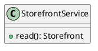

# UC-01 — Explore the storefront

### Description

Discover promotions, apparel categories, featured products, and feedback on the storefront.

### Actors

Primary: Shopper. Supporting: web client and application service.

### Priority

Medium.

### Trigger

**TRG-UC-01-01** — The shopper opens the Shop landing page.

### Preconditions

- **PRE-UC-01-01** — The storefront route is open in the client.

### Postconditions

- **POST-UC-01-01** — The client displays the storefront sections.

### Basic Flow

1. The shopper opens the storefront.
2. The client requests storefront content.
3. The system returns promotions, categories, featured products, and feedback.
4. The client renders the returned sections.
5. The shopper chooses an Explore Now category.
6. The client opens the product listing and displays the returned cards.

### Alternative Flows

#### AF-UC-01-01

1. The shopper selects a featured product card.
2. The client opens the product detail route.

### Exception Flows

#### EF-UC-01-01

1. The system returns a temporary service failure.
2. The client presents a retry action for the storefront.
3. The shopper retries the request.

### UML Model

Vocabulary imports: [shared domain model](shared-domain-model.md). This local service model extends that vocabulary.



### Business Rules

```ocl
-- BR-UC-01-01
-- Source: Assumption
context StorefrontService::read(): Storefront
post BR_UC_01_01_Promotions:
  result.promotions = Promotion.allInstances()->select(p | p.published)->sortedBy(p | p.displayRank)
```
```ocl
-- BR-UC-01-02
-- Source: Assumption
context StorefrontService::read(): Storefront
post BR_UC_01_02_Categories:
  result.categories = Category.allInstances()->sortedBy(c | c.displayRank)
```
```ocl
-- BR-UC-01-03
-- Source: Assumption
context StorefrontService::read(): Storefront
post BR_UC_01_03_FeaturedCards:
  result.featured = Product.allInstances()->select(p | p.published and p.featured)->sortedBy(p | p.displayRank)
```
```ocl
-- BR-UC-01-04
-- Source: Assumption
context StorefrontService::read(): Storefront
post BR_UC_01_04_Feedback:
  result.testimonials = Testimonial.allInstances()->select(t | t.published)->sortedBy(t | t.displayRank)
```
```ocl
-- BR-UC-01-05
-- Source: Assumption
context Promotion
inv BR_UC_01_05_CategoryDestination:
  self.targetCategoryId = null or Category.allInstances()->exists(c | c.id = self.targetCategoryId)
```
```ocl
-- BR-UC-01-06
-- Source: Assumption
context Testimonial
inv BR_UC_01_06_RatingScale:
  self.rating >= 0 and self.rating <= 5
```
```ocl
-- BR-UC-01-07
-- Source: Assumption
context Promotion
inv BR_UC_01_07_EditorialPositions:
  Promotion.allInstances()->isUnique(displayRank) and Category.allInstances()->isUnique(displayRank) and Testimonial.allInstances()->isUnique(displayRank)
```

### Related UI

- [Figma node 85:1544](https://www.figma.com/design/WcpUgAYaQJA4J00rMaMgj8/Euphoria?node-id=85-1544)

### Related APIs

- [API-STOREFRONT](../api/api-storefront.md)
- [API-CATALOG](../api/api-catalog.md)

### Notes

Screen and text-layer evidence establishes the visible goal. Service decomposition, request shapes, and exception recovery are proposed implementation contracts; they are not extracted server behavior. See [assumptions](../ASSUMPTIONS.md) and [coverage](../coverage-report.md) for the supported boundary. No prototype interaction wiring was available for verification.
