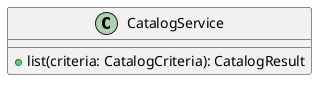

# UC-02 — Browse products by category

### Description

Open the apparel listing from Shop or a category and inspect its product cards.

### Actors

Primary: Shopper. Supporting: web client and application service.

### Priority

High.

### Trigger

**TRG-UC-02-01** — The shopper opens Shop or selects a category.

### Preconditions

- **PRE-UC-02-01** — The storefront or category navigation is displayed.

### Postconditions

- **POST-UC-02-01** — The client displays the product listing.

### Basic Flow

1. The shopper chooses Shop or a category.
2. The client requests the product listing.
3. The system returns product cards and filter choices.
4. The client displays the listing and the category heading.
5. The shopper selects a product card.
6. The client opens its product detail route.

### Alternative Flows

#### AF-UC-02-01

1. The shopper chooses another category.
2. The client requests and displays its product listing.

### Exception Flows

#### EF-UC-02-01

1. The system returns an unavailable resource response.
2. The client displays the returned message.
3. The shopper returns to category navigation.

### UML Model

Vocabulary imports: [shared domain model](shared-domain-model.md). This local service model extends that vocabulary.



### Business Rules

```ocl
-- BR-UC-02-01
-- Source: Assumption
context CatalogService::list(criteria: CatalogCriteria): CatalogResult
pre BR_UC_02_01_CategoryReference:
  criteria.categoryId = null or Category.allInstances()->exists(c | c.id = criteria.categoryId)
```
```ocl
-- BR-UC-02-02
-- Source: Assumption
context CatalogService::list(criteria: CatalogCriteria): CatalogResult
post BR_UC_02_02_PublishedCatalog:
  result.items->forAll(p | p.published)
```
```ocl
-- BR-UC-02-03
-- Source: Assumption
context CatalogService::list(criteria: CatalogCriteria): CatalogResult
post BR_UC_02_03_CategoryBoundary:
  criteria.categoryId = null or result.items->forAll(p | p.category.id = criteria.categoryId)
```
```ocl
-- BR-UC-02-04
-- Source: Assumption
context CatalogService::list(criteria: CatalogCriteria): CatalogResult
post BR_UC_02_04_CardIdentity:
  result.items->isUnique(id)
```
```ocl
-- BR-UC-02-05
-- Source: Assumption
context CatalogService::list(criteria: CatalogCriteria): CatalogResult
post BR_UC_02_05_CategoryChoices:
  result.categories = Category.allInstances()->collect(c | c.id)->asSet()
```
```ocl
-- BR-UC-02-06
-- Source: Assumption
context CatalogService::list(criteria: CatalogCriteria): CatalogResult
post BR_UC_02_06_ResultCount:
  result.total = result.items->size()
```
```ocl
-- BR-UC-02-07
-- Source: Assumption
context Product
inv BR_UC_02_07_DisplayPrice:
  self.displayPrice.amount >= 0 and self.variants->exists(v | v.price = self.displayPrice)
```

### Related UI

- [Figma node 64:33](https://www.figma.com/design/WcpUgAYaQJA4J00rMaMgj8/Euphoria?node-id=64-33)

### Related APIs

- [API-CATALOG](../api/api-catalog.md)

### Notes

Screen and text-layer evidence establishes the visible goal. Service decomposition, request shapes, and exception recovery are proposed implementation contracts; they are not extracted server behavior. See [assumptions](../ASSUMPTIONS.md) and [coverage](../coverage-report.md) for the supported boundary. No prototype interaction wiring was available for verification.
