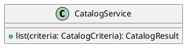

# UC-03 — Filter the product listing

### Description

Refine the displayed apparel listing using price, color, size, and dress style controls.

### Actors

Primary: Shopper. Supporting: web client and application service.

### Priority

High.

### Trigger

**TRG-UC-03-01** — The shopper changes a product filter.

### Preconditions

- **PRE-UC-03-01** — The product listing and filter controls are displayed.

### Postconditions

- **POST-UC-03-01** — The client displays the returned filtered listing.

### Basic Flow

1. The shopper changes the price, color, size, or dress style controls.
2. The client submits the selected values.
3. The system returns a listing result.
4. The client displays the returned cards and the selected controls.

### Alternative Flows

#### AF-UC-03-01

1. The shopper clears the selected controls.
2. The client submits the changed selection.
3. The client displays the returned listing.

### Exception Flows

#### EF-UC-03-01

1. The system returns a request rejection.
2. The client presents the returned message beside the listing controls.
3. The shopper revises the selections and submits again.

### UML Model

Vocabulary imports: [shared domain model](shared-domain-model.md). This local service model extends that vocabulary.



### Business Rules

```ocl
-- BR-UC-03-01
-- Source: Assumption
context CatalogCriteria
inv BR_UC_03_01_LowerDefault:
  self.minAmount = (if self.rawMinAmount = null then 0 else self.rawMinAmount endif)
```
```ocl
-- BR-UC-03-02
-- Source: Assumption
context CatalogCriteria
inv BR_UC_03_02_UpperDefault:
  self.maxAmount = (if self.rawMaxAmount = null then if Product.allInstances()->isEmpty() then 0 else Product.allInstances()->collect(p | p.displayPrice.amount)->max() endif else self.rawMaxAmount endif)
```
```ocl
-- BR-UC-03-03
-- Source: Assumption
context CatalogService::list(criteria: CatalogCriteria): CatalogResult
pre BR_UC_03_03_PriceInterval:
  criteria.minAmount >= 0 and criteria.maxAmount >= criteria.minAmount
```
```ocl
-- BR-UC-03-04
-- Source: Assumption
context CatalogService::list(criteria: CatalogCriteria): CatalogResult
post BR_UC_03_04_PriceSelection:
  result.items->forAll(p | p.displayPrice.amount >= criteria.minAmount and p.displayPrice.amount <= criteria.maxAmount)
```
```ocl
-- BR-UC-03-05
-- Source: Assumption
context CatalogService::list(criteria: CatalogCriteria): CatalogResult
post BR_UC_03_05_DressStyleSelection:
  criteria.styles->isEmpty() or result.items->forAll(p | criteria.styles->includes(p.style))
```
```ocl
-- BR-UC-03-06
-- Source: Assumption
context CatalogService::list(criteria: CatalogCriteria): CatalogResult
post BR_UC_03_06_VariantIntersection:
  result.items->forAll(p | p.variants->exists(v | (criteria.colors->isEmpty() or criteria.colors->includes(v.color)) and (criteria.sizes->isEmpty() or criteria.sizes->includes(v.size))))
```
```ocl
-- BR-UC-03-07
-- Source: Assumption
context CatalogService::list(criteria: CatalogCriteria): CatalogResult
post BR_UC_03_07_CompleteMatches:
  result.items->asSet() = Product.allInstances()->select(p | p.published and (criteria.categoryId = null or p.category.id = criteria.categoryId) and p.displayPrice.amount >= criteria.minAmount and p.displayPrice.amount <= criteria.maxAmount and (criteria.styles->isEmpty() or criteria.styles->includes(p.style)) and p.variants->exists(v | (criteria.colors->isEmpty() or criteria.colors->includes(v.color)) and (criteria.sizes->isEmpty() or criteria.sizes->includes(v.size))))
```
```ocl
-- BR-UC-03-08
-- Source: Assumption
context CatalogService::list(criteria: CatalogCriteria): CatalogResult
post BR_UC_03_08_FilterChoices:
  result.colors = Variant.allInstances()->collect(v | v.color)->asSet() and result.sizes = Variant.allInstances()->collect(v | v.size)->asSet() and result.styles = Product.allInstances()->collect(p | p.style)->asSet()
```

### Related UI

- [Figma node 64:33](https://www.figma.com/design/WcpUgAYaQJA4J00rMaMgj8/Euphoria?node-id=64-33)

### Related APIs

- [API-CATALOG](../api/api-catalog.md)

### Notes

Screen and text-layer evidence establishes the visible goal. Service decomposition, request shapes, and exception recovery are proposed implementation contracts; they are not extracted server behavior. See [assumptions](../ASSUMPTIONS.md) and [coverage](../coverage-report.md) for the supported boundary. No prototype interaction wiring was available for verification.
