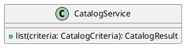

# UC-04 — Change product listing order

### Description

Switch the product listing between New and Recommended views.

### Actors

Primary: Shopper. Supporting: web client and application service.

### Priority

High.

### Trigger

**TRG-UC-04-01** — The shopper chooses New or Recommended.

### Preconditions

- **PRE-UC-04-01** — The product listing is displayed.

### Postconditions

- **POST-UC-04-01** — The client displays the returned product sequence.

### Basic Flow

1. The shopper chooses New.
2. The client submits the listing request with the chosen view.
3. The system returns product cards.
4. The client displays the returned sequence and highlights the chosen view.

### Alternative Flows

#### AF-UC-04-01

1. The shopper chooses Recommended.
2. The client submits the changed view.
3. The client displays the returned sequence.

### Exception Flows

#### EF-UC-04-01

1. The system returns a temporary service failure.
2. The client keeps the displayed listing and offers Retry.

### UML Model

Vocabulary imports: [shared domain model](shared-domain-model.md). This local service model extends that vocabulary.



### Business Rules

```ocl
-- BR-UC-04-01
-- Source: Assumption
context CatalogCriteria
inv BR_UC_04_01_DefaultView:
  self.sort = (if self.rawSort = null then CatalogSort::RECOMMENDED else self.rawSort endif)
```
```ocl
-- BR-UC-04-02
-- Source: Assumption
context CatalogService::list(criteria: CatalogCriteria): CatalogResult
post BR_UC_04_02_NewFirst:
  criteria.sort = CatalogSort::NEW implies result.items->forAll(a,b | a.createdAt > b.createdAt implies result.items->indexOf(a) < result.items->indexOf(b))
```
```ocl
-- BR-UC-04-03
-- Source: Assumption
context CatalogService::list(criteria: CatalogCriteria): CatalogResult
post BR_UC_04_03_NewTies:
  criteria.sort = CatalogSort::NEW implies result.items->forAll(a,b | a.createdAt = b.createdAt and a.displayRank < b.displayRank implies result.items->indexOf(a) < result.items->indexOf(b))
```
```ocl
-- BR-UC-04-04
-- Source: Assumption
context CatalogService::list(criteria: CatalogCriteria): CatalogResult
post BR_UC_04_04_RecommendedFirst:
  criteria.sort = CatalogSort::RECOMMENDED implies result.items = result.items->sortedBy(p | p.recommendationRank)
```
```ocl
-- BR-UC-04-05
-- Source: Assumption
context Product
inv BR_UC_04_05_EditorialRankIdentity:
  Product.allInstances()->isUnique(displayRank)
```
```ocl
-- BR-UC-04-06
-- Source: Assumption
context Product
inv BR_UC_04_06_RecommendationRankIdentity:
  Product.allInstances()->isUnique(recommendationRank)
```
```ocl
-- BR-UC-04-07
-- Source: Assumption
context CatalogService::list(criteria: CatalogCriteria): CatalogResult
post BR_UC_04_07_StableCatalogValues:
  Product.allInstances() = Product.allInstances()@pre and Product.allInstances()->forAll(p | p.displayPrice = p.displayPrice@pre and p.displayRank = p.displayRank@pre and p.recommendationRank = p.recommendationRank@pre and p.createdAt = p.createdAt@pre)
```

### Related UI

- [Figma node 64:33](https://www.figma.com/design/WcpUgAYaQJA4J00rMaMgj8/Euphoria?node-id=64-33)

### Related APIs

- [API-CATALOG](../api/api-catalog.md)

### Notes

Screen and text-layer evidence establishes the visible goal. Service decomposition, request shapes, and exception recovery are proposed implementation contracts; they are not extracted server behavior. See [assumptions](../ASSUMPTIONS.md) and [coverage](../coverage-report.md) for the supported boundary. No prototype interaction wiring was available for verification.
