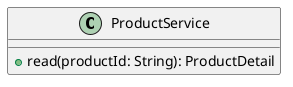

# UC-05 — View product details

### Description

Inspect product imagery, description, attributes, rating summary, size and color selections, and similar products.

### Actors

Primary: Shopper. Supporting: web client and application service.

### Priority

High.

### Trigger

**TRG-UC-05-01** — The shopper selects a product card.

### Preconditions

- **PRE-UC-05-01** — The client has a product identifier from a displayed card.

### Postconditions

- **POST-UC-05-01** — The client displays the product detail and variant choices.

### Basic Flow

1. The shopper selects a product card.
2. The client requests the product detail.
3. The system returns images, description, attributes, rating summary, variants, and similar products.
4. The client renders the product detail.
5. The shopper selects an image, size, and color.
6. The client displays the selected image and variant.

### Alternative Flows

#### AF-UC-05-01

1. The shopper selects a similar product.
2. The client requests and displays that product detail.

### Exception Flows

#### EF-UC-05-01

1. The system returns an unavailable resource response.
2. The client displays the unavailable product message.
3. The shopper returns to the listing.

### UML Model

Vocabulary imports: [shared domain model](shared-domain-model.md). This local service model extends that vocabulary.



### Business Rules

```ocl
-- BR-UC-05-01
-- Source: Assumption
context ProductService::read(productId: String): ProductDetail
pre BR_UC_05_01_PublishedProduct:
  Product.allInstances()->exists(p | p.id = productId and p.published)
```
```ocl
-- BR-UC-05-02
-- Source: Assumption
context ProductService::read(productId: String): ProductDetail
post BR_UC_05_02_ProductIdentity:
  result.product.id = productId
```
```ocl
-- BR-UC-05-03
-- Source: Assumption
context ProductService::read(productId: String): ProductDetail
post BR_UC_05_03_VariantChoices:
  result.variants->asSet() = result.product.variants and result.variants->forAll(v | v.productId = productId)
```
```ocl
-- BR-UC-05-04
-- Source: Assumption
context ProductService::read(productId: String): ProductDetail
post BR_UC_05_04_GallerySequence:
  result.images = result.product.images->sortedBy(i | i.position) and result.images->forAll(i | i.productId = productId)
```
```ocl
-- BR-UC-05-05
-- Source: Assumption
context ProductService::read(productId: String): ProductDetail
post BR_UC_05_05_DescriptionAndAttributes:
  result.description = result.product.description and result.attributes = result.product.attributes and result.attributes->forAll(a | a.productId = productId)
```
```ocl
-- BR-UC-05-06
-- Source: Assumption
context ProductService::read(productId: String): ProductDetail
post BR_UC_05_06_RelatedProducts:
  result.similarProducts = Product.allInstances()->select(p | p.published and p.id <> productId and p.category = result.product.category)->sortedBy(p | p.displayRank)
```
```ocl
-- BR-UC-05-07
-- Source: Assumption
context Variant
inv BR_UC_05_07_PublicSelection:
  self.purchasable = (self.sellable and self.stock > 0)
```
```ocl
-- BR-UC-05-08
-- Source: Assumption
context ProductService::read(productId: String): ProductDetail
post BR_UC_05_08_ReviewSummary:
  result.rating = result.product.rating and result.commentCount = result.product.commentCount and result.questionCount = result.product.questionCount
```
```ocl
-- BR-UC-05-09
-- Source: Assumption
context Product
inv BR_UC_05_09_ReviewValues:
  self.rating >= 0 and self.rating <= 5 and self.commentCount >= 0 and self.questionCount >= 0
```
```ocl
-- BR-UC-05-10
-- Source: Assumption
context Product
inv BR_UC_05_10_VariantIdentity:
  self.variants->isUnique(v | Tuple{size = v.size, color = v.color}) and self.images->isUnique(position)
```

### Related UI

- [Figma node 1:2](https://www.figma.com/design/WcpUgAYaQJA4J00rMaMgj8/Euphoria?node-id=1-2)

### Related APIs

- [API-PRODUCT](../api/api-product.md)

### Notes

Screen and text-layer evidence establishes the visible goal. Service decomposition, request shapes, and exception recovery are proposed implementation contracts; they are not extracted server behavior. See [assumptions](../ASSUMPTIONS.md) and [coverage](../coverage-report.md) for the supported boundary. No prototype interaction wiring was available for verification.
