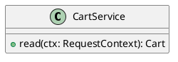

# UC-06 — Review the cart

### Description

Review product lines, quantities, and the subtotal, including the dedicated empty-cart state.

### Actors

Primary: Shopper. Supporting: web client and application service.

### Priority

High.

### Trigger

**TRG-UC-06-01** — The shopper opens the cart.

### Preconditions

- **PRE-UC-06-01** — The cart route is open in the client.

### Postconditions

- **POST-UC-06-01** — The client displays the returned cart or the empty-cart state.

### Basic Flow

1. The shopper opens the cart.
2. The client requests the cart.
3. The system returns cart lines and the subtotal.
4. The client displays product details, selected options, quantities, subtotal, shipping estimate, and total estimate.
5. The shopper chooses Proceed Check Out.
6. The client opens checkout.

### Alternative Flows

#### AF-UC-06-01

1. The system returns a cart with no lines.
2. The client displays the empty-cart message.
3. The shopper returns to shopping.

### Exception Flows

#### EF-UC-06-01

1. The system returns a rejected authentication context.
2. The client presents the sign-in entry point.

### UML Model

Vocabulary imports: [shared domain model](shared-domain-model.md). This local service model extends that vocabulary.



### Business Rules

```ocl
-- BR-UC-06-01
-- Source: Assumption
context CartService::read(ctx: RequestContext): Cart
pre BR_UC_06_01_AccountContext:
  ctx.authenticated
```
```ocl
-- BR-UC-06-02
-- Source: Assumption
context CartService::read(ctx: RequestContext): Cart
post BR_UC_06_02_CustomerCart:
  result.customerId = ctx.customerId
```
```ocl
-- BR-UC-06-03
-- Source: Assumption
context CartLine
inv BR_UC_06_03_QuantityAndAmount:
  self.quantity > 0 and self.unitPrice.amount >= 0
```
```ocl
-- BR-UC-06-04
-- Source: Assumption
context Cart
inv BR_UC_06_04_CurrencyConsistency:
  self.items->forAll(l | l.unitPrice.currency = self.subtotal.currency and l.lineTotal.currency = self.subtotal.currency)
```
```ocl
-- BR-UC-06-05
-- Source: Assumption
context CartLine
inv BR_UC_06_05_LineAmount:
  self.lineTotal.amount = self.quantity * self.unitPrice.amount
```
```ocl
-- BR-UC-06-06
-- Source: Assumption
context Cart
inv BR_UC_06_06_Subtotal:
  self.subtotal.amount = self.items->collect(l | l.lineTotal.amount)->sum()
```
```ocl
-- BR-UC-06-07
-- Source: Assumption
context Cart
inv BR_UC_06_07_OneVariantLine:
  self.items->isUnique(variantId) and self.version >= 0
```
```ocl
-- BR-UC-06-08
-- Source: Assumption
context Cart
inv BR_UC_06_08_DisplayEstimates:
  self.shippingEstimate.amount = (if self.items->isEmpty() then 0 else 5.00 endif) and self.shippingEstimate.currency = self.subtotal.currency and self.totalEstimate.currency = self.subtotal.currency and self.totalEstimate.amount = self.subtotal.amount + self.shippingEstimate.amount
```

### Related UI

- [Figma node 181:393](https://www.figma.com/design/WcpUgAYaQJA4J00rMaMgj8/Euphoria?node-id=181-393)
- [Figma node 190:423](https://www.figma.com/design/WcpUgAYaQJA4J00rMaMgj8/Euphoria?node-id=190-423)

### Related APIs

- [API-CART](../api/api-cart.md)

### Notes

Screen and text-layer evidence establishes the visible goal. Service decomposition, request shapes, and exception recovery are proposed implementation contracts; they are not extracted server behavior. See [assumptions](../ASSUMPTIONS.md) and [coverage](../coverage-report.md) for the supported boundary. No prototype interaction wiring was available for verification.
