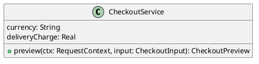

# UC-07 — Enter billing details and review checkout

### Description

Enter billing details and review the delivery information and order summary before submitting an order.

### Actors

Primary: Shopper. Supporting: web client and application service.

### Priority

High.

### Trigger

**TRG-UC-07-01** — The shopper chooses Proceed Check Out from the cart.

### Preconditions

- **PRE-UC-07-01** — The checkout screen is open.

### Postconditions

- **POST-UC-07-01** — The client displays the returned checkout summary and delivery information.

### Basic Flow

1. The shopper chooses Proceed Check Out.
2. The client displays the billing form and cart summary.
3. The shopper enters billing details and chooses Same as Billing address.
4. The shopper chooses Continue to delivery.
5. The client submits the checkout details.
6. The system returns the checkout summary.
7. The client displays the returned amounts and delivery information.

### Alternative Flows

#### AF-UC-07-01

1. The shopper returns to the billing fields and edits the details.
2. The shopper chooses Continue to delivery again.
3. The client displays the returned checkout summary.

### Exception Flows

#### EF-UC-07-01

1. The system returns an operation conflict.
2. The client requests a refreshed cart and checkout summary.
3. The client shows the returned summary and asks the shopper to review it before submitting again.

### UML Model

Vocabulary imports: [shared domain model](shared-domain-model.md). This local service model extends that vocabulary.



### Business Rules

```ocl
-- BR-UC-07-01
-- Source: Assumption
context CheckoutService::preview(ctx: RequestContext, input: CheckoutInput): CheckoutPreview
pre BR_UC_07_01_AccountCart:
  ctx.authenticated and input.cart.customerId = ctx.customerId
```
```ocl
-- BR-UC-07-02
-- Source: Assumption
context CheckoutService::preview(ctx: RequestContext, input: CheckoutInput): CheckoutPreview
pre BR_UC_07_02_CartRevision:
  input.cartVersion = input.cart.version and input.cart.items->notEmpty()
```
```ocl
-- BR-UC-07-03
-- Source: Assumption
context CheckoutService::preview(ctx: RequestContext, input: CheckoutInput): CheckoutPreview
pre BR_UC_07_03_AddressValues:
  AddressValidation::valid(input.billing) and input.sameAsBilling and input.shipping = null
```
```ocl
-- BR-UC-07-04
-- Source: Assumption
context CheckoutService::preview(ctx: RequestContext, input: CheckoutInput): CheckoutPreview
post BR_UC_07_04_CartSnapshot:
  result.cartVersion = input.cartVersion and result.items = input.cart.items and result.subtotal = input.cart.subtotal
```
```ocl
-- BR-UC-07-05
-- Source: Assumption
context CheckoutService::preview(ctx: RequestContext, input: CheckoutInput): CheckoutPreview
post BR_UC_07_05_DeliveryAndSavings:
  result.discount.amount = 0 and result.shipping.amount = self.deliveryCharge
```
```ocl
-- BR-UC-07-06
-- Source: Assumption
context CheckoutService::preview(ctx: RequestContext, input: CheckoutInput): CheckoutPreview
post BR_UC_07_06_TotalAmount:
  result.total.amount = result.subtotal.amount - result.discount.amount + result.shipping.amount
```
```ocl
-- BR-UC-07-07
-- Source: Assumption
context CheckoutService::preview(ctx: RequestContext, input: CheckoutInput): CheckoutPreview
post BR_UC_07_07_Currency:
  result.total.currency = self.currency and result.subtotal.currency = self.currency and result.discount.currency = self.currency and result.shipping.currency = self.currency
```
```ocl
-- BR-UC-07-08
-- Source: Assumption
context CheckoutService
inv BR_UC_07_08_ProvisionalConfiguration:
  self.currency = 'USD' and self.deliveryCharge = 5.00
```
```ocl
-- BR-UC-07-09
-- Source: Assumption
context CheckoutService::preview(ctx: RequestContext, input: CheckoutInput): CheckoutPreview
post BR_UC_07_09_NoOrderCreation:
  Order.allInstances() = Order.allInstances()@pre and CheckoutReceipt.allInstances() = CheckoutReceipt.allInstances()@pre and input.cart.items = input.cart.items@pre and input.cart.version = input.cart.version@pre
```

### Related UI

- [Figma node 181:393](https://www.figma.com/design/WcpUgAYaQJA4J00rMaMgj8/Euphoria?node-id=181-393)
- [Figma node 235:1056](https://www.figma.com/design/WcpUgAYaQJA4J00rMaMgj8/Euphoria?node-id=235-1056)

### Related APIs

- [API-CART](../api/api-cart.md)
- [API-CHECKOUT-PREVIEW](../api/api-checkout-preview.md)

### Notes

Screen and text-layer evidence establishes the visible goal. Service decomposition, request shapes, and exception recovery are proposed implementation contracts; they are not extracted server behavior. See [assumptions](../ASSUMPTIONS.md) and [coverage](../coverage-report.md) for the supported boundary. No prototype interaction wiring was available for verification.
