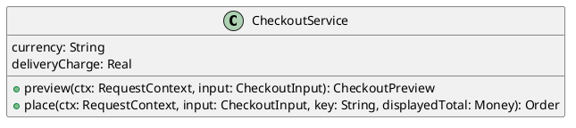

# UC-08 — Place a cash-on-delivery order

### Description

Submit the reviewed checkout using Cash on delivery and read the resulting order confirmation.

### Actors

Primary: Shopper. Supporting: web client and application service.

### Priority

High.

### Trigger

**TRG-UC-08-01** — The shopper chooses Pay Now after selecting Cash on delivery.

### Preconditions

- **PRE-UC-08-01** — The checkout summary and payment choices are displayed.

### Postconditions

- **POST-UC-08-01** — The client displays the returned order confirmation.

### Basic Flow

1. The shopper selects Cash on delivery.
2. The shopper chooses Pay Now.
3. The client submits the checkout request.
4. The system returns the order confirmation.
5. The client displays Your Order is Confirmed.

### Alternative Flows

#### AF-UC-08-01

1. The shopper returns to the billing details.
2. The client displays the checkout form.

### Exception Flows

#### EF-UC-08-01

1. The system returns an operation conflict.
2. The client requests a refreshed cart and checkout summary.
3. The client shows the returned summary and asks the shopper to review it before submitting again.

### UML Model

Vocabulary imports: [shared domain model](shared-domain-model.md). This local service model extends that vocabulary.



### Business Rules

```ocl
-- BR-UC-08-01
-- Source: Assumption
context CheckoutService::place(ctx: RequestContext, input: CheckoutInput, key: String, displayedTotal: Money): Order
pre BR_UC_08_01_Identity:
  ctx.authenticated and input.cart.customerId = ctx.customerId and key.size() > 0
```
```ocl
-- BR-UC-08-02
-- Source: Assumption
context CheckoutService::place(ctx: RequestContext, input: CheckoutInput, key: String, displayedTotal: Money): Order
pre BR_UC_08_02_NewOrReplay:
  let receipts : Set(CheckoutReceipt) = CheckoutReceipt.allInstances()->select(r | r.customerId = ctx.customerId and r.key = key) in if receipts->notEmpty() then receipts->forAll(r | r.requestDigest = Digest::checkout(input, displayedTotal)) else input.cartVersion = input.cart.version and input.cart.items->notEmpty() and AddressValidation::valid(input.billing) and (input.sameAsBilling or (input.shipping <> null and AddressValidation::valid(input.shipping))) and input.cart.items->forAll(l | l.variant.sellable and l.variant.stock >= l.quantity and l.unitPrice = l.variant.price) and displayedTotal = self.preview(ctx, input).total endif
```
```ocl
-- BR-UC-08-03
-- Source: Assumption
context CheckoutService::place(ctx: RequestContext, input: CheckoutInput, key: String, displayedTotal: Money): Order
post BR_UC_08_03_ReplayOrCreate:
  let prior : Set(CheckoutReceipt) = CheckoutReceipt.allInstances()@pre->select(r | r.customerId = ctx.customerId and r.key = key) in if prior->notEmpty() then result = prior->any(true).order else result.oclIsNew() and result.customerId = ctx.customerId and result.status = OrderStatus::PLACED and result.paymentMethod = PaymentMethod::COD and result.total = displayedTotal and result.billing = input.billing and result.shipping = (if input.sameAsBilling then input.billing else input.shipping endif) and result.items->size() = input.cart.items@pre->size() and result.items->forAll(o | input.cart.items@pre->one(c | o.variantId = c.variantId and o.quantity = c.quantity and o.unitPrice = c.unitPrice and o.title = c.title)) and input.cart.items->isEmpty() and input.cart.version = input.cart.version@pre + 1 endif
```
```ocl
-- BR-UC-08-04
-- Source: Assumption
context CheckoutService::place(ctx: RequestContext, input: CheckoutInput, key: String, displayedTotal: Money): Order
post BR_UC_08_04_ReceiptAndStock:
  let prior : Set(CheckoutReceipt) = CheckoutReceipt.allInstances()@pre->select(r | r.customerId = ctx.customerId and r.key = key) in if prior->isEmpty() then CheckoutReceipt.allInstances()->one(r | r.oclIsNew() and r.customerId = ctx.customerId and r.key = key and r.order = result and r.requestDigest = Digest::checkout(input, displayedTotal)) and Variant.allInstances()->forAll(v | v.stock = v.stock@pre - input.cart.items@pre->select(l | l.variantId = v.id)->collect(l | l.quantity)->sum()) else Variant.allInstances()->forAll(v | v.stock = v.stock@pre) and input.cart.items = input.cart.items@pre and input.cart.version = input.cart.version@pre endif
```
```ocl
-- BR-UC-08-05
-- Source: Assumption
context CheckoutReceipt
inv BR_UC_08_05_ReceiptIdentity:
  CheckoutReceipt.allInstances()->isUnique(r | Tuple{customerId = r.customerId, key = r.key})
```
```ocl
-- BR-UC-08-06
-- Source: Assumption
context CheckoutService::place(ctx: RequestContext, input: CheckoutInput, key: String, displayedTotal: Money): Order
pre BR_UC_08_06_RequestBinding:
  ctx.csrfValid
```
```ocl
-- BR-UC-08-07
-- Source: Assumption
context CheckoutService::place(ctx: RequestContext, input: CheckoutInput, key: String, displayedTotal: Money): Order
post BR_UC_08_07_InitialSnapshot:
  if result.oclIsNew() then result.subtotal.amount = input.cart.items@pre->collect(l | l.lineTotal.amount)->sum() and result.discount.amount = 0 and result.shippingCharge.amount = self.deliveryCharge and result.placedAt = Clock::now() and result.version = 0 and result.events->one(e | e.oclIsNew() and e.status = OrderStatus::PLACED and e.occurredAt = result.placedAt and e.orderId = result.id) and result.items->forAll(o | input.cart.items@pre->one(c | o.variantId = c.variantId and o.size = c.size and o.color = c.color and o.imageUrl = c.imageUrl)) else result.items = result.items@pre and result.events = result.events@pre endif
```
```ocl
-- BR-UC-08-08
-- Source: Assumption
context CheckoutService::place(ctx: RequestContext, input: CheckoutInput, key: String, displayedTotal: Money): Order
post BR_UC_08_08_AtomicCommit:
  -- The operation is atomic across the cart, inventory, order, lines, addresses, event and receipt.
  -- Concurrent calls serialize the receipt key and cart revision checks with these writes.
  if result.oclIsNew() then Order.allInstances() = Order.allInstances()@pre->including(result) and Variant.allInstances()->forAll(v | v.version = v.version@pre + (if input.cart.items@pre->exists(l | l.variantId = v.id) then 1 else 0 endif)) else Order.allInstances() = Order.allInstances()@pre and CheckoutReceipt.allInstances() = CheckoutReceipt.allInstances()@pre and Variant.allInstances()->forAll(v | v.version = v.version@pre) endif
```
```ocl
-- BR-UC-08-09
-- Source: Assumption
context Order
inv BR_UC_08_09_PublicIdentity:
  Order.allInstances()->isUnique(number) and self.items->isUnique(variantId) and self.items->forAll(l | l.orderId = self.id)
```
```ocl
-- BR-UC-08-10
-- Source: Assumption
context CheckoutService::place(ctx: RequestContext, input: CheckoutInput, key: String, displayedTotal: Money): Order
pre BR_UC_08_10_SupportedAddressChoice:
  input.sameAsBilling and input.shipping = null
```
```ocl
-- BR-UC-08-11
-- Source: Assumption
context Variant
inv BR_UC_08_11_StockAndRevision:
  self.stock >= 0 and self.version >= 0 and self.price.amount >= 0
```

### Related UI

- [Figma node 235:1056](https://www.figma.com/design/WcpUgAYaQJA4J00rMaMgj8/Euphoria?node-id=235-1056)
- [Figma node 273:839](https://www.figma.com/design/WcpUgAYaQJA4J00rMaMgj8/Euphoria?node-id=273-839)
- [Figma node 181:393](https://www.figma.com/design/WcpUgAYaQJA4J00rMaMgj8/Euphoria?node-id=181-393)

### Related APIs

- [API-CART](../api/api-cart.md)
- [API-CHECKOUT-PREVIEW](../api/api-checkout-preview.md)
- [API-ORDER-CREATE](../api/api-order-create.md)

### Notes

Screen and text-layer evidence establishes the visible goal. Service decomposition, request shapes, and exception recovery are proposed implementation contracts; they are not extracted server behavior. See [assumptions](../ASSUMPTIONS.md) and [coverage](../coverage-report.md) for the supported boundary. No prototype interaction wiring was available for verification.
