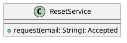

# UC-09 — Request a password reset email

### Description

Submit an email address and reach the Check Email acknowledgement screen. Completing the reset is outside this use case.

### Actors

Primary: Visitor. Supporting: web client and application service.

### Priority

Medium.

### Trigger

**TRG-UC-09-01** — The visitor chooses Forget your password.

### Preconditions

- **PRE-UC-09-01** — The Reset Your Password form is displayed.

### Postconditions

- **POST-UC-09-01** — The client displays the Check Email acknowledgement.

### Basic Flow

1. The visitor enters an email address in the reset form.
2. The client submits the email request.
3. The system returns an acknowledgement.
4. The client displays Check Email and the Back to Login link.

### Alternative Flows

#### AF-UC-09-01

1. The visitor chooses Back to Login.
2. The client displays the sign-in page.

### Exception Flows

#### EF-UC-09-01

1. The system returns a temporary service failure.
2. The client presents the retry action.
3. The visitor retries the request.

### UML Model

Vocabulary imports: [shared domain model](shared-domain-model.md). This local service model extends that vocabulary.



### Business Rules

```ocl
-- BR-UC-09-01
-- Source: Assumption
context ResetService::request(email: String): Accepted
pre BR_UC_09_01_EmailSyntax:
  TextSyntax::email(email)
```
```ocl
-- BR-UC-09-02
-- Source: Assumption
context ResetService::request(email: String): Accepted
post BR_UC_09_02_NeutralAcknowledgement:
  result.accepted = true
```
```ocl
-- BR-UC-09-03
-- Source: Assumption
context ResetService::request(email: String): Accepted
post BR_UC_09_03_KnownAccountQueue:
  let matches : Set(Customer) = Customer.allInstances()->select(c | c.email = TextSyntax::canonicalEmail(email)) in matches->notEmpty() implies ResetDelivery.allInstances()->one(d | d.oclIsNew() and d.customerId = matches->any(true).id and d.status = DeliveryStatus::QUEUED)
```
```ocl
-- BR-UC-09-04
-- Source: Assumption
context ResetService::request(email: String): Accepted
post BR_UC_09_04_UnknownAddress:
  Customer.allInstances()->forAll(c | c.email <> TextSyntax::canonicalEmail(email)) implies ResetDelivery.allInstances() = ResetDelivery.allInstances()@pre
```
```ocl
-- BR-UC-09-05
-- Source: Assumption
context ResetService::request(email: String): Accepted
post BR_UC_09_05_QueueCardinality:
  ResetDelivery.allInstances()->select(d | d.oclIsNew())->size() = (if Customer.allInstances()->exists(c | c.email = TextSyntax::canonicalEmail(email)) then 1 else 0 endif)
```
```ocl
-- BR-UC-09-06
-- Source: Assumption
context ResetService::request(email: String): Accepted
post BR_UC_09_06_QueueTime:
  ResetDelivery.allInstances()->select(d | d.oclIsNew())->forAll(d | d.createdAt = Clock::now())
```
```ocl
-- BR-UC-09-07
-- Source: Assumption
context ResetService::request(email: String): Accepted
post BR_UC_09_07_DispatchBoundary:
  ResetDelivery.allInstances()->select(d | d.oclIsNew())->forAll(d | d.providerReference = null)
```

### Related UI

- [Figma node 245:588](https://www.figma.com/design/WcpUgAYaQJA4J00rMaMgj8/Euphoria?node-id=245-588)
- [Figma node 270:721](https://www.figma.com/design/WcpUgAYaQJA4J00rMaMgj8/Euphoria?node-id=270-721)

### Related APIs

- [API-RESET-REQUEST](../api/api-reset-request.md)

### Notes

Screen and text-layer evidence establishes the visible goal. Service decomposition, request shapes, and exception recovery are proposed implementation contracts; they are not extracted server behavior. See [assumptions](../ASSUMPTIONS.md) and [coverage](../coverage-report.md) for the supported boundary. No prototype interaction wiring was available for verification.
