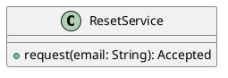

# UC-10 — Resend the password reset email

### Description

Request another reset email from the Check Email screen without completing a password change.

### Actors

Primary: Visitor. Supporting: web client and application service.

### Priority

Medium.

### Trigger

**TRG-UC-10-01** — The visitor chooses Click here to resend.

### Preconditions

- **PRE-UC-10-01** — The Check Email screen is displayed.

### Postconditions

- **POST-UC-10-01** — The client displays the returned acknowledgement.

### Basic Flow

1. The visitor chooses Click here to resend.
2. The client submits the email request again.
3. The system returns an acknowledgement.
4. The client displays the acknowledgement on Check Email.

### Alternative Flows

#### AF-UC-10-01

1. The visitor chooses Back to Login.
2. The client displays the sign-in page.

### Exception Flows

#### EF-UC-10-01

1. The system returns a temporary service failure.
2. The client presents the retry action.
3. The visitor retries the request.

### UML Model

Vocabulary imports: [shared domain model](shared-domain-model.md). This local service model extends that vocabulary.



### Business Rules

```ocl
-- BR-UC-10-01
-- Source: Assumption
context ResetService::request(email: String): Accepted
post BR_UC_10_01_KeepEarlierRequests:
  ResetDelivery.allInstances()@pre->forAll(d | ResetDelivery.allInstances()->includes(d) and d.customerId = d.customerId@pre and d.status = d.status@pre and d.providerReference = d.providerReference@pre and d.createdAt = d.createdAt@pre)
```
```ocl
-- BR-UC-10-02
-- Source: Assumption
context ResetService::request(email: String): Accepted
post BR_UC_10_02_SameDestination:
  ResetDelivery.allInstances()->select(d | d.oclIsNew())->forAll(d | Customer.allInstances()->exists(c | c.id = d.customerId and c.email = TextSyntax::canonicalEmail(email)))
```
```ocl
-- BR-UC-10-03
-- Source: Assumption
context ResetService::request(email: String): Accepted
post BR_UC_10_03_NoAccountCreation:
  Customer.allInstances() = Customer.allInstances()@pre
```
```ocl
-- BR-UC-10-04
-- Source: Assumption
context ResetService::request(email: String): Accepted
post BR_UC_10_04_ContactDataPreserved:
  Customer.allInstances()->forAll(c | c.email = c.email@pre and c.name = c.name@pre and c.phone = c.phone@pre)
```
```ocl
-- BR-UC-10-05
-- Source: Assumption
context ResetService::request(email: String): Accepted
post BR_UC_10_05_SessionsPreserved:
  Session.allInstances() = Session.allInstances()@pre and Session.allInstances()->forAll(s | s.tokenHash = s.tokenHash@pre and s.csrfHash = s.csrfHash@pre and s.expiresAt = s.expiresAt@pre and s.revoked = s.revoked@pre)
```
```ocl
-- BR-UC-10-06
-- Source: Assumption
context ResetDelivery
inv BR_UC_10_06_QueuedDispatchReference:
  self.status = DeliveryStatus::QUEUED implies self.providerReference = null
```
```ocl
-- BR-UC-10-07
-- Source: Assumption
context ResetDelivery
inv BR_UC_10_07_SentDispatchReference:
  self.status = DeliveryStatus::SENT implies (self.providerReference <> null and TextSyntax::nonBlank(self.providerReference))
```

### Related UI

- [Figma node 270:721](https://www.figma.com/design/WcpUgAYaQJA4J00rMaMgj8/Euphoria?node-id=270-721)
- [Figma node 245:588](https://www.figma.com/design/WcpUgAYaQJA4J00rMaMgj8/Euphoria?node-id=245-588)

### Related APIs

- [API-RESET-REQUEST](../api/api-reset-request.md)

### Notes

Screen and text-layer evidence establishes the visible goal. Service decomposition, request shapes, and exception recovery are proposed implementation contracts; they are not extracted server behavior. See [assumptions](../ASSUMPTIONS.md) and [coverage](../coverage-report.md) for the supported boundary. No prototype interaction wiring was available for verification.
