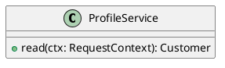

# UC-11 — View contact details

### Description

Read the contact information displayed in My Info.

### Actors

Primary: Customer. Supporting: web client and application service.

### Priority

Medium.

### Trigger

**TRG-UC-11-01** — The customer chooses My info.

### Preconditions

- **PRE-UC-11-01** — The My Account area is displayed.

### Postconditions

- **POST-UC-11-01** — The client displays the returned contact details.

### Basic Flow

1. The customer chooses My info.
2. The client requests the profile.
3. The system returns name, email, and phone information.
4. The client displays Contact Details.

### Alternative Flows

#### AF-UC-11-01

1. The customer returns to My orders.
2. The client displays the order-history route.

### Exception Flows

#### EF-UC-11-01

1. The system returns a rejected authentication context.
2. The client presents the sign-in entry point.

### UML Model

Vocabulary imports: [shared domain model](shared-domain-model.md). This local service model extends that vocabulary.



### Business Rules

```ocl
-- BR-UC-11-01
-- Source: Assumption
context ProfileService::read(ctx: RequestContext): Customer
pre BR_UC_11_01_AccountContext:
  ctx.authenticated
```
```ocl
-- BR-UC-11-02
-- Source: Assumption
context ProfileService::read(ctx: RequestContext): Customer
pre BR_UC_11_02_ProfileReference:
  Customer.allInstances()->exists(c | c.id = ctx.customerId)
```
```ocl
-- BR-UC-11-03
-- Source: Assumption
context ProfileService::read(ctx: RequestContext): Customer
post BR_UC_11_03_CustomerProfile:
  result.id = ctx.customerId
```
```ocl
-- BR-UC-11-04
-- Source: Assumption
context RequestContext
inv BR_UC_11_04_SessionAuthentication:
  self.authenticated = Session.allInstances()->exists(s | s.tokenHash = self.sessionHash and s.customerId = self.customerId and not s.revoked and s.expiresAt > Clock::now())
```
```ocl
-- BR-UC-11-05
-- Source: Assumption
context RequestContext
inv BR_UC_11_05_CsrfContext:
  self.csrfValid = Session.allInstances()->exists(s | s.tokenHash = self.sessionHash and s.customerId = self.customerId and s.csrfHash = self.csrfHash and not s.revoked and s.expiresAt > Clock::now())
```
```ocl
-- BR-UC-11-06
-- Source: Assumption
context Customer
inv BR_UC_11_06_CanonicalIdentity:
  self.email = TextSyntax::canonicalEmail(self.email) and Customer.allInstances()->isUnique(email)
```
```ocl
-- BR-UC-11-07
-- Source: Assumption
context ProfileService::read(ctx: RequestContext): Customer
post BR_UC_11_07_ContactsUnchanged:
  Customer.allInstances()->forAll(c | c.name = c.name@pre and c.email = c.email@pre and c.phone = c.phone@pre)
```

### Related UI

- [Figma node 275:1168](https://www.figma.com/design/WcpUgAYaQJA4J00rMaMgj8/Euphoria?node-id=275-1168)

### Related APIs

- [API-PROFILE](../api/api-profile.md)

### Notes

Screen and text-layer evidence establishes the visible goal. Service decomposition, request shapes, and exception recovery are proposed implementation contracts; they are not extracted server behavior. See [assumptions](../ASSUMPTIONS.md) and [coverage](../coverage-report.md) for the supported boundary. No prototype interaction wiring was available for verification.
