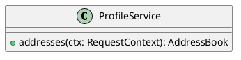

# UC-12 — View saved addresses

### Description

Read saved address cards and their shipping and billing default badges.

### Actors

Primary: Customer. Supporting: web client and application service.

### Priority

Medium.

### Trigger

**TRG-UC-12-01** — The customer opens the Address section of My Info.

### Preconditions

- **PRE-UC-12-01** — The My Info screen is displayed.

### Postconditions

- **POST-UC-12-01** — The client displays the returned address cards.

### Basic Flow

1. The customer opens the Address section.
2. The client requests the address book.
3. The system returns saved addresses and their displayed badges.
4. The client displays the address cards.

### Alternative Flows

#### AF-UC-12-01

1. The customer chooses Add New in the address section.
2. The client opens Add Address.

### Exception Flows

#### EF-UC-12-01

1. The system returns a rejected authentication context.
2. The client presents the sign-in entry point.

### UML Model

Vocabulary imports: [shared domain model](shared-domain-model.md). This local service model extends that vocabulary.



### Business Rules

```ocl
-- BR-UC-12-01
-- Source: Assumption
context ProfileService::addresses(ctx: RequestContext): AddressBook
pre BR_UC_12_01_AccountContext:
  ctx.authenticated
```
```ocl
-- BR-UC-12-02
-- Source: Assumption
context ProfileService::addresses(ctx: RequestContext): AddressBook
pre BR_UC_12_02_BookReference:
  AddressBook.allInstances()->exists(b | b.customerId = ctx.customerId)
```
```ocl
-- BR-UC-12-03
-- Source: Assumption
context ProfileService::addresses(ctx: RequestContext): AddressBook
post BR_UC_12_03_BookIdentity:
  result.customerId = ctx.customerId
```
```ocl
-- BR-UC-12-04
-- Source: Assumption
context ProfileService::addresses(ctx: RequestContext): AddressBook
post BR_UC_12_04_AddressEntries:
  result.items = Address.allInstances()->select(a | a.customerId = ctx.customerId)->sortedBy(a | a.id)
```
```ocl
-- BR-UC-12-05
-- Source: Assumption
context AddressBook
inv BR_UC_12_05_SingleShippingDefault:
  self.items->select(a | a.defaultShipping)->size() <= 1
```
```ocl
-- BR-UC-12-06
-- Source: Assumption
context AddressBook
inv BR_UC_12_06_SingleBillingDefault:
  self.items->select(a | a.defaultBilling)->size() <= 1
```
```ocl
-- BR-UC-12-07
-- Source: Assumption
context ProfileService::addresses(ctx: RequestContext): AddressBook
post BR_UC_12_07_BookUnchanged:
  AddressBook.allInstances()->forAll(b | b.version = b.version@pre and b.items = b.items@pre) and Address.allInstances()->forAll(a | a.defaultShipping = a.defaultShipping@pre and a.defaultBilling = a.defaultBilling@pre and a.details = a.details@pre)
```

### Related UI

- [Figma node 275:1168](https://www.figma.com/design/WcpUgAYaQJA4J00rMaMgj8/Euphoria?node-id=275-1168)

### Related APIs

- [API-ADDRESSES](../api/api-addresses.md)

### Notes

Screen and text-layer evidence establishes the visible goal. Service decomposition, request shapes, and exception recovery are proposed implementation contracts; they are not extracted server behavior. See [assumptions](../ASSUMPTIONS.md) and [coverage](../coverage-report.md) for the supported boundary. No prototype interaction wiring was available for verification.
