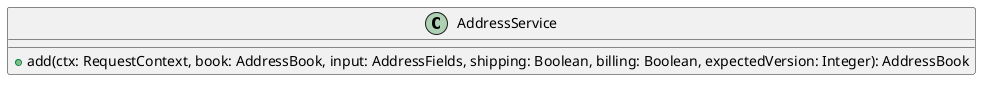

# UC-13 — Add a delivery address

### Description

Enter a new address and optional default-address selections, then return to the address book.

### Actors

Primary: Customer. Supporting: web client and application service.

### Priority

Medium.

### Trigger

**TRG-UC-13-01** — The customer chooses Add New in My Info.

### Preconditions

- **PRE-UC-13-01** — The Add Address form is displayed.

### Postconditions

- **POST-UC-13-01** — The client displays the returned address book.

### Basic Flow

1. The customer enters the address fields and delivery instructions.
2. The customer chooses the default shipping and default billing checkboxes as desired.
3. The customer chooses Save.
4. The client submits the address form.
5. The system returns the saved address book.
6. The client displays the address cards.

### Alternative Flows

#### AF-UC-13-01

1. The customer chooses Cancel.
2. The client returns to My Info.

### Exception Flows

#### EF-UC-13-01

1. The system returns an operation conflict.
2. The client refreshes the address book.
3. The client asks the customer to review and submit the form again.

### UML Model

Vocabulary imports: [shared domain model](shared-domain-model.md). This local service model extends that vocabulary.



### Business Rules

```ocl
-- BR-UC-13-01
-- Source: Assumption
context AddressService::add(ctx: RequestContext, book: AddressBook, input: AddressFields, shipping: Boolean, billing: Boolean, expectedVersion: Integer): AddressBook
pre BR_UC_13_01_AccountBook:
  ctx.authenticated and ctx.csrfValid and book.customerId = ctx.customerId
```
```ocl
-- BR-UC-13-02
-- Source: Assumption
context AddressService::add(ctx: RequestContext, book: AddressBook, input: AddressFields, shipping: Boolean, billing: Boolean, expectedVersion: Integer): AddressBook
pre BR_UC_13_02_ExpectedRevision:
  expectedVersion = book.version
```
```ocl
-- BR-UC-13-03
-- Source: Assumption
context AddressService::add(ctx: RequestContext, book: AddressBook, input: AddressFields, shipping: Boolean, billing: Boolean, expectedVersion: Integer): AddressBook
pre BR_UC_13_03_AddressAccepted:
  AddressValidation::valid(input)
```
```ocl
-- BR-UC-13-04
-- Source: Assumption
context AddressService::add(ctx: RequestContext, book: AddressBook, input: AddressFields, shipping: Boolean, billing: Boolean, expectedVersion: Integer): AddressBook
post BR_UC_13_04_AddressCreated:
  result = book and result.version = expectedVersion + 1 and result.items->size() = book.items@pre->size() + 1 and result.items->one(a | a.oclIsNew() and a.customerId = ctx.customerId and a.details = input and a.defaultShipping = shipping and a.defaultBilling = billing)
```
```ocl
-- BR-UC-13-05
-- Source: Assumption
context AddressService::add(ctx: RequestContext, book: AddressBook, input: AddressFields, shipping: Boolean, billing: Boolean, expectedVersion: Integer): AddressBook
post BR_UC_13_05_PreserveEntries:
  book.items@pre->forAll(a | result.items->includes(a) and a.details = a.details@pre and a.defaultShipping = (if shipping then false else a.defaultShipping@pre endif) and a.defaultBilling = (if billing then false else a.defaultBilling@pre endif))
```
```ocl
-- BR-UC-13-06
-- Source: Assumption
context AddressBook
inv BR_UC_13_06_CustomerAddresses:
  self.items->forAll(a | a.customerId = self.customerId)
```
```ocl
-- BR-UC-13-07
-- Source: Assumption
context AddressValidation::valid(input: AddressFields): Boolean
post BR_UC_13_07_RequiredAddressValues:
  result = (TextSyntax::nonBlank(input.firstName) and TextSyntax::nonBlank(input.lastName) and TextSyntax::nonBlank(input.country) and TextSyntax::nonBlank(input.street) and TextSyntax::nonBlank(input.city) and TextSyntax::nonBlank(input.state) and TextSyntax::nonBlank(input.postalCode) and TextSyntax::nonBlank(input.phone))
```

### Related UI

- [Figma node 279:1003](https://www.figma.com/design/WcpUgAYaQJA4J00rMaMgj8/Euphoria?node-id=279-1003)
- [Figma node 275:1168](https://www.figma.com/design/WcpUgAYaQJA4J00rMaMgj8/Euphoria?node-id=275-1168)

### Related APIs

- [API-ADDRESSES](../api/api-addresses.md)
- [API-ADDRESS-CREATE](../api/api-address-create.md)

### Notes

Screen and text-layer evidence establishes the visible goal. Service decomposition, request shapes, and exception recovery are proposed implementation contracts; they are not extracted server behavior. See [assumptions](../ASSUMPTIONS.md) and [coverage](../coverage-report.md) for the supported boundary. No prototype interaction wiring was available for verification.
