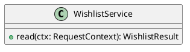

# UC-14 — View saved wishlist products

### Description

Read saved product cards or the empty-wishlist state.

### Actors

Primary: Customer. Supporting: web client and application service.

### Priority

Medium.

### Trigger

**TRG-UC-14-01** — The customer chooses Wishlist.

### Preconditions

- **PRE-UC-14-01** — The My Account area is displayed.

### Postconditions

- **POST-UC-14-01** — The client displays the returned wishlist state.

### Basic Flow

1. The customer chooses Wishlist.
2. The client requests the wishlist.
3. The system returns saved product cards.
4. The client displays the wishlist cards.
5. The customer selects a card.
6. The client opens the product detail.

### Alternative Flows

#### AF-UC-14-01

1. The system returns a wishlist with no saved cards.
2. The client displays Your wishlist is empty and the Shop entry point.

### Exception Flows

#### EF-UC-14-01

1. The system returns a rejected authentication context.
2. The client presents the sign-in entry point.

### UML Model

Vocabulary imports: [shared domain model](shared-domain-model.md). This local service model extends that vocabulary.



### Business Rules

```ocl
-- BR-UC-14-01
-- Source: Assumption
context WishlistService::read(ctx: RequestContext): WishlistResult
pre BR_UC_14_01_AccountContext:
  ctx.authenticated
```
```ocl
-- BR-UC-14-02
-- Source: Assumption
context WishlistService::read(ctx: RequestContext): WishlistResult
post BR_UC_14_02_SavedCards:
  result.items->asSet() = WishlistEntry.allInstances()->select(w | w.customerId = ctx.customerId and w.product.published)->collect(w | w.product)->asSet() and result.items->forAll(a,b | let wa : WishlistEntry = WishlistEntry.allInstances()->any(w | w.customerId = ctx.customerId and w.product = a) in let wb : WishlistEntry = WishlistEntry.allInstances()->any(w | w.customerId = ctx.customerId and w.product = b) in wa.createdAt > wb.createdAt implies result.items->indexOf(a) < result.items->indexOf(b))
```
```ocl
-- BR-UC-14-03
-- Source: Assumption
context WishlistEntry
inv BR_UC_14_03_SavedOnce:
  WishlistEntry.allInstances()->isUnique(w | Tuple{customerId = w.customerId, productId = w.product.id})
```
```ocl
-- BR-UC-14-04
-- Source: Assumption
context WishlistService::read(ctx: RequestContext): WishlistResult
post BR_UC_14_04_CardCount:
  result.items->size() = WishlistEntry.allInstances()->select(w | w.customerId = ctx.customerId and w.product.published)->size()
```
```ocl
-- BR-UC-14-05
-- Source: Assumption
context WishlistService::read(ctx: RequestContext): WishlistResult
post BR_UC_14_05_StableSavedOrder:
  result.items->forAll(a,b | let wa : WishlistEntry = WishlistEntry.allInstances()->any(w | w.customerId = ctx.customerId and w.product = a) in let wb : WishlistEntry = WishlistEntry.allInstances()->any(w | w.customerId = ctx.customerId and w.product = b) in wa.createdAt = wb.createdAt and a.displayRank < b.displayRank implies result.items->indexOf(a) < result.items->indexOf(b))
```
```ocl
-- BR-UC-14-06
-- Source: Assumption
context WishlistService::read(ctx: RequestContext): WishlistResult
post BR_UC_14_06_SavedEntriesUnchanged:
  WishlistEntry.allInstances() = WishlistEntry.allInstances()@pre and WishlistEntry.allInstances()->forAll(w | w.customerId = w.customerId@pre and w.product = w.product@pre and w.createdAt = w.createdAt@pre)
```
```ocl
-- BR-UC-14-07
-- Source: Assumption
context WishlistService::read(ctx: RequestContext): WishlistResult
post BR_UC_14_07_CartUnchanged:
  Cart.allInstances()->forAll(c | c.items = c.items@pre and c.version = c.version@pre)
```

### Related UI

- [Figma node 290:855](https://www.figma.com/design/WcpUgAYaQJA4J00rMaMgj8/Euphoria?node-id=290-855)
- [Figma node 299:1027](https://www.figma.com/design/WcpUgAYaQJA4J00rMaMgj8/Euphoria?node-id=299-1027)

### Related APIs

- [API-WISHLIST](../api/api-wishlist.md)
- [API-PRODUCT](../api/api-product.md)

### Notes

Screen and text-layer evidence establishes the visible goal. Service decomposition, request shapes, and exception recovery are proposed implementation contracts; they are not extracted server behavior. See [assumptions](../ASSUMPTIONS.md) and [coverage](../coverage-report.md) for the supported boundary. No prototype interaction wiring was available for verification.
