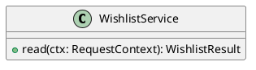

# UC-15 — Rediscover recently viewed products

### Description

Use Recently Viewed on the empty-wishlist screen to reopen a product.

### Actors

Primary: Customer. Supporting: web client and application service.

### Priority

Medium.

### Trigger

**TRG-UC-15-01** — The customer opens Recently Viewed from the empty-wishlist screen.

### Preconditions

- **PRE-UC-15-01** — The empty-wishlist screen is displayed.

### Postconditions

- **POST-UC-15-01** — The client displays a selected product detail.

### Basic Flow

1. The customer opens Recently Viewed.
2. The client requests the wishlist screen content.
3. The system returns recently viewed cards.
4. The client displays the cards.
5. The customer selects a card.
6. The client requests and displays its product detail.

### Alternative Flows

#### AF-UC-15-01

1. The customer chooses the Shop entry point.
2. The client opens the product listing.

### Exception Flows

#### EF-UC-15-01

1. The system returns a rejected authentication context.
2. The client presents the sign-in entry point.

### UML Model

Vocabulary imports: [shared domain model](shared-domain-model.md). This local service model extends that vocabulary.



### Business Rules

```ocl
-- BR-UC-15-01
-- Source: Assumption
context WishlistService::read(ctx: RequestContext): WishlistResult
pre BR_UC_15_01_CustomerContext:
  ctx.authenticated
```
```ocl
-- BR-UC-15-02
-- Source: Assumption
context WishlistService::read(ctx: RequestContext): WishlistResult
post BR_UC_15_02_ViewedMembership:
  result.recentlyViewed->asSet() = ViewedProduct.allInstances()->select(v | v.customerId = ctx.customerId and v.product.published)->collect(v | v.product)->asSet()
```
```ocl
-- BR-UC-15-03
-- Source: Assumption
context ViewedProduct
inv BR_UC_15_03_RecentOnce:
  ViewedProduct.allInstances()->isUnique(v | Tuple{customerId = v.customerId, productId = v.product.id})
```
```ocl
-- BR-UC-15-04
-- Source: Assumption
context WishlistService::read(ctx: RequestContext): WishlistResult
post BR_UC_15_04_RecentSequence:
  result.recentlyViewed->forAll(a,b | let va : ViewedProduct = ViewedProduct.allInstances()->any(v | v.customerId = ctx.customerId and v.product = a) in let vb : ViewedProduct = ViewedProduct.allInstances()->any(v | v.customerId = ctx.customerId and v.product = b) in va.viewedAt > vb.viewedAt implies result.recentlyViewed->indexOf(a) < result.recentlyViewed->indexOf(b))
```
```ocl
-- BR-UC-15-05
-- Source: Assumption
context WishlistService::read(ctx: RequestContext): WishlistResult
post BR_UC_15_05_RecentTies:
  result.recentlyViewed->forAll(a,b | let va : ViewedProduct = ViewedProduct.allInstances()->any(v | v.customerId = ctx.customerId and v.product = a) in let vb : ViewedProduct = ViewedProduct.allInstances()->any(v | v.customerId = ctx.customerId and v.product = b) in va.viewedAt = vb.viewedAt and a.displayRank < b.displayRank implies result.recentlyViewed->indexOf(a) < result.recentlyViewed->indexOf(b))
```
```ocl
-- BR-UC-15-06
-- Source: Assumption
context WishlistService::read(ctx: RequestContext): WishlistResult
post BR_UC_15_06_RecentCardIdentity:
  result.recentlyViewed->isUnique(id)
```
```ocl
-- BR-UC-15-07
-- Source: Assumption
context WishlistService::read(ctx: RequestContext): WishlistResult
post BR_UC_15_07_ViewingHistoryUnchanged:
  ViewedProduct.allInstances() = ViewedProduct.allInstances()@pre and ViewedProduct.allInstances()->forAll(v | v.product = v.product@pre and v.customerId = v.customerId@pre and v.viewedAt = v.viewedAt@pre)
```

### Related UI

- [Figma node 299:1027](https://www.figma.com/design/WcpUgAYaQJA4J00rMaMgj8/Euphoria?node-id=299-1027)

### Related APIs

- [API-WISHLIST](../api/api-wishlist.md)
- [API-PRODUCT](../api/api-product.md)

### Notes

Screen and text-layer evidence establishes the visible goal. Service decomposition, request shapes, and exception recovery are proposed implementation contracts; they are not extracted server behavior. See [assumptions](../ASSUMPTIONS.md) and [coverage](../coverage-report.md) for the supported boundary. No prototype interaction wiring was available for verification.
