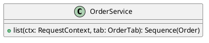

# UC-16 — View order history

### Description

Open My Orders and read the displayed summaries before opening a selected order.

### Actors

Primary: Customer. Supporting: web client and application service.

### Priority

Medium.

### Trigger

**TRG-UC-16-01** — The customer chooses My orders.

### Preconditions

- **PRE-UC-16-01** — The My Account area is displayed.

### Postconditions

- **POST-UC-16-01** — The client displays the returned order summaries.

### Basic Flow

1. The customer chooses My orders.
2. The client requests the displayed tab.
3. The system returns order summaries.
4. The client displays order numbers, dates, statuses, delivery estimates, payment labels, items, and totals.
5. The customer opens an order.
6. The client requests and displays its detail.

### Alternative Flows

#### AF-UC-16-01

1. The customer returns to My Info.
2. The client opens My Info.

### Exception Flows

#### EF-UC-16-01

1. The system returns a temporary service failure.
2. The client presents a retry action in the order list.

### UML Model

Vocabulary imports: [shared domain model](shared-domain-model.md). This local service model extends that vocabulary.



### Business Rules

```ocl
-- BR-UC-16-01
-- Source: Assumption
context OrderService::list(ctx: RequestContext, tab: OrderTab): Sequence(Order)
pre BR_UC_16_01_AccountContext:
  ctx.authenticated
```
```ocl
-- BR-UC-16-02
-- Source: Assumption
context OrderService::list(ctx: RequestContext, tab: OrderTab): Sequence(Order)
post BR_UC_16_02_CustomerSummaries:
  result->forAll(o | o.customerId = ctx.customerId)
```
```ocl
-- BR-UC-16-03
-- Source: Assumption
context OrderService::list(ctx: RequestContext, tab: OrderTab): Sequence(Order)
post BR_UC_16_03_DistinctOrders:
  result->isUnique(id)
```
```ocl
-- BR-UC-16-04
-- Source: Assumption
context OrderService::list(ctx: RequestContext, tab: OrderTab): Sequence(Order)
post BR_UC_16_04_RecentFirst:
  result->forAll(a,b | a.placedAt > b.placedAt implies result->indexOf(a) < result->indexOf(b))
```
```ocl
-- BR-UC-16-05
-- Source: Assumption
context OrderService::list(ctx: RequestContext, tab: OrderTab): Sequence(Order)
post BR_UC_16_05_PlacementTies:
  result->forAll(a,b | a.placedAt = b.placedAt and a.number < b.number implies result->indexOf(a) < result->indexOf(b))
```
```ocl
-- BR-UC-16-06
-- Source: Assumption
context Order
inv BR_UC_16_06_OrderNumberIdentity:
  Order.allInstances()->isUnique(number)
```
```ocl
-- BR-UC-16-07
-- Source: Assumption
context OrderService::list(ctx: RequestContext, tab: OrderTab): Sequence(Order)
post BR_UC_16_07_SummarySnapshotPreserved:
  Order.allInstances()->forAll(o | o.status = o.status@pre and o.total = o.total@pre and o.paymentMethod = o.paymentMethod@pre and o.placedAt = o.placedAt@pre and o.items = o.items@pre)
```

### Related UI

- [Figma node 290:1372](https://www.figma.com/design/WcpUgAYaQJA4J00rMaMgj8/Euphoria?node-id=290-1372)

### Related APIs

- [API-ORDERS](../api/api-orders.md)
- [API-ORDER-DETAIL](../api/api-order-detail.md)

### Notes

Screen and text-layer evidence establishes the visible goal. Service decomposition, request shapes, and exception recovery are proposed implementation contracts; they are not extracted server behavior. See [assumptions](../ASSUMPTIONS.md) and [coverage](../coverage-report.md) for the supported boundary. No prototype interaction wiring was available for verification.
