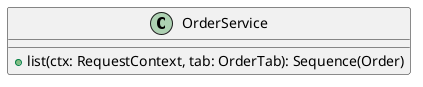

# UC-17 — Filter orders by status

### Description

Switch between Active, Cancelled, and Completed order-history views.

### Actors

Primary: Customer. Supporting: web client and application service.

### Priority

Medium.

### Trigger

**TRG-UC-17-01** — The customer chooses an order-history tab.

### Preconditions

- **PRE-UC-17-01** — My Orders and its tabs are displayed.

### Postconditions

- **POST-UC-17-01** — The client displays the returned order-history view.

### Basic Flow

1. The customer chooses Active, Cancelled, or Completed.
2. The client requests the chosen view.
3. The system returns order summaries.
4. The client displays the summaries and highlights the chosen tab.

### Alternative Flows

#### AF-UC-17-01

1. The customer chooses a different tab.
2. The client requests and displays that view.

### Exception Flows

#### EF-UC-17-01

1. The system returns a temporary service failure.
2. The client presents a retry action in the order list.

### UML Model

Vocabulary imports: [shared domain model](shared-domain-model.md). This local service model extends that vocabulary.



### Business Rules

```ocl
-- BR-UC-17-01
-- Source: Assumption
context OrderService::list(ctx: RequestContext, tab: OrderTab): Sequence(Order)
post BR_UC_17_01_ActiveMembership:
  tab = OrderTab::ACTIVE implies result->forAll(o | Set{OrderStatus::PLACED, OrderStatus::IN_PROGRESS, OrderStatus::SHIPPED}->includes(o.status))
```
```ocl
-- BR-UC-17-02
-- Source: Assumption
context OrderService::list(ctx: RequestContext, tab: OrderTab): Sequence(Order)
post BR_UC_17_02_CancelledMembership:
  tab = OrderTab::CANCELLED implies result->forAll(o | o.status = OrderStatus::CANCELLED)
```
```ocl
-- BR-UC-17-03
-- Source: Assumption
context OrderService::list(ctx: RequestContext, tab: OrderTab): Sequence(Order)
post BR_UC_17_03_CompletedMembership:
  tab = OrderTab::COMPLETED implies result->forAll(o | o.status = OrderStatus::DELIVERED)
```
```ocl
-- BR-UC-17-04
-- Source: Assumption
context OrderService::list(ctx: RequestContext, tab: OrderTab): Sequence(Order)
post BR_UC_17_04_TabMembership:
  result->asSet() = Order.allInstances()->select(o | o.customerId = ctx.customerId and (if tab = OrderTab::ACTIVE then Set{OrderStatus::PLACED, OrderStatus::IN_PROGRESS, OrderStatus::SHIPPED}->includes(o.status) else if tab = OrderTab::COMPLETED then o.status = OrderStatus::DELIVERED else o.status = OrderStatus::CANCELLED endif endif))
```
```ocl
-- BR-UC-17-05
-- Source: Assumption
context OrderService::list(ctx: RequestContext, tab: OrderTab): Sequence(Order)
post BR_UC_17_05_NoCancellationAction:
  Order.allInstances() = Order.allInstances()@pre and Order.allInstances()->forAll(o | o.status = o.status@pre and o.version = o.version@pre)
```
```ocl
-- BR-UC-17-06
-- Source: Assumption
context OrderService::list(ctx: RequestContext, tab: OrderTab): Sequence(Order)
post BR_UC_17_06_EventsPreserved:
  OrderEvent.allInstances() = OrderEvent.allInstances()@pre and OrderEvent.allInstances()->forAll(e | e.status = e.status@pre and e.occurredAt = e.occurredAt@pre and e.message = e.message@pre)
```
```ocl
-- BR-UC-17-07
-- Source: Assumption
context OrderService::list(ctx: RequestContext, tab: OrderTab): Sequence(Order)
post BR_UC_17_07_PaymentChoicePreserved:
  Order.allInstances()->forAll(o | o.paymentMethod = o.paymentMethod@pre and o.total = o.total@pre)
```

### Related UI

- [Figma node 290:1372](https://www.figma.com/design/WcpUgAYaQJA4J00rMaMgj8/Euphoria?node-id=290-1372)

### Related APIs

- [API-ORDERS](../api/api-orders.md)

### Notes

Screen and text-layer evidence establishes the visible goal. Service decomposition, request shapes, and exception recovery are proposed implementation contracts; they are not extracted server behavior. See [assumptions](../ASSUMPTIONS.md) and [coverage](../coverage-report.md) for the supported boundary. No prototype interaction wiring was available for verification.
