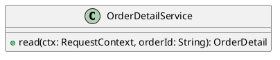

# UC-18 — View order details and progress

### Description

Inspect the order line summary and the Order Placed, Inprogress, Shipped, and Delivered progress display.

### Actors

Primary: Customer. Supporting: web client and application service.

### Priority

Medium.

### Trigger

**TRG-UC-18-01** — The customer opens an order from My Orders.

### Preconditions

- **PRE-UC-18-01** — The client has an order identifier from the order list.

### Postconditions

- **POST-UC-18-01** — The client displays the returned order details and timeline.

### Basic Flow

1. The customer opens an order.
2. The client requests its detail.
3. The system returns the order summary and timeline.
4. The client displays the order number, placement time, total, product lines, progress stages, and event message.

### Alternative Flows

#### AF-UC-18-01

1. The customer returns to My orders.
2. The client displays the order list.

### Exception Flows

#### EF-UC-18-01

1. The system returns an unavailable resource response.
2. The client displays the unavailable order message.
3. The customer returns to the order list.

### UML Model

Vocabulary imports: [shared domain model](shared-domain-model.md). This local service model extends that vocabulary.



### Business Rules

```ocl
-- BR-UC-18-01
-- Source: Assumption
context OrderDetailService::read(ctx: RequestContext, orderId: String): OrderDetail
pre BR_UC_18_01_CustomerOrder:
  ctx.authenticated and Order.allInstances()->exists(o | o.id = orderId and o.customerId = ctx.customerId)
```
```ocl
-- BR-UC-18-02
-- Source: Assumption
context OrderDetailService::read(ctx: RequestContext, orderId: String): OrderDetail
post BR_UC_18_02_OrderIdentity:
  result.order.id = orderId and result.order.customerId = ctx.customerId
```
```ocl
-- BR-UC-18-03
-- Source: Assumption
context OrderDetailService::read(ctx: RequestContext, orderId: String): OrderDetail
post BR_UC_18_03_TimelineSequence:
  result.events = result.order.events->sortedBy(e | e.occurredAt) and result.events->forAll(e | e.orderId = orderId)
```
```ocl
-- BR-UC-18-04
-- Source: Assumption
context Order
inv BR_UC_18_04_ItemAmounts:
  self.items->forAll(l | l.lineTotal.amount = l.quantity * l.unitPrice.amount and l.quantity > 0 and l.unitPrice.amount >= 0)
```
```ocl
-- BR-UC-18-05
-- Source: Assumption
context Order
inv BR_UC_18_05_CurrencyAgreement:
  self.items->forAll(l | l.unitPrice.currency = self.total.currency and l.lineTotal.currency = self.total.currency) and self.total.currency = self.subtotal.currency and self.total.currency = self.discount.currency and self.total.currency = self.shippingCharge.currency
```
```ocl
-- BR-UC-18-06
-- Source: Assumption
context Order
inv BR_UC_18_06_Subtotal:
  self.subtotal.amount = self.items->collect(l | l.lineTotal.amount)->sum()
```
```ocl
-- BR-UC-18-07
-- Source: Assumption
context Order
inv BR_UC_18_07_Total:
  self.total.amount = self.subtotal.amount - self.discount.amount + self.shippingCharge.amount and self.discount.amount >= 0 and self.shippingCharge.amount >= 0 and self.total.amount >= 0
```
```ocl
-- BR-UC-18-08
-- Source: Assumption
context Order
inv BR_UC_18_08_ItemIdentity:
  self.items->isUnique(variantId) and self.items->forAll(l | l.orderId = self.id)
```

### Related UI

- [Figma node 295:949](https://www.figma.com/design/WcpUgAYaQJA4J00rMaMgj8/Euphoria?node-id=295-949)

### Related APIs

- [API-ORDER-DETAIL](../api/api-order-detail.md)

### Notes

Screen and text-layer evidence establishes the visible goal. Service decomposition, request shapes, and exception recovery are proposed implementation contracts; they are not extracted server behavior. See [assumptions](../ASSUMPTIONS.md) and [coverage](../coverage-report.md) for the supported boundary. No prototype interaction wiring was available for verification.
