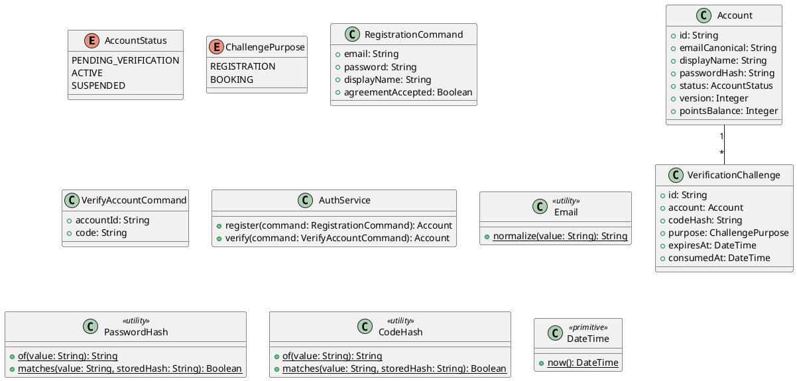

# UC-01 — Register an Account

### Description

A visitor creates a customer account from the sign-up form.

### Actors

Visitor; client; system.

### Priority

P0.

### Trigger

**TRG-UC-01-01** — The visitor opens Sign Up.

### Preconditions

- **PRE-UC-01-01** — The sign-up form is visible.

### Postconditions

- **POST-UC-01-01** — The client displays the registration outcome and its next action.

### Basic Flow

1. The visitor opens the sign-up form.
2. The client displays the form fields and agreement control.
3. The visitor enters account details and submits the form.
4. The client sends the registration request.
5. The system returns the account outcome and verification prompt.
6. The visitor enters the displayed code.
7. The client submits verification and displays the returned completion.

### Alternative Flows

#### AF-UC-01-01

1. The visitor switches to the sign-in form, and the client displays it.

### Exception Flows

#### EF-UC-01-01

1. The client displays the returned registration error and keeps the form available.

### UML Model



### Business Rules

```ocl
-- BR-UC-01-01
-- Source: Assumption
context AuthService::register(command: RegistrationCommand): Account
pre BR_UC_01_01_EmailIsUnique:
  Account.allInstances()->forAll(a | a.emailCanonical <> Email::normalize(command.email))
```
```ocl
-- BR-UC-01-02
-- Source: Assumption
context AuthService::register(command: RegistrationCommand): Account
post BR_UC_01_02_PasswordIsStoredAsHash:
  result.passwordHash = PasswordHash::of(command.password) and result.passwordHash <> command.password
```
```ocl
-- BR-UC-01-03
-- Source: Assumption
context AuthService::register(command: RegistrationCommand): Account
post BR_UC_01_03_NewAccountAwaitsVerification:
  result.status = AccountStatus::PENDING_VERIFICATION
```
```ocl
-- BR-UC-01-04
-- Source: Assumption
context AuthService::register(command: RegistrationCommand): Account
post BR_UC_01_04_RegistrationChallengeIsCreated:
  VerificationChallenge.allInstances()->exists(v | v.account.id = result.id and v.purpose = ChallengePurpose::REGISTRATION and v.codeHash <> null and v.expiresAt > DateTime::now())
```
```ocl
-- BR-UC-01-05
-- Source: Assumption
context AuthService::verify(command: VerifyAccountCommand): Account
pre BR_UC_01_05_RegistrationChallengeMatches:
  VerificationChallenge.allInstances()->exists(v | v.account.id = command.accountId and v.purpose = ChallengePurpose::REGISTRATION and CodeHash::matches(command.code, v.codeHash) and v.expiresAt > DateTime::now() and v.consumedAt = null)
```
```ocl
-- BR-UC-01-06
-- Source: Assumption
context AuthService::verify(command: VerifyAccountCommand): Account
post BR_UC_01_06_VerificationActivatesAccount:
  result.id = command.accountId and result.status = AccountStatus::ACTIVE
```
```ocl
-- BR-UC-01-07
-- Source: Assumption
context AuthService::register(command: RegistrationCommand): Account
post BR_UC_01_07_AccountFieldsAreCanonical:
  result.emailCanonical = Email::normalize(command.email) and result.displayName = command.displayName
```
```ocl
-- BR-UC-01-08
-- Source: Assumption
context AuthService::register(command: RegistrationCommand): Account
pre BR_UC_01_08_AgreementIsAccepted:
  command.agreementAccepted = true
```
```ocl
-- BR-UC-01-09
-- Source: Assumption
context AuthService::verify(command: VerifyAccountCommand): Account
post BR_UC_01_09_RegistrationChallengeIsConsumed:
  VerificationChallenge.allInstances()->exists(v | v.account.id = command.accountId and v.purpose = ChallengePurpose::REGISTRATION and v.consumedAt <> null)
```

### Related UI

- [Sign Up](https://www.figma.com/design/BKc1SojjRCQwSPPzZpvDn2/Table-Booking-Restaurant-Application--Web---Mobile---Admin-Panels---Community---Copy-?node-id=339-1015) (`339:1015`)
- [Sign Up Popup Web](https://www.figma.com/design/BKc1SojjRCQwSPPzZpvDn2/Table-Booking-Restaurant-Application--Web---Mobile---Admin-Panels---Community---Copy-?node-id=2178-2751) (`2178:2751`)
- [registration OTP state](https://www.figma.com/design/BKc1SojjRCQwSPPzZpvDn2/Table-Booking-Restaurant-Application--Web---Mobile---Admin-Panels---Community---Copy-?node-id=395-748) (`395:748`)

### Related APIs

- [API-ACCOUNT-REGISTER](../api/api-account-register.md)
- [API-ACCOUNT-VERIFY](../api/api-account-verify.md)

### Notes

The UI establishes the interaction boundary. Rule values and persistence behavior are explicit assumptions in [ASSUMPTIONS.md](../ASSUMPTIONS.md).
