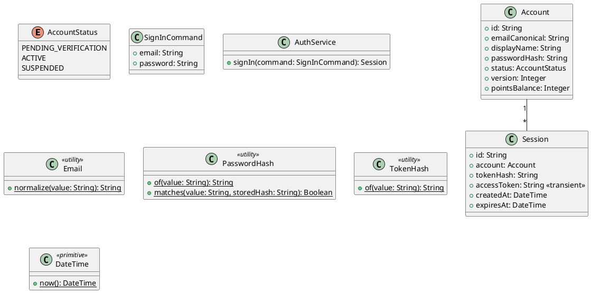

# UC-02 — Sign In

### Description

A customer signs in using the account form.

### Actors

Customer; client; system.

### Priority

P0.

### Trigger

**TRG-UC-02-01** — The customer opens Sign In.

### Preconditions

- **PRE-UC-02-01** — The sign-in form is visible.

### Postconditions

- **POST-UC-02-01** — The client displays the sign-in result.

### Basic Flow

1. The customer opens the sign-in form.
2. The client displays credential inputs.
3. The customer submits credentials.
4. The client sends the sign-in request.
5. The system returns a session outcome.
6. The client presents the signed-in view.

### Alternative Flows

#### AF-UC-02-01

1. The customer opens the sign-up form from the sign-in view.

### Exception Flows

#### EF-UC-02-01

1. The client displays the returned sign-in error and offers another attempt.

### UML Model



### Business Rules

```ocl
-- BR-UC-02-01
-- Source: Assumption
context AuthService::signIn(command: SignInCommand): Session
pre BR_UC_02_01_CredentialMatches:
  Account.allInstances()->exists(a | a.emailCanonical = Email::normalize(command.email) and PasswordHash::matches(command.password, a.passwordHash) and a.status = AccountStatus::ACTIVE)
```
```ocl
-- BR-UC-02-02
-- Source: Assumption
context AuthService::signIn(command: SignInCommand): Session
post BR_UC_02_02_SessionReferenceIsHashed:
  result.tokenHash = TokenHash::of(result.accessToken) and result.tokenHash <> result.accessToken
```
```ocl
-- BR-UC-02-03
-- Source: Assumption
context AuthService::signIn(command: SignInCommand): Session
pre BR_UC_02_03_EmailIsProvided:
  command.email.trim().size() > 0
```
```ocl
-- BR-UC-02-04
-- Source: Assumption
context AuthService::signIn(command: SignInCommand): Session
pre BR_UC_02_04_PasswordIsProvided:
  command.password.size() > 0
```
```ocl
-- BR-UC-02-05
-- Source: Assumption
context AuthService::signIn(command: SignInCommand): Session
post BR_UC_02_05_SessionBelongsToMatchedAccount:
  result.account.emailCanonical = Email::normalize(command.email)
```
```ocl
-- BR-UC-02-06
-- Source: Assumption
context AuthService::signIn(command: SignInCommand): Session
post BR_UC_02_06_SessionAccountIsActive:
  result.account.status = AccountStatus::ACTIVE
```
```ocl
-- BR-UC-02-07
-- Source: Assumption
context AuthService::signIn(command: SignInCommand): Session
post BR_UC_02_07_SessionHasValidityWindow:
  result.createdAt <= DateTime::now() and result.expiresAt > result.createdAt
```

### Related UI

- [Sign In with error msg](https://www.figma.com/design/BKc1SojjRCQwSPPzZpvDn2/Table-Booking-Restaurant-Application--Web---Mobile---Admin-Panels---Community---Copy-?node-id=394-488) (`394:488`)
- [Sign In Popup Web](https://www.figma.com/design/BKc1SojjRCQwSPPzZpvDn2/Table-Booking-Restaurant-Application--Web---Mobile---Admin-Panels---Community---Copy-?node-id=2178-2715) (`2178:2715`)

### Related APIs

- [API-SESSION-CREATE](../api/api-session-create.md)


### Notes

The UI establishes the interaction boundary. Rule values and persistence behavior are explicit assumptions in [ASSUMPTIONS.md](../ASSUMPTIONS.md).
