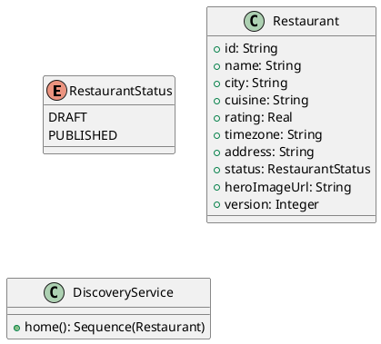

# UC-03 — Browse the Restaurant Home Page

### Description

A visitor views featured restaurants and entry points on the home page.

### Actors

Visitor; client; system.

### Priority

P0.

### Trigger

**TRG-UC-03-01** — The visitor opens the home page.

### Preconditions

- **PRE-UC-03-01** — The site is reachable.

### Postconditions

- **POST-UC-03-01** — The client presents the returned home content.

### Basic Flow

1. The visitor opens the home page.
2. The client requests home content.
3. The system returns restaurant cards and navigation content.
4. The client renders the cards and available actions.

### Alternative Flows

#### AF-UC-03-01

1. The visitor chooses a featured restaurant, and the client opens its detail view.

### Exception Flows

#### EF-UC-03-01

1. The client displays a retry state when home content cannot be loaded.

### UML Model



### Business Rules

```ocl
-- BR-UC-03-01
-- Source: Assumption
context DiscoveryService::home(): Sequence(Restaurant)
post BR_UC_03_01_PublishedRestaurantsOnly:
  result->forAll(r | r.status = RestaurantStatus::PUBLISHED)
```
```ocl
-- BR-UC-03-02
-- Source: Assumption
context DiscoveryService::home(): Sequence(Restaurant)
post BR_UC_03_02_FeaturedItemsHaveImages:
  result->forAll(r | r.heroImageUrl <> null)
```
```ocl
-- BR-UC-03-03
-- Source: Assumption
context DiscoveryService::home(): Sequence(Restaurant)
post BR_UC_03_03_FeaturedRestaurantsAreUnique:
  result->isUnique(r | r.id)
```
```ocl
-- BR-UC-03-04
-- Source: Assumption
context DiscoveryService::home(): Sequence(Restaurant)
post BR_UC_03_04_FeaturedNamesArePresent:
  result->forAll(r | r.name.trim().size() > 0)
```
```ocl
-- BR-UC-03-05
-- Source: Assumption
context DiscoveryService::home(): Sequence(Restaurant)
post BR_UC_03_05_FeaturedCitiesArePresent:
  result->forAll(r | r.city.trim().size() > 0)
```
```ocl
-- BR-UC-03-06
-- Source: Assumption
context DiscoveryService::home(): Sequence(Restaurant)
post BR_UC_03_06_FeaturedRatingsAreBounded:
  result->forAll(r | r.rating >= 0 and r.rating <= 5)
```
```ocl
-- BR-UC-03-07
-- Source: Assumption
context DiscoveryService::home(): Sequence(Restaurant)
post BR_UC_03_07_FeaturedImagesAreNonempty:
  result->forAll(r | r.heroImageUrl.trim().size() > 0)
```

### Related UI

- [home](https://www.figma.com/design/BKc1SojjRCQwSPPzZpvDn2/Table-Booking-Restaurant-Application--Web---Mobile---Admin-Panels---Community---Copy-?node-id=102-170) (`102:170`)
- [home variant 1](https://www.figma.com/design/BKc1SojjRCQwSPPzZpvDn2/Table-Booking-Restaurant-Application--Web---Mobile---Admin-Panels---Community---Copy-?node-id=278-790) (`278:790`)
- [home variant 2](https://www.figma.com/design/BKc1SojjRCQwSPPzZpvDn2/Table-Booking-Restaurant-Application--Web---Mobile---Admin-Panels---Community---Copy-?node-id=173-362) (`173:362`)

### Related APIs

- [API-HOME-GET](../api/api-home-get.md)


### Notes

The UI establishes the interaction boundary. Rule values and persistence behavior are explicit assumptions in [ASSUMPTIONS.md](../ASSUMPTIONS.md).
