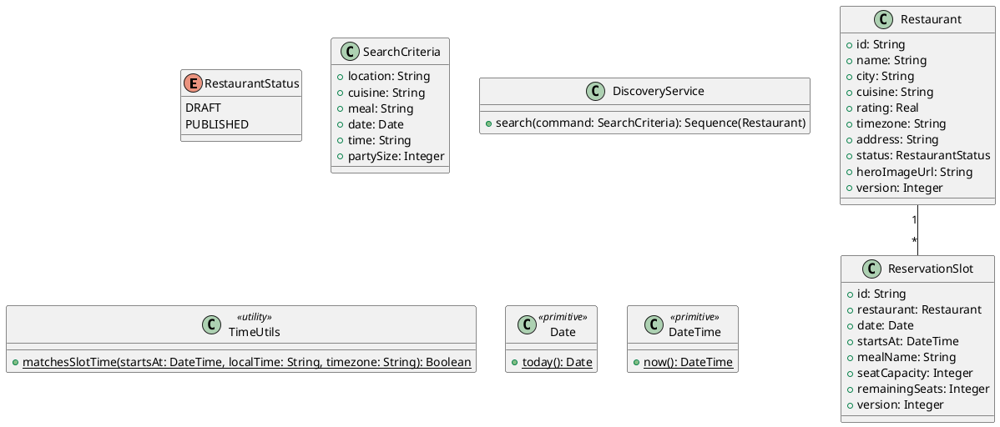

# UC-04 — Search Restaurants

### Description

A visitor searches for restaurants using the home search controls.

### Actors

Visitor; client; system.

### Priority

P0.

### Trigger

**TRG-UC-04-01** — The visitor submits a restaurant search.

### Preconditions

- **PRE-UC-04-01** — The search controls are visible.

### Postconditions

- **POST-UC-04-01** — The client displays a result or empty state.

### Basic Flow

1. The visitor enters location, cuisine, meal, date, time, and party details.
2. The client submits the search request.
3. The system returns matching restaurant cards.
4. The client renders the result list and search controls.

### Alternative Flows

#### AF-UC-04-01

1. The visitor changes the search inputs and requests a refreshed list.

### Exception Flows

#### EF-UC-04-01

1. The client displays a search error and keeps the entered inputs visible.

### UML Model



### Business Rules

```ocl
-- BR-UC-04-01
-- Source: Assumption
context DiscoveryService::search(command: SearchCriteria): Sequence(Restaurant)
pre BR_UC_04_01_PartySizePositive:
  command.partySize > 0
```
```ocl
-- BR-UC-04-02
-- Source: Assumption
context DiscoveryService::search(command: SearchCriteria): Sequence(Restaurant)
post BR_UC_04_02_OnlyPublishedMatches:
  result->forAll(r | r.status = RestaurantStatus::PUBLISHED and r.city = command.location and r.cuisine = command.cuisine)
```
```ocl
-- BR-UC-04-03
-- Source: Assumption
context DiscoveryService::search(command: SearchCriteria): Sequence(Restaurant)
post BR_UC_04_03_ResultsHaveRequestedSlots:
  result->forAll(r | ReservationSlot.allInstances()->exists(s | s.restaurant.id = r.id and s.date = command.date and s.mealName = command.meal and TimeUtils::matchesSlotTime(s.startsAt, command.time, r.timezone) and s.remainingSeats >= command.partySize))
```
```ocl
-- BR-UC-04-04
-- Source: Assumption
context DiscoveryService::search(command: SearchCriteria): Sequence(Restaurant)
pre BR_UC_04_04_SearchDateIsCurrentOrFuture:
  command.date >= Date::today()
```
```ocl
-- BR-UC-04-05
-- Source: Assumption
context DiscoveryService::search(command: SearchCriteria): Sequence(Restaurant)
pre BR_UC_04_05_LocationIsProvided:
  command.location.trim().size() > 0
```
```ocl
-- BR-UC-04-06
-- Source: Assumption
context DiscoveryService::search(command: SearchCriteria): Sequence(Restaurant)
pre BR_UC_04_06_CuisineIsProvided:
  command.cuisine.trim().size() > 0
```
```ocl
-- BR-UC-04-07
-- Source: Assumption
context DiscoveryService::search(command: SearchCriteria): Sequence(Restaurant)
pre BR_UC_04_07_MealIsProvided:
  command.meal.trim().size() > 0
```

### Related UI

- [home search controls](https://www.figma.com/design/BKc1SojjRCQwSPPzZpvDn2/Table-Booking-Restaurant-Application--Web---Mobile---Admin-Panels---Community---Copy-?node-id=102-170) (`102:170`)
- [Wireframes search results](https://www.figma.com/design/BKc1SojjRCQwSPPzZpvDn2/Table-Booking-Restaurant-Application--Web---Mobile---Admin-Panels---Community---Copy-?node-id=12-299) (`12:299`)

### Related APIs

- [API-RESTAURANT-SEARCH](../api/api-restaurant-search.md)


### Notes

The UI establishes the interaction boundary. Rule values and persistence behavior are explicit assumptions in [ASSUMPTIONS.md](../ASSUMPTIONS.md).
