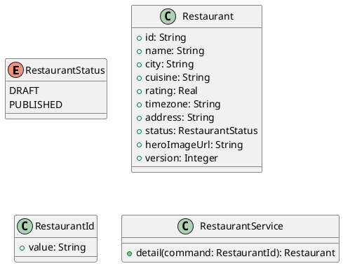

# UC-05 — View Restaurant Details

### Description

A visitor views a restaurant profile before reserving a table.

### Actors

Visitor; client; system.

### Priority

P0.

### Trigger

**TRG-UC-05-01** — The visitor opens a restaurant card.

### Preconditions

- **PRE-UC-05-01** — A restaurant card is visible.

### Postconditions

- **POST-UC-05-01** — The client displays the returned restaurant details.

### Basic Flow

1. The visitor selects a restaurant card.
2. The client requests the restaurant detail.
3. The system returns the restaurant profile.
4. The client displays photos, description, address, and booking entry point.

### Alternative Flows

#### AF-UC-05-01

1. The visitor moves from the profile to the menu or reservation view.

### Exception Flows

#### EF-UC-05-01

1. The client shows an unavailable-detail state with a way back to results.

### UML Model



### Business Rules

```ocl
-- BR-UC-05-01
-- Source: Assumption
context RestaurantService::detail(command: RestaurantId): Restaurant
pre BR_UC_05_01_RestaurantIsPublished:
  Restaurant.allInstances()->exists(r | r.id = command.value and r.status = RestaurantStatus::PUBLISHED)
```
```ocl
-- BR-UC-05-02
-- Source: Assumption
context RestaurantService::detail(command: RestaurantId): Restaurant
post BR_UC_05_02_RequestedRestaurantReturned:
  result.id = command.value
```
```ocl
-- BR-UC-05-03
-- Source: Assumption
context RestaurantService::detail(command: RestaurantId): Restaurant
post BR_UC_05_03_DetailRemainsPublished:
  result.status = RestaurantStatus::PUBLISHED
```
```ocl
-- BR-UC-05-04
-- Source: Assumption
context RestaurantService::detail(command: RestaurantId): Restaurant
post BR_UC_05_04_DetailNameIsPresent:
  result.name.trim().size() > 0
```
```ocl
-- BR-UC-05-05
-- Source: Assumption
context RestaurantService::detail(command: RestaurantId): Restaurant
post BR_UC_05_05_DetailAddressIsPresent:
  result.address.trim().size() > 0
```
```ocl
-- BR-UC-05-06
-- Source: Assumption
context RestaurantService::detail(command: RestaurantId): Restaurant
post BR_UC_05_06_DetailTimezoneIsPresent:
  result.timezone.trim().size() > 0
```
```ocl
-- BR-UC-05-07
-- Source: Assumption
context RestaurantService::detail(command: RestaurantId): Restaurant
post BR_UC_05_07_DetailRatingIsBounded:
  result.rating >= 0 and result.rating <= 5
```

### Related UI

- [single restaurant view page](https://www.figma.com/design/BKc1SojjRCQwSPPzZpvDn2/Table-Booking-Restaurant-Application--Web---Mobile---Admin-Panels---Community---Copy-?node-id=88-41) (`88:41`)
- [single restaurant page mobile](https://www.figma.com/design/BKc1SojjRCQwSPPzZpvDn2/Table-Booking-Restaurant-Application--Web---Mobile---Admin-Panels---Community---Copy-?node-id=4594-4056) (`4594:4056`)

### Related APIs

- [API-RESTAURANT-DETAIL](../api/api-restaurant-detail.md)


### Notes

The UI establishes the interaction boundary. Rule values and persistence behavior are explicit assumptions in [ASSUMPTIONS.md](../ASSUMPTIONS.md).
