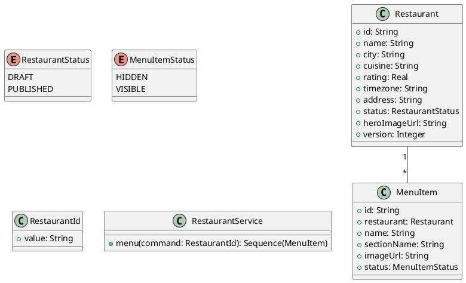

# UC-06 — View a Restaurant Menu

### Description

A visitor opens the menu shown from a restaurant profile.

### Actors

Visitor; client; system.

### Priority

P1.

### Trigger

**TRG-UC-06-01** — The visitor chooses the menu action.

### Preconditions

- **PRE-UC-06-01** — The restaurant profile is visible.

### Postconditions

- **POST-UC-06-01** — The client displays the returned menu items.

### Basic Flow

1. The visitor opens the restaurant menu.
2. The client requests menu content.
3. The system returns menu sections and items.
4. The client displays the menu overlay.

### Alternative Flows

#### AF-UC-06-01

1. The visitor closes the overlay and returns to restaurant details.

### Exception Flows

#### EF-UC-06-01

1. The client displays a menu loading error with a retry action.

### UML Model



### Business Rules

```ocl
-- BR-UC-06-01
-- Source: Assumption
context RestaurantService::menu(command: RestaurantId): Sequence(MenuItem)
post BR_UC_06_01_MenuBelongsToRestaurant:
  result->forAll(i | i.restaurant.id = command.value)
```
```ocl
-- BR-UC-06-02
-- Source: Assumption
context RestaurantService::menu(command: RestaurantId): Sequence(MenuItem)
post BR_UC_06_02_VisibleMenuItemsOnly:
  result->forAll(i | i.status = MenuItemStatus::VISIBLE)
```
```ocl
-- BR-UC-06-03
-- Source: Assumption
context RestaurantService::menu(command: RestaurantId): Sequence(MenuItem)
pre BR_UC_06_03_MenuRestaurantIsPublished:
  Restaurant.allInstances()->exists(r | r.id = command.value and r.status = RestaurantStatus::PUBLISHED)
```
```ocl
-- BR-UC-06-04
-- Source: Assumption
context RestaurantService::menu(command: RestaurantId): Sequence(MenuItem)
post BR_UC_06_04_MenuItemsAreUnique:
  result->isUnique(i | i.id)
```
```ocl
-- BR-UC-06-05
-- Source: Assumption
context RestaurantService::menu(command: RestaurantId): Sequence(MenuItem)
post BR_UC_06_05_MenuItemNamesArePresent:
  result->forAll(i | i.name.trim().size() > 0)
```
```ocl
-- BR-UC-06-06
-- Source: Assumption
context RestaurantService::menu(command: RestaurantId): Sequence(MenuItem)
post BR_UC_06_06_MenuSectionsArePresent:
  result->forAll(i | i.sectionName.trim().size() > 0)
```
```ocl
-- BR-UC-06-07
-- Source: Assumption
context RestaurantService::menu(command: RestaurantId): Sequence(MenuItem)
post BR_UC_06_07_MenuImagesArePresent:
  result->forAll(i | i.imageUrl <> null and i.imageUrl.trim().size() > 0)
```

### Related UI

- [menu card overlay](https://www.figma.com/design/BKc1SojjRCQwSPPzZpvDn2/Table-Booking-Restaurant-Application--Web---Mobile---Admin-Panels---Community---Copy-?node-id=321-429) (`321:429`)
- [restaurant profile](https://www.figma.com/design/BKc1SojjRCQwSPPzZpvDn2/Table-Booking-Restaurant-Application--Web---Mobile---Admin-Panels---Community---Copy-?node-id=88-41) (`88:41`)

### Related APIs

- [API-MENU-LIST](../api/api-menu-list.md)


### Notes

The UI establishes the interaction boundary. Rule values and persistence behavior are explicit assumptions in [ASSUMPTIONS.md](../ASSUMPTIONS.md).
