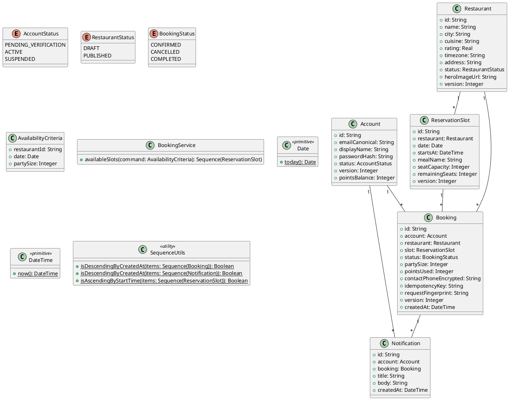

# UC-07 — Check Table Availability

### Description

A customer checks available reservation slots for a restaurant.

### Actors

Customer; client; system.

### Priority

P0.

### Trigger

**TRG-UC-07-01** — The customer opens the reservation controls.

### Preconditions

- **PRE-UC-07-01** — A restaurant detail or booking view is visible.

### Postconditions

- **POST-UC-07-01** — The client displays returned time slots or an empty state.

### Basic Flow

1. The customer selects dining date and party details.
2. The client requests available slots.
3. The system returns slot options.
4. The client renders the options and the unavailable state when applicable.

### Alternative Flows

#### AF-UC-07-01

1. The customer changes the date and views refreshed slots.

### Exception Flows

#### EF-UC-07-01

1. The client shows a retry state if slot retrieval fails.

### UML Model



### Business Rules

```ocl
-- BR-UC-07-01
-- Source: Assumption
context BookingService::availableSlots(command: AvailabilityCriteria): Sequence(ReservationSlot)
pre BR_UC_07_01_ValidSearchWindow:
  command.partySize > 0 and command.date >= Date::today()
```
```ocl
-- BR-UC-07-02
-- Source: Assumption
context BookingService::availableSlots(command: AvailabilityCriteria): Sequence(ReservationSlot)
post BR_UC_07_02_OnlyMatchingSlots:
  result->forAll(s | s.restaurant.id = command.restaurantId and s.date = command.date and s.remainingSeats >= command.partySize)
```
```ocl
-- BR-UC-07-03
-- Source: Assumption
context BookingService::availableSlots(command: AvailabilityCriteria): Sequence(ReservationSlot)
post BR_UC_07_03_SlotsAppearInTimeOrder:
  SequenceUtils::isAscendingByStartTime(result)
```
```ocl
-- BR-UC-07-04
-- Source: Assumption
context BookingService::availableSlots(command: AvailabilityCriteria): Sequence(ReservationSlot)
pre BR_UC_07_04_AvailabilityRestaurantIsPublished:
  Restaurant.allInstances()->exists(r | r.id = command.restaurantId and r.status = RestaurantStatus::PUBLISHED)
```
```ocl
-- BR-UC-07-05
-- Source: Assumption
context BookingService::availableSlots(command: AvailabilityCriteria): Sequence(ReservationSlot)
post BR_UC_07_05_AvailableSlotsAreUnique:
  result->isUnique(s | s.id)
```
```ocl
-- BR-UC-07-06
-- Source: Assumption
context BookingService::availableSlots(command: AvailabilityCriteria): Sequence(ReservationSlot)
post BR_UC_07_06_AvailableSlotsAreFuture:
  result->forAll(s | s.startsAt > DateTime::now())
```
```ocl
-- BR-UC-07-07
-- Source: Assumption
context BookingService::availableSlots(command: AvailabilityCriteria): Sequence(ReservationSlot)
post BR_UC_07_07_RemainingSeatsDoNotExceedCapacity:
  result->forAll(s | s.remainingSeats <= s.seatCapacity)
```

### Related UI

- [time slots reservation page](https://www.figma.com/design/BKc1SojjRCQwSPPzZpvDn2/Table-Booking-Restaurant-Application--Web---Mobile---Admin-Panels---Community---Copy-?node-id=772-1137) (`772:1137`)
- [not available](https://www.figma.com/design/BKc1SojjRCQwSPPzZpvDn2/Table-Booking-Restaurant-Application--Web---Mobile---Admin-Panels---Community---Copy-?node-id=772-1139) (`772:1139`)
- [select date](https://www.figma.com/design/BKc1SojjRCQwSPPzZpvDn2/Table-Booking-Restaurant-Application--Web---Mobile---Admin-Panels---Community---Copy-?node-id=772-1127) (`772:1127`)
- [restaurant booking view](https://www.figma.com/design/BKc1SojjRCQwSPPzZpvDn2/Table-Booking-Restaurant-Application--Web---Mobile---Admin-Panels---Community---Copy-?node-id=88-41) (`88:41`)
- [single restaurant page mobile](https://www.figma.com/design/BKc1SojjRCQwSPPzZpvDn2/Table-Booking-Restaurant-Application--Web---Mobile---Admin-Panels---Community---Copy-?node-id=4611-4460) (`4611:4460`)

### Related APIs

- [API-SLOT-LIST](../api/api-slot-list.md)


### Notes

The UI establishes the interaction boundary. Rule values and persistence behavior are explicit assumptions in [ASSUMPTIONS.md](../ASSUMPTIONS.md).
