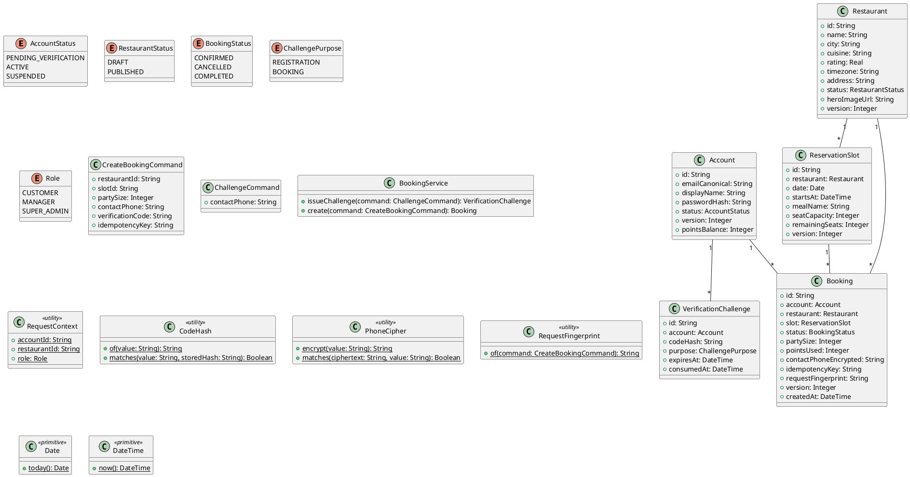

# UC-08 — Book a Table

### Description

A customer confirms a restaurant table reservation.

### Actors

Customer; client; system.

### Priority

P0.

### Trigger

**TRG-UC-08-01** — The customer chooses Confirm Booking.

### Preconditions

- **PRE-UC-08-01** — The booking form and a selected slot are visible.

### Postconditions

- **POST-UC-08-01** — The client displays the booking result.

### Basic Flow

1. The customer selects a time slot and enters booking details.
2. The client displays the confirmation view.
3. The client requests a confirmation code and displays the returned prompt.
4. The customer enters the code and confirms the booking.
5. The client submits the booking request.
6. The system returns a reservation outcome.
7. The client displays the returned confirmation.

### Alternative Flows

#### AF-UC-08-01

1. The customer returns to slot selection from the confirmation view.

### Exception Flows

#### EF-UC-08-01

1. The client displays the returned booking conflict and offers the slot list again.

### UML Model



### Business Rules

```ocl
-- BR-UC-08-01
-- Source: Assumption
context BookingService::create(command: CreateBookingCommand): Booking
pre BR_UC_08_01_SlotCanServeParty:
  Booking.allInstances()->exists(b | b.account.id = RequestContext::accountId and b.idempotencyKey = command.idempotencyKey) or ReservationSlot.allInstances()->exists(s | s.id = command.slotId and s.restaurant.id = command.restaurantId and s.remainingSeats >= command.partySize and s.startsAt > DateTime::now())
```
```ocl
-- BR-UC-08-02
-- Source: Assumption
context BookingService::create(command: CreateBookingCommand): Booking
pre BR_UC_08_02_VerifiedContact:
  Booking.allInstances()->exists(b | b.account.id = RequestContext::accountId and b.idempotencyKey = command.idempotencyKey) or VerificationChallenge.allInstances()->exists(v | v.account.id = RequestContext::accountId and v.purpose = ChallengePurpose::BOOKING and CodeHash::matches(command.verificationCode, v.codeHash) and v.expiresAt > DateTime::now() and v.consumedAt = null)
```
```ocl
-- BR-UC-08-03
-- Source: Assumption
context BookingService::create(command: CreateBookingCommand): Booking
post BR_UC_08_03_BookingIsBoundToSlotAndOwner:
  result.account.id = RequestContext::accountId and result.slot.id = command.slotId and result.status = BookingStatus::CONFIRMED
```
```ocl
-- BR-UC-08-04
-- Source: Assumption
context BookingService::create(command: CreateBookingCommand): Booking
post BR_UC_08_04_IdempotentCreation:
  let prior = Booking.allInstances()@pre->select(b | b.account.id = RequestContext::accountId and b.idempotencyKey = command.idempotencyKey) in if prior->notEmpty() then result.id = prior->any(b | true).id else Booking.allInstances()->select(b | b.account.id = RequestContext::accountId and b.idempotencyKey = command.idempotencyKey)->size() = 1 endif
```
```ocl
-- BR-UC-08-05
-- Source: Assumption
context BookingService::create(command: CreateBookingCommand): Booking
post BR_UC_08_05_SlotCapacityChangesAtomically:
  if Booking.allInstances()@pre->exists(b | b.account.id = RequestContext::accountId and b.idempotencyKey = command.idempotencyKey) then result.slot.remainingSeats = result.slot.remainingSeats@pre else ReservationSlot.allInstances()->one(s | s.id = command.slotId and s.remainingSeats = s.remainingSeats@pre - command.partySize and s.version = s.version@pre + 1) endif
```
```ocl
-- BR-UC-08-06
-- Source: Assumption
context BookingService::issueChallenge(command: ChallengeCommand): VerificationChallenge
post BR_UC_08_06_ChallengeStoresOnlyHash:
  result.codeHash <> null and result.purpose = ChallengePurpose::BOOKING and result.expiresAt > DateTime::now()
```
```ocl
-- BR-UC-08-07
-- Source: Assumption
context BookingService::create(command: CreateBookingCommand): Booking
pre BR_UC_08_07_ExistingKeyMatchesIntent:
  Booking.allInstances()->select(b | b.account.id = RequestContext::accountId and b.idempotencyKey = command.idempotencyKey)->forAll(b | b.requestFingerprint = RequestFingerprint::of(command))
```
```ocl
-- BR-UC-08-08
-- Source: Assumption
context BookingService::create(command: CreateBookingCommand): Booking
post BR_UC_08_08_BookingCopiesConfirmedParty:
  result.partySize = command.partySize and PhoneCipher::matches(result.contactPhoneEncrypted, command.contactPhone)
```
```ocl
-- BR-UC-08-09
-- Source: Assumption
context BookingService::create(command: CreateBookingCommand): Booking
post BR_UC_08_09_BookingStoresRequestFingerprint:
  result.requestFingerprint = RequestFingerprint::of(command)
```
```ocl
-- BR-UC-08-10
-- Source: Assumption
context BookingService::create(command: CreateBookingCommand): Booking
post BR_UC_08_10_BookingChallengeIsConsumed:
  Booking.allInstances()@pre->exists(b | b.account.id = RequestContext::accountId and b.idempotencyKey = command.idempotencyKey) or VerificationChallenge.allInstances()->exists(v | v.account.id = RequestContext::accountId and v.purpose = ChallengePurpose::BOOKING and v.consumedAt <> null)
```

### Related UI

- [Confirm Booking](https://www.figma.com/design/BKc1SojjRCQwSPPzZpvDn2/Table-Booking-Restaurant-Application--Web---Mobile---Admin-Panels---Community---Copy-?node-id=295-495) (`295:495`)
- [Confirm Booking OTP](https://www.figma.com/design/BKc1SojjRCQwSPPzZpvDn2/Table-Booking-Restaurant-Application--Web---Mobile---Admin-Panels---Community---Copy-?node-id=2383-2998) (`2383:2998`)
- [table booked](https://www.figma.com/design/BKc1SojjRCQwSPPzZpvDn2/Table-Booking-Restaurant-Application--Web---Mobile---Admin-Panels---Community---Copy-?node-id=772-1193) (`772:1193`)

### Related APIs

- [API-BOOKING-CREATE](../api/api-booking-create.md)
- [API-BOOKING-CHALLENGE](../api/api-booking-challenge.md)

### Notes

The UI establishes the interaction boundary. Rule values and persistence behavior are explicit assumptions in [ASSUMPTIONS.md](../ASSUMPTIONS.md).
