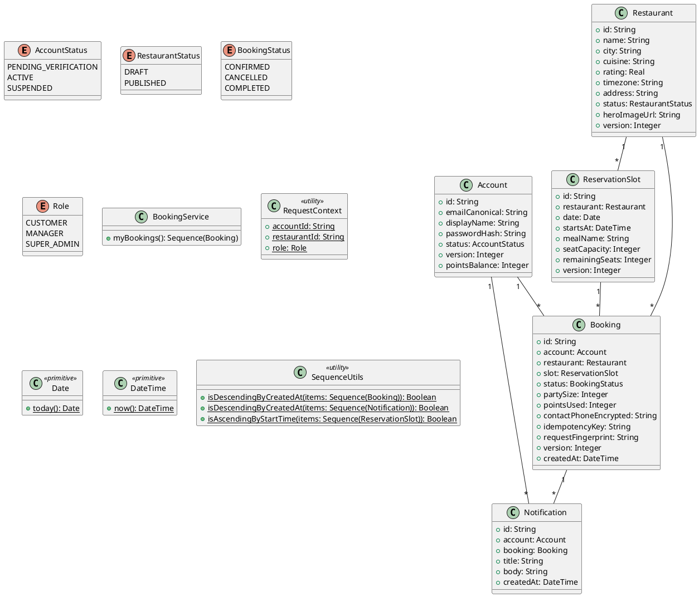

# UC-09 — View Booking History

### Description

A customer reviews reserved, completed, and cancelled bookings.

### Actors

Customer; client; system.

### Priority

P0.

### Trigger

**TRG-UC-09-01** — The customer opens History.

### Preconditions

- **PRE-UC-09-01** — The customer is signed in.

### Postconditions

- **POST-UC-09-01** — The client displays returned booking groups.

### Basic Flow

1. The customer opens booking history.
2. The client requests the customer's bookings.
3. The system returns booking summaries.
4. The client renders the history and status views.

### Alternative Flows

#### AF-UC-09-01

1. The customer opens a booking detail from the history list.

### Exception Flows

#### EF-UC-09-01

1. The client displays a history loading error and retry action.

### UML Model



### Business Rules

```ocl
-- BR-UC-09-01
-- Source: Assumption
context BookingService::myBookings(): Sequence(Booking)
post BR_UC_09_01_HistoryIsOwned:
  result->forAll(b | b.account.id = RequestContext::accountId)
```
```ocl
-- BR-UC-09-02
-- Source: Assumption
context BookingService::myBookings(): Sequence(Booking)
post BR_UC_09_02_HistoryIsNewestFirst:
  SequenceUtils::isDescendingByCreatedAt(result)
```
```ocl
-- BR-UC-09-03
-- Source: Assumption
context BookingService::myBookings(): Sequence(Booking)
post BR_UC_09_03_HistoryRowsAreUnique:
  result->isUnique(b | b.id)
```
```ocl
-- BR-UC-09-04
-- Source: Assumption
context BookingService::myBookings(): Sequence(Booking)
post BR_UC_09_04_HistoryHasPositivePartySize:
  result->forAll(b | b.partySize > 0)
```
```ocl
-- BR-UC-09-05
-- Source: Assumption
context BookingService::myBookings(): Sequence(Booking)
post BR_UC_09_05_HistorySlotsMatchRestaurants:
  result->forAll(b | b.slot.restaurant.id = b.restaurant.id)
```
```ocl
-- BR-UC-09-06
-- Source: Assumption
context BookingService::myBookings(): Sequence(Booking)
post BR_UC_09_06_HistoryTimestampsArePast:
  result->forAll(b | b.createdAt <= DateTime::now())
```
```ocl
-- BR-UC-09-07
-- Source: Assumption
context BookingService::myBookings(): Sequence(Booking)
post BR_UC_09_07_HistoryPointsAreNonnegative:
  result->forAll(b | b.pointsUsed >= 0)
```

### Related UI

- [history](https://www.figma.com/design/BKc1SojjRCQwSPPzZpvDn2/Table-Booking-Restaurant-Application--Web---Mobile---Admin-Panels---Community---Copy-?node-id=4611-4772) (`4611:4772`)
- [Reserved Table](https://www.figma.com/design/BKc1SojjRCQwSPPzZpvDn2/Table-Booking-Restaurant-Application--Web---Mobile---Admin-Panels---Community---Copy-?node-id=772-1244) (`772:1244`)
- [Cancelled Booking](https://www.figma.com/design/BKc1SojjRCQwSPPzZpvDn2/Table-Booking-Restaurant-Application--Web---Mobile---Admin-Panels---Community---Copy-?node-id=772-1245) (`772:1245`)
- [Completed Booking](https://www.figma.com/design/BKc1SojjRCQwSPPzZpvDn2/Table-Booking-Restaurant-Application--Web---Mobile---Admin-Panels---Community---Copy-?node-id=772-1246) (`772:1246`)

### Related APIs

- [API-BOOKING-LIST](../api/api-booking-list.md)


### Notes

The UI establishes the interaction boundary. Rule values and persistence behavior are explicit assumptions in [ASSUMPTIONS.md](../ASSUMPTIONS.md).
