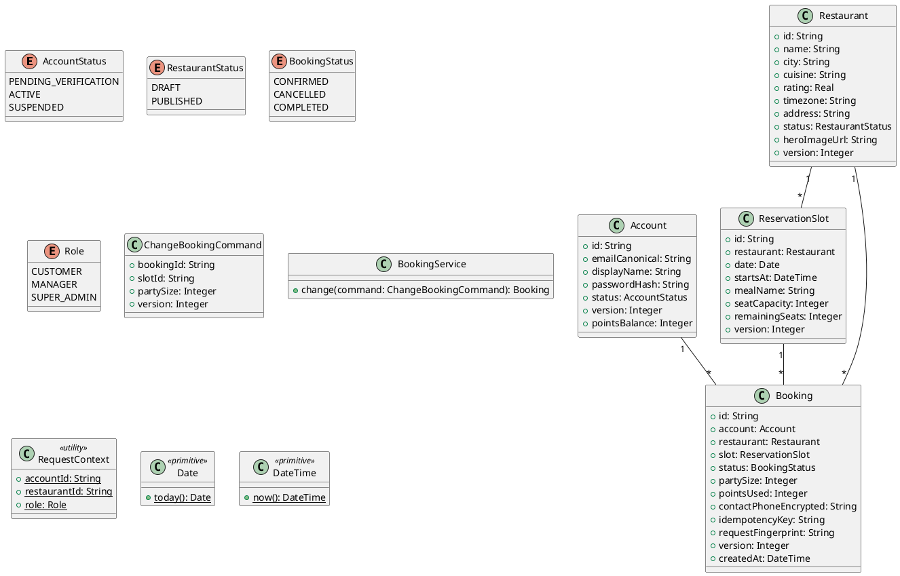

# UC-10 — Change a Booking

### Description

A customer changes a future reservation from its booking view.

### Actors

Customer; client; system.

### Priority

P0.

### Trigger

**TRG-UC-10-01** — The customer chooses Edit Booking.

### Preconditions

- **PRE-UC-10-01** — A booking detail is visible.

### Postconditions

- **POST-UC-10-01** — The client displays the updated booking result.

### Basic Flow

1. The customer opens the edit booking form.
2. The client displays current booking details and alternative controls.
3. The customer changes the booking and submits it.
4. The client sends the update request.
5. The system returns the booking outcome.
6. The client displays the returned booking.

### Alternative Flows

#### AF-UC-10-01

1. The customer leaves the edit form and returns to the booking view.

### Exception Flows

#### EF-UC-10-01

1. The client displays the returned conflict and offers a fresh slot selection.

### UML Model



### Business Rules

```ocl
-- BR-UC-10-01
-- Source: Assumption
context BookingService::change(command: ChangeBookingCommand): Booking
pre BR_UC_10_01_OwnerAndEditableState:
  Booking.allInstances()->exists(b | b.id = command.bookingId and b.account.id = RequestContext::accountId and b.status = BookingStatus::CONFIRMED and b.slot.startsAt > DateTime::now())
```
```ocl
-- BR-UC-10-02
-- Source: Assumption
context BookingService::change(command: ChangeBookingCommand): Booking
pre BR_UC_10_02_FreshSlotAndVersion:
  ReservationSlot.allInstances()->exists(s | s.id = command.slotId and s.remainingSeats >= command.partySize) and Booking.allInstances()->exists(b | b.id = command.bookingId and b.version = command.version)
```
```ocl
-- BR-UC-10-03
-- Source: Assumption
context BookingService::change(command: ChangeBookingCommand): Booking
post BR_UC_10_03_UpdatedBookingVersion:
  result.id = command.bookingId and result.slot.id = command.slotId and result.version = command.version + 1
```
```ocl
-- BR-UC-10-04
-- Source: Assumption
context BookingService::change(command: ChangeBookingCommand): Booking
post BR_UC_10_04_ChangedPartySizeIsPersisted:
  result.partySize = command.partySize
```
```ocl
-- BR-UC-10-05
-- Source: Assumption
context BookingService::change(command: ChangeBookingCommand): Booking
pre BR_UC_10_05_ChangedPartySizeIsPositive:
  command.partySize > 0
```
```ocl
-- BR-UC-10-06
-- Source: Assumption
context BookingService::change(command: ChangeBookingCommand): Booking
pre BR_UC_10_06_ChangedSlotMatchesRestaurant:
  Booking.allInstances()->exists(b | b.id = command.bookingId and ReservationSlot.allInstances()->exists(s | s.id = command.slotId and s.restaurant.id = b.restaurant.id and s.startsAt > DateTime::now()))
```
```ocl
-- BR-UC-10-07
-- Source: Assumption
context BookingService::change(command: ChangeBookingCommand): Booking
post BR_UC_10_07_ChangedBookingRemainsConfirmed:
  result.status = BookingStatus::CONFIRMED
```

### Related UI

- [Edit Booking](https://www.figma.com/design/BKc1SojjRCQwSPPzZpvDn2/Table-Booking-Restaurant-Application--Web---Mobile---Admin-Panels---Community---Copy-?node-id=3890-2970) (`3890:2970`)
- [edit booking mobile](https://www.figma.com/design/BKc1SojjRCQwSPPzZpvDn2/Table-Booking-Restaurant-Application--Web---Mobile---Admin-Panels---Community---Copy-?node-id=4611-4659) (`4611:4659`)

### Related APIs

- [API-BOOKING-UPDATE](../api/api-booking-update.md)


### Notes

The UI establishes the interaction boundary. Rule values and persistence behavior are explicit assumptions in [ASSUMPTIONS.md](../ASSUMPTIONS.md).
