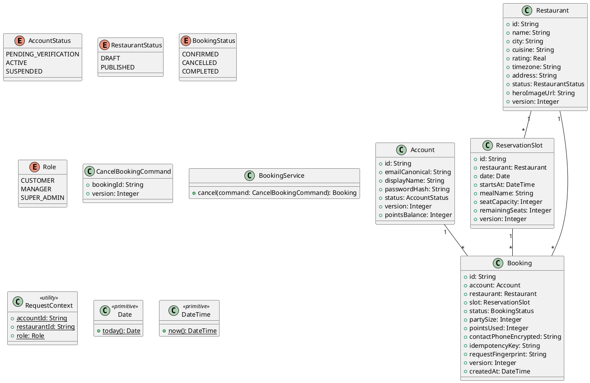

# UC-11 — Cancel a Booking

### Description

A customer cancels a reservation from booking history.

### Actors

Customer; client; system.

### Priority

P0.

### Trigger

**TRG-UC-11-01** — The customer chooses the cancel action on a booking.

### Preconditions

- **PRE-UC-11-01** — A booking detail is visible.

### Postconditions

- **POST-UC-11-01** — The client displays the cancellation outcome.

### Basic Flow

1. The customer opens a booking from history.
2. The client displays the booking details.
3. The customer chooses Cancel Booking.
4. The client presents the confirmation prompt and its policy notice.
5. The customer confirms cancellation.
6. The client sends the cancellation request.
7. The system returns the booking outcome.
8. The client displays the cancelled view.

### Alternative Flows

#### AF-UC-11-01

1. The customer dismisses the cancellation prompt and remains on the booking view.

### Exception Flows

#### EF-UC-11-01

1. The client presents a returned cancellation error and the booking detail.

### UML Model



### Business Rules

```ocl
-- BR-UC-11-01
-- Source: Assumption
context BookingService::cancel(command: CancelBookingCommand): Booking
pre BR_UC_11_01_OwnerMayCancel:
  Booking.allInstances()->exists(b | b.id = command.bookingId and b.account.id = RequestContext::accountId and b.status = BookingStatus::CONFIRMED and b.version = command.version)
```
```ocl
-- BR-UC-11-02
-- Source: Assumption
context BookingService::cancel(command: CancelBookingCommand): Booking
post BR_UC_11_02_BookingIsCancelled:
  result.id = command.bookingId and result.status = BookingStatus::CANCELLED and result.version = command.version + 1
```
```ocl
-- BR-UC-11-03
-- Source: Assumption
context BookingService::cancel(command: CancelBookingCommand): Booking
post BR_UC_11_03_CancelledCapacityIsReleased:
  result.slot.remainingSeats = result.slot.remainingSeats@pre + result.partySize and result.slot.version = result.slot.version@pre + 1
```
```ocl
-- BR-UC-11-04
-- Source: Figma
context BookingService::cancel(command: CancelBookingCommand): Booking
post BR_UC_11_04_CancellationDoesNotRefundPoints:
  result.pointsUsed = result.pointsUsed@pre and result.account.pointsBalance = result.account.pointsBalance@pre
```
```ocl
-- BR-UC-11-05
-- Source: Assumption
context BookingService::cancel(command: CancelBookingCommand): Booking
pre BR_UC_11_05_OnlyFutureBookingsCanBeCancelled:
  Booking.allInstances()->exists(b | b.id = command.bookingId and b.slot.startsAt > DateTime::now())
```
```ocl
-- BR-UC-11-06
-- Source: Assumption
context BookingService::cancel(command: CancelBookingCommand): Booking
post BR_UC_11_06_CancellationKeepsOwner:
  result.account.id = Booking.allInstances()@pre->any(b | b.id = command.bookingId).account.id
```
```ocl
-- BR-UC-11-07
-- Source: Assumption
context BookingService::cancel(command: CancelBookingCommand): Booking
post BR_UC_11_07_CancellationKeepsRestaurantAndSlot:
  result.restaurant.id = Booking.allInstances()@pre->any(b | b.id = command.bookingId).restaurant.id and result.slot.id = Booking.allInstances()@pre->any(b | b.id = command.bookingId).slot.id
```

### Related UI

- [Booking canceled](https://www.figma.com/design/BKc1SojjRCQwSPPzZpvDn2/Table-Booking-Restaurant-Application--Web---Mobile---Admin-Panels---Community---Copy-?node-id=772-1196) (`772:1196`)
- [Cancelled Booking](https://www.figma.com/design/BKc1SojjRCQwSPPzZpvDn2/Table-Booking-Restaurant-Application--Web---Mobile---Admin-Panels---Community---Copy-?node-id=772-1245) (`772:1245`)
- [history](https://www.figma.com/design/BKc1SojjRCQwSPPzZpvDn2/Table-Booking-Restaurant-Application--Web---Mobile---Admin-Panels---Community---Copy-?node-id=4611-4772) (`4611:4772`)
- [history cancellation prompt](https://www.figma.com/design/BKc1SojjRCQwSPPzZpvDn2/Table-Booking-Restaurant-Application--Web---Mobile---Admin-Panels---Community---Copy-?node-id=4611-4710) (`4611:4710`)

### Related APIs

- [API-BOOKING-CANCEL](../api/api-booking-cancel.md)


### Notes

The UI establishes the interaction boundary. Rule values and persistence behavior are explicit assumptions in [ASSUMPTIONS.md](../ASSUMPTIONS.md).
