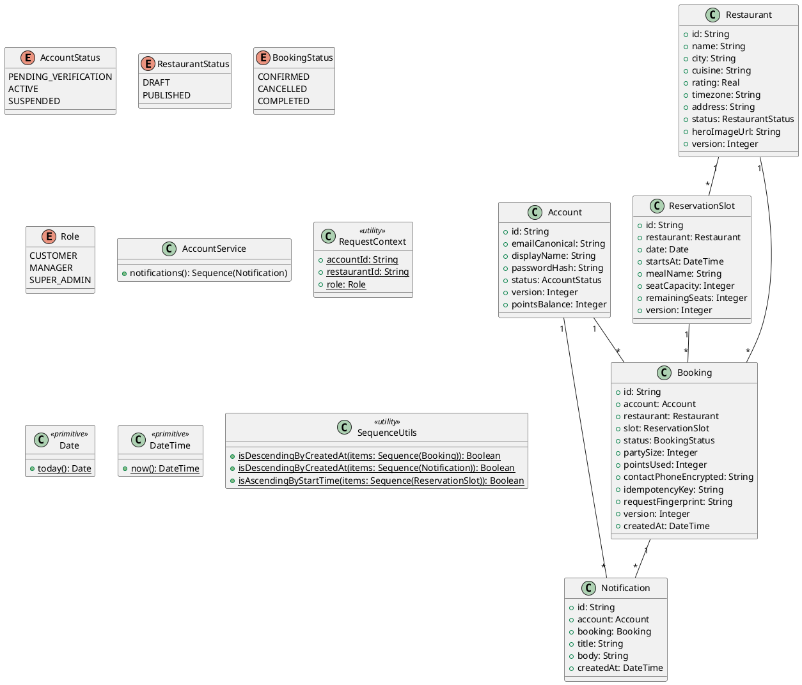

# UC-12 — View Notifications

### Description

A customer views booking and account notifications.

### Actors

Customer; client; system.

### Priority

P1.

### Trigger

**TRG-UC-12-01** — The customer opens Notifications.

### Preconditions

- **PRE-UC-12-01** — The customer is signed in.

### Postconditions

- **POST-UC-12-01** — The client displays returned notifications.

### Basic Flow

1. The customer opens notifications.
2. The client requests notification items.
3. The system returns notification summaries.
4. The client displays the list and individual items.

### Alternative Flows

#### AF-UC-12-01

1. The customer opens a related booking from a notification.

### Exception Flows

#### EF-UC-12-01

1. The client shows a retry state for unavailable notifications.

### UML Model



### Business Rules

```ocl
-- BR-UC-12-01
-- Source: Assumption
context AccountService::notifications(): Sequence(Notification)
post BR_UC_12_01_NotificationsAreOwned:
  result->forAll(n | n.account.id = RequestContext::accountId)
```
```ocl
-- BR-UC-12-02
-- Source: Assumption
context AccountService::notifications(): Sequence(Notification)
post BR_UC_12_02_NewestNotificationsFirst:
  SequenceUtils::isDescendingByCreatedAt(result)
```
```ocl
-- BR-UC-12-03
-- Source: Assumption
context AccountService::notifications(): Sequence(Notification)
post BR_UC_12_03_NotificationsAreUnique:
  result->isUnique(n | n.id)
```
```ocl
-- BR-UC-12-04
-- Source: Assumption
context AccountService::notifications(): Sequence(Notification)
post BR_UC_12_04_NotificationTimesArePast:
  result->forAll(n | n.createdAt <= DateTime::now())
```
```ocl
-- BR-UC-12-05
-- Source: Assumption
context AccountService::notifications(): Sequence(Notification)
post BR_UC_12_05_NotificationTitlesArePresent:
  result->forAll(n | n.title.trim().size() > 0)
```
```ocl
-- BR-UC-12-06
-- Source: Assumption
context AccountService::notifications(): Sequence(Notification)
post BR_UC_12_06_NotificationBodiesArePresent:
  result->forAll(n | n.body.trim().size() > 0)
```
```ocl
-- BR-UC-12-07
-- Source: Assumption
context AccountService::notifications(): Sequence(Notification)
post BR_UC_12_07_LinkedBookingsBelongToRecipient:
  result->forAll(n | n.booking = null or n.booking.account.id = n.account.id)
```

### Related UI

- [notifications](https://www.figma.com/design/BKc1SojjRCQwSPPzZpvDn2/Table-Booking-Restaurant-Application--Web---Mobile---Admin-Panels---Community---Copy-?node-id=4611-4549) (`4611:4549`)
- [notifications mobile variant](https://www.figma.com/design/BKc1SojjRCQwSPPzZpvDn2/Table-Booking-Restaurant-Application--Web---Mobile---Admin-Panels---Community---Copy-?node-id=4594-4145) (`4594:4145`)

### Related APIs

- [API-NOTIFICATION-LIST](../api/api-notification-list.md)


### Notes

The UI establishes the interaction boundary. Rule values and persistence behavior are explicit assumptions in [ASSUMPTIONS.md](../ASSUMPTIONS.md).
