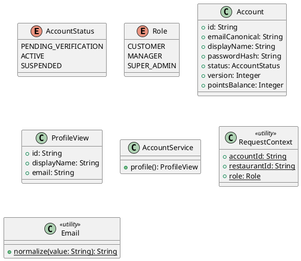

# UC-13 — View Profile

### Description

A customer views account details and profile actions.

### Actors

Customer; client; system.

### Priority

P1.

### Trigger

**TRG-UC-13-01** — The customer opens More or Profile.

### Preconditions

- **PRE-UC-13-01** — The customer is signed in.

### Postconditions

- **POST-UC-13-01** — The client displays returned profile details.

### Basic Flow

1. The customer opens the profile tab.
2. The client requests account details.
3. The system returns the profile view.
4. The client renders details and navigation actions.

### Alternative Flows

#### AF-UC-13-01

1. The customer moves from the profile to booking history.

### Exception Flows

#### EF-UC-13-01

1. The client displays a profile loading error and retry action.

### UML Model



### Business Rules

```ocl
-- BR-UC-13-01
-- Source: Assumption
context AccountService::profile(): ProfileView
post BR_UC_13_01_OwnProfileReturned:
  result.id = RequestContext::accountId
```
```ocl
-- BR-UC-13-02
-- Source: Assumption
context AccountService::profile(): ProfileView
post BR_UC_13_02_ProfileEmailMatchesAccount:
  result.email = Account.allInstances()->any(a | a.id = RequestContext::accountId).emailCanonical
```
```ocl
-- BR-UC-13-03
-- Source: Assumption
context AccountService::profile(): ProfileView
pre BR_UC_13_03_ProfileAccountExists:
  Account.allInstances()->exists(a | a.id = RequestContext::accountId)
```
```ocl
-- BR-UC-13-04
-- Source: Assumption
context AccountService::profile(): ProfileView
post BR_UC_13_04_ProfileNameMatchesAccount:
  result.displayName = Account.allInstances()->any(a | a.id = RequestContext::accountId).displayName
```
```ocl
-- BR-UC-13-05
-- Source: Assumption
context AccountService::profile(): ProfileView
post BR_UC_13_05_ProfileNameIsPresent:
  result.displayName.trim().size() > 0
```
```ocl
-- BR-UC-13-06
-- Source: Assumption
context AccountService::profile(): ProfileView
post BR_UC_13_06_ProfileEmailIsCanonical:
  result.email = Email::normalize(result.email)
```
```ocl
-- BR-UC-13-07
-- Source: Assumption
context AccountService::profile(): ProfileView
post BR_UC_13_07_ProfileEmailIsPresent:
  result.email.trim().size() > 0
```

### Related UI

- [more/profile](https://www.figma.com/design/BKc1SojjRCQwSPPzZpvDn2/Table-Booking-Restaurant-Application--Web---Mobile---Admin-Panels---Community---Copy-?node-id=4611-5055) (`4611:5055`)
- [Profile component](https://www.figma.com/design/BKc1SojjRCQwSPPzZpvDn2/Table-Booking-Restaurant-Application--Web---Mobile---Admin-Panels---Community---Copy-?node-id=770-1085) (`770:1085`)

### Related APIs

- [API-PROFILE-GET](../api/api-profile-get.md)


### Notes

The UI establishes the interaction boundary. Rule values and persistence behavior are explicit assumptions in [ASSUMPTIONS.md](../ASSUMPTIONS.md).
