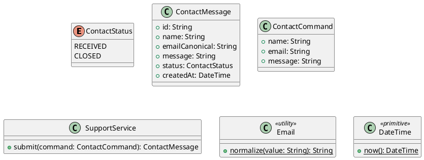

# UC-14 — Contact Support

### Description

A visitor submits the contact form shown by the site.

### Actors

Visitor; client; system.

### Priority

P1.

### Trigger

**TRG-UC-14-01** — The visitor opens Contact Us.

### Preconditions

- **PRE-UC-14-01** — The contact page is visible.

### Postconditions

- **POST-UC-14-01** — The client displays the submission result.

### Basic Flow

1. The visitor opens Contact Us.
2. The client displays the contact form.
3. The visitor enters a message and submits it.
4. The client sends the contact request.
5. The system returns a submission receipt.
6. The client presents the receipt.

### Alternative Flows

#### AF-UC-14-01

1. The visitor returns to the restaurant page without submitting.

### Exception Flows

#### EF-UC-14-01

1. The client displays the returned contact error and keeps the form available.

### UML Model



### Business Rules

```ocl
-- BR-UC-14-01
-- Source: Assumption
context SupportService::submit(command: ContactCommand): ContactMessage
pre BR_UC_14_01_MessageHasContent:
  command.message.trim().size() > 0
```
```ocl
-- BR-UC-14-02
-- Source: Assumption
context SupportService::submit(command: ContactCommand): ContactMessage
post BR_UC_14_02_SubmissionIsRecorded:
  result.emailCanonical = Email::normalize(command.email) and result.status = ContactStatus::RECEIVED
```
```ocl
-- BR-UC-14-03
-- Source: Assumption
context SupportService::submit(command: ContactCommand): ContactMessage
post BR_UC_14_03_ContactContentIsRecorded:
  result.name = command.name and result.message = command.message
```
```ocl
-- BR-UC-14-04
-- Source: Assumption
context SupportService::submit(command: ContactCommand): ContactMessage
pre BR_UC_14_04_ContactNameIsPresent:
  command.name.trim().size() > 0
```
```ocl
-- BR-UC-14-05
-- Source: Assumption
context SupportService::submit(command: ContactCommand): ContactMessage
pre BR_UC_14_05_ContactEmailIsPresent:
  command.email.trim().size() > 0
```
```ocl
-- BR-UC-14-06
-- Source: Assumption
context SupportService::submit(command: ContactCommand): ContactMessage
post BR_UC_14_06_ContactHasIdentifier:
  result.id.trim().size() > 0
```
```ocl
-- BR-UC-14-07
-- Source: Assumption
context SupportService::submit(command: ContactCommand): ContactMessage
post BR_UC_14_07_ContactHasCreationTime:
  result.createdAt <= DateTime::now()
```

### Related UI

- [Conatct Us Page](https://www.figma.com/design/BKc1SojjRCQwSPPzZpvDn2/Table-Booking-Restaurant-Application--Web---Mobile---Admin-Panels---Community---Copy-?node-id=2345-2682) (`2345:2682`)
- [Contact us Page Mobile](https://www.figma.com/design/BKc1SojjRCQwSPPzZpvDn2/Table-Booking-Restaurant-Application--Web---Mobile---Admin-Panels---Community---Copy-?node-id=2375-2627) (`2375:2627`)

### Related APIs

- [API-CONTACT-CREATE](../api/api-contact-create.md)


### Notes

The UI establishes the interaction boundary. Rule values and persistence behavior are explicit assumptions in [ASSUMPTIONS.md](../ASSUMPTIONS.md).
