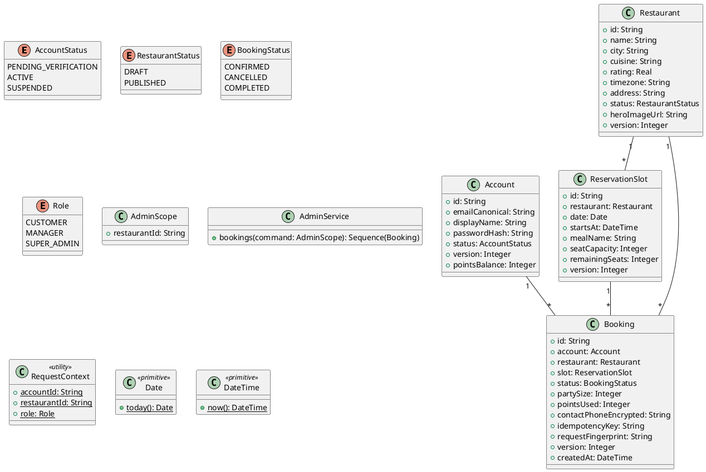

# UC-15 — View Admin Bookings

### Description

A manager reviews restaurant bookings in the administration panel.

### Actors

Restaurant Manager; client; system.

### Priority

P0.

### Trigger

**TRG-UC-15-01** — The manager opens Bookings.

### Preconditions

- **PRE-UC-15-01** — The manager is in the administration panel.

### Postconditions

- **POST-UC-15-01** — The client displays booking rows and controls.

### Basic Flow

1. The manager opens Bookings.
2. The client requests booking rows.
3. The system returns booking summaries.
4. The client displays the table and available row actions.

### Alternative Flows

#### AF-UC-15-01

1. The manager opens an individual booking from the table.

### Exception Flows

#### EF-UC-15-01

1. The client displays a bookings loading error and retry action.

### UML Model



### Business Rules

```ocl
-- BR-UC-15-01
-- Source: Assumption
context AdminService::bookings(command: AdminScope): Sequence(Booking)
pre BR_UC_15_01_ManagerHasRestaurantScope:
  RequestContext::role = Role::SUPER_ADMIN or (RequestContext::role = Role::MANAGER and RequestContext::restaurantId = command.restaurantId)
```
```ocl
-- BR-UC-15-02
-- Source: Assumption
context AdminService::bookings(command: AdminScope): Sequence(Booking)
post BR_UC_15_02_RowsStayInScope:
  result->forAll(b | b.restaurant.id = command.restaurantId)
```
```ocl
-- BR-UC-15-03
-- Source: Assumption
context AdminService::bookings(command: AdminScope): Sequence(Booking)
post BR_UC_15_03_AdminBookingRowsAreUnique:
  result->isUnique(b | b.id)
```
```ocl
-- BR-UC-15-04
-- Source: Assumption
context AdminService::bookings(command: AdminScope): Sequence(Booking)
post BR_UC_15_04_AdminBookingRowsHaveOwners:
  result->forAll(b | b.account <> null)
```
```ocl
-- BR-UC-15-05
-- Source: Assumption
context AdminService::bookings(command: AdminScope): Sequence(Booking)
post BR_UC_15_05_AdminBookingRowsHavePositiveParties:
  result->forAll(b | b.partySize > 0)
```
```ocl
-- BR-UC-15-06
-- Source: Assumption
context AdminService::bookings(command: AdminScope): Sequence(Booking)
post BR_UC_15_06_AdminBookingSlotsMatchRestaurants:
  result->forAll(b | b.slot.restaurant.id = b.restaurant.id)
```
```ocl
-- BR-UC-15-07
-- Source: Assumption
context AdminService::bookings(command: AdminScope): Sequence(Booking)
post BR_UC_15_07_AdminBookingRowsHaveCreationTime:
  result->forAll(b | b.createdAt <= DateTime::now())
```

### Related UI

- [Bookings](https://www.figma.com/design/BKc1SojjRCQwSPPzZpvDn2/Table-Booking-Restaurant-Application--Web---Mobile---Admin-Panels---Community---Copy-?node-id=1000-2063) (`1000:2063`)
- [Super admin section](https://www.figma.com/design/BKc1SojjRCQwSPPzZpvDn2/Table-Booking-Restaurant-Application--Web---Mobile---Admin-Panels---Community---Copy-?node-id=1000-4522) (`1000:4522`)

### Related APIs

- [API-ADMIN-BOOKING-LIST](../api/api-admin-booking-list.md)


### Notes

The UI establishes the interaction boundary. Rule values and persistence behavior are explicit assumptions in [ASSUMPTIONS.md](../ASSUMPTIONS.md).
