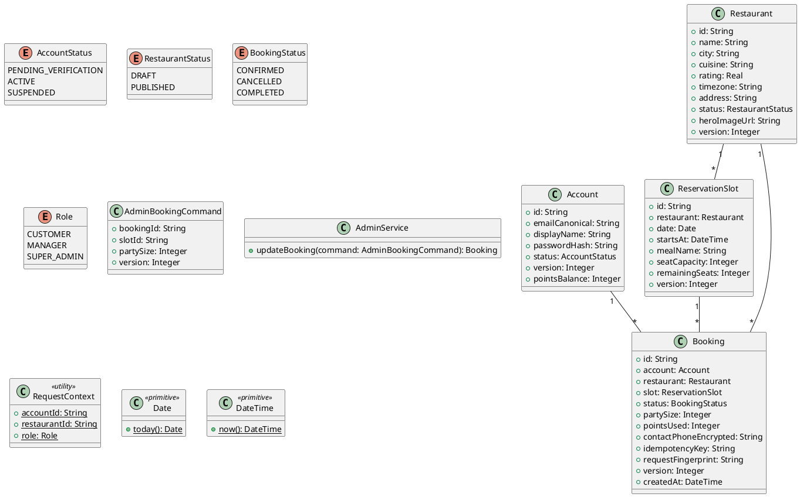

# UC-16 — Update a Booking as Admin

### Description

A manager edits a booking from the admin booking list.

### Actors

Restaurant Manager; client; system.

### Priority

P0.

### Trigger

**TRG-UC-16-01** — The manager opens the edit booking popup.

### Preconditions

- **PRE-UC-16-01** — An admin booking row is visible.

### Postconditions

- **POST-UC-16-01** — The client displays the updated booking.

### Basic Flow

1. The manager selects a booking row action.
2. The client opens the edit booking popup.
3. The manager updates the displayed booking details and submits.
4. The client sends the update request.
5. The system returns the booking result.
6. The client refreshes the booking row.

### Alternative Flows

#### AF-UC-16-01

1. The manager dismisses the popup and returns to the list.

### Exception Flows

#### EF-UC-16-01

1. The client displays the returned conflict and keeps the popup available.

### UML Model



### Business Rules

```ocl
-- BR-UC-16-01
-- Source: Assumption
context AdminService::updateBooking(command: AdminBookingCommand): Booking
pre BR_UC_16_01_AdminBookingInScope:
  Booking.allInstances()->exists(b | b.id = command.bookingId and b.restaurant.id = RequestContext::restaurantId and b.version = command.version)
```
```ocl
-- BR-UC-16-02
-- Source: Assumption
context AdminService::updateBooking(command: AdminBookingCommand): Booking
post BR_UC_16_02_AdminUpdateIncrementsVersion:
  result.id = command.bookingId and result.version = command.version + 1
```
```ocl
-- BR-UC-16-03
-- Source: Assumption
context AdminService::updateBooking(command: AdminBookingCommand): Booking
pre BR_UC_16_03_AdminTargetSlotCanServeParty:
  ReservationSlot.allInstances()->exists(s | s.id = command.slotId and s.remainingSeats >= command.partySize)
```
```ocl
-- BR-UC-16-04
-- Source: Assumption
context AdminService::updateBooking(command: AdminBookingCommand): Booking
post BR_UC_16_04_AdminBookingFieldsAreSaved:
  result.slot.id = command.slotId and result.partySize = command.partySize
```
```ocl
-- BR-UC-16-05
-- Source: Assumption
context AdminService::updateBooking(command: AdminBookingCommand): Booking
pre BR_UC_16_05_AdminUpdateRoleAuthorized:
  RequestContext::role = Role::MANAGER or RequestContext::role = Role::SUPER_ADMIN
```
```ocl
-- BR-UC-16-06
-- Source: Assumption
context AdminService::updateBooking(command: AdminBookingCommand): Booking
pre BR_UC_16_06_AdminPartySizeIsPositive:
  command.partySize > 0
```
```ocl
-- BR-UC-16-07
-- Source: Assumption
context AdminService::updateBooking(command: AdminBookingCommand): Booking
pre BR_UC_16_07_AdminTargetSlotMatchesRestaurant:
  Booking.allInstances()->exists(b | b.id = command.bookingId and ReservationSlot.allInstances()->exists(s | s.id = command.slotId and s.restaurant.id = b.restaurant.id and s.startsAt > DateTime::now()))
```

### Related UI

- [edit booking popup](https://www.figma.com/design/BKc1SojjRCQwSPPzZpvDn2/Table-Booking-Restaurant-Application--Web---Mobile---Admin-Panels---Community---Copy-?node-id=3769-3135) (`3769:3135`)
- [Bookings](https://www.figma.com/design/BKc1SojjRCQwSPPzZpvDn2/Table-Booking-Restaurant-Application--Web---Mobile---Admin-Panels---Community---Copy-?node-id=1000-2063) (`1000:2063`)

### Related APIs

- [API-ADMIN-BOOKING-UPDATE](../api/api-admin-booking-update.md)


### Notes

The UI establishes the interaction boundary. Rule values and persistence behavior are explicit assumptions in [ASSUMPTIONS.md](../ASSUMPTIONS.md).
