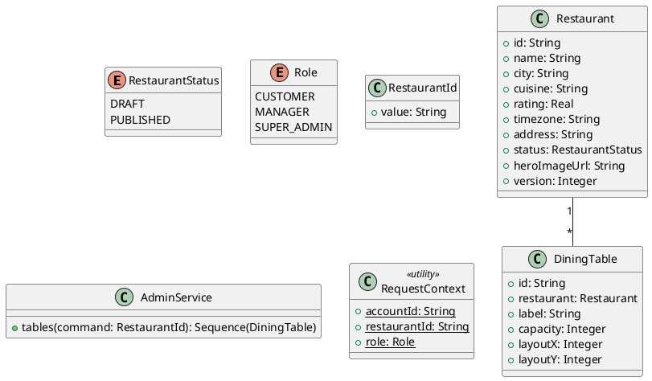

# UC-17 — View Table Layout

### Description

A manager views the restaurant table inventory and layout.

### Actors

Restaurant Manager; client; system.

### Priority

P1.

### Trigger

**TRG-UC-17-01** — The manager opens the table layout view.

### Preconditions

- **PRE-UC-17-01** — The manager is in the administration panel.

### Postconditions

- **POST-UC-17-01** — The client displays returned table positions and labels.

### Basic Flow

1. The manager opens the table view.
2. The client requests table inventory.
3. The system returns tables and layout positions.
4. The client renders the table layout.

### Alternative Flows

#### AF-UC-17-01

1. The manager selects a table to view its detail panel.

### Exception Flows

#### EF-UC-17-01

1. The client displays a table-view loading error and retry action.

### UML Model



### Business Rules

```ocl
-- BR-UC-17-01
-- Source: Assumption
context AdminService::tables(command: RestaurantId): Sequence(DiningTable)
pre BR_UC_17_01_TableScopeAuthorized:
  RequestContext::role = Role::SUPER_ADMIN or RequestContext::restaurantId = command.value
```
```ocl
-- BR-UC-17-02
-- Source: Assumption
context AdminService::tables(command: RestaurantId): Sequence(DiningTable)
post BR_UC_17_02_TablesBelongToRestaurant:
  result->forAll(t | t.restaurant.id = command.value)
```
```ocl
-- BR-UC-17-03
-- Source: Assumption
context AdminService::tables(command: RestaurantId): Sequence(DiningTable)
pre BR_UC_17_03_TableViewerHasAdminRole:
  RequestContext::role = Role::MANAGER or RequestContext::role = Role::SUPER_ADMIN
```
```ocl
-- BR-UC-17-04
-- Source: Assumption
context AdminService::tables(command: RestaurantId): Sequence(DiningTable)
post BR_UC_17_04_LayoutTablesAreUnique:
  result->isUnique(t | t.id)
```
```ocl
-- BR-UC-17-05
-- Source: Assumption
context AdminService::tables(command: RestaurantId): Sequence(DiningTable)
post BR_UC_17_05_TableLabelsAreUniquePerRestaurant:
  result->isUnique(t | t.label)
```
```ocl
-- BR-UC-17-06
-- Source: Assumption
context AdminService::tables(command: RestaurantId): Sequence(DiningTable)
post BR_UC_17_06_TableCapacityIsPositive:
  result->forAll(t | t.capacity > 0)
```
```ocl
-- BR-UC-17-07
-- Source: Assumption
context AdminService::tables(command: RestaurantId): Sequence(DiningTable)
post BR_UC_17_07_TableCoordinatesAreNonnegative:
  result->forAll(t | t.layoutX >= 0 and t.layoutY >= 0)
```

### Related UI

- [list of tables](https://www.figma.com/design/BKc1SojjRCQwSPPzZpvDn2/Table-Booking-Restaurant-Application--Web---Mobile---Admin-Panels---Community---Copy-?node-id=3387-3558) (`3387:3558`)
- [table layout](https://www.figma.com/design/BKc1SojjRCQwSPPzZpvDn2/Table-Booking-Restaurant-Application--Web---Mobile---Admin-Panels---Community---Copy-?node-id=4657-6383) (`4657:6383`)

### Related APIs

- [API-ADMIN-TABLE-LIST](../api/api-admin-table-list.md)


### Notes

The UI establishes the interaction boundary. Rule values and persistence behavior are explicit assumptions in [ASSUMPTIONS.md](../ASSUMPTIONS.md).
