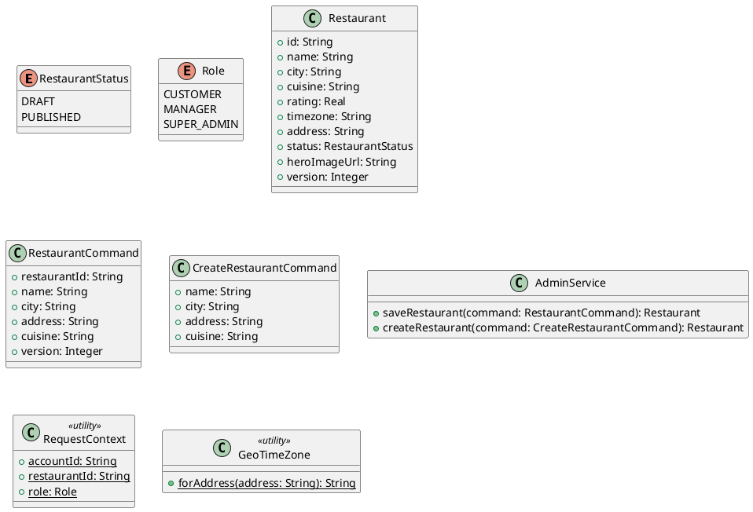

# UC-18 — Manage Restaurants

### Description

A super admin adds or edits a restaurant entry.

### Actors

Super Admin; client; system.

### Priority

P0.

### Trigger

**TRG-UC-18-01** — The admin opens Restaurant Edit / Add.

### Preconditions

- **PRE-UC-18-01** — The restaurant management view is visible.

### Postconditions

- **POST-UC-18-01** — The client displays the saved restaurant result.

### Basic Flow

1. The admin opens restaurant management.
2. The client displays the restaurant form.
3. The admin enters or changes restaurant details and submits.
4. The client sends the save request.
5. The system returns the restaurant outcome.
6. The client displays the saved entry.

### Alternative Flows

#### AF-UC-18-01

1. The admin closes the form and returns to the restaurant list.

### Exception Flows

#### EF-UC-18-01

1. The client displays the returned save error and keeps form data visible.

### UML Model



### Business Rules

```ocl
-- BR-UC-18-01
-- Source: Assumption
context AdminService::saveRestaurant(command: RestaurantCommand): Restaurant
pre BR_UC_18_01_OnlySuperAdminMaySaveRestaurant:
  RequestContext::role = Role::SUPER_ADMIN
```
```ocl
-- BR-UC-18-02
-- Source: Assumption
context AdminService::saveRestaurant(command: RestaurantCommand): Restaurant
pre BR_UC_18_02_RestaurantVersionMatchesForEdit:
  Restaurant.allInstances()->exists(r | r.id = command.restaurantId and r.version = command.version)
```
```ocl
-- BR-UC-18-03
-- Source: Assumption
context AdminService::saveRestaurant(command: RestaurantCommand): Restaurant
post BR_UC_18_03_SavedRestaurantVersionAdvances:
  result.id = command.restaurantId and result.version = command.version + 1
```
```ocl
-- BR-UC-18-04
-- Source: Assumption
context AdminService::createRestaurant(command: CreateRestaurantCommand): Restaurant
pre BR_UC_18_04_OnlySuperAdminMayCreateRestaurant:
  RequestContext::role = Role::SUPER_ADMIN
```
```ocl
-- BR-UC-18-05
-- Source: Assumption
context AdminService::createRestaurant(command: CreateRestaurantCommand): Restaurant
post BR_UC_18_05_NewRestaurantStartsDraft:
  result.status = RestaurantStatus::DRAFT and result.version = 1
```
```ocl
-- BR-UC-18-06
-- Source: Assumption
context AdminService::saveRestaurant(command: RestaurantCommand): Restaurant
post BR_UC_18_06_EditedRestaurantFieldsAreSaved:
  result.name = command.name and result.city = command.city and result.address = command.address and result.cuisine = command.cuisine
```
```ocl
-- BR-UC-18-07
-- Source: Assumption
context AdminService::createRestaurant(command: CreateRestaurantCommand): Restaurant
post BR_UC_18_07_CreatedRestaurantFieldsAreSaved:
  result.name = command.name and result.city = command.city and result.address = command.address and result.cuisine = command.cuisine
```
```ocl
-- BR-UC-18-08
-- Source: Assumption
context AdminService::saveRestaurant(command: RestaurantCommand): Restaurant
post BR_UC_18_08_EditedRestaurantTimezoneIsDerived:
  result.timezone = GeoTimeZone::forAddress(command.address)
```
```ocl
-- BR-UC-18-09
-- Source: Assumption
context AdminService::createRestaurant(command: CreateRestaurantCommand): Restaurant
post BR_UC_18_09_CreatedRestaurantTimezoneIsDerived:
  result.timezone = GeoTimeZone::forAddress(command.address)
```

### Related UI

- [Restaurant edit/add](https://www.figma.com/design/BKc1SojjRCQwSPPzZpvDn2/Table-Booking-Restaurant-Application--Web---Mobile---Admin-Panels---Community---Copy-?node-id=1000-3691) (`1000:3691`)
- [Super admin section](https://www.figma.com/design/BKc1SojjRCQwSPPzZpvDn2/Table-Booking-Restaurant-Application--Web---Mobile---Admin-Panels---Community---Copy-?node-id=1000-4522) (`1000:4522`)

### Related APIs

- [API-ADMIN-RESTAURANT-SAVE](../api/api-admin-restaurant-save.md)
- [API-ADMIN-RESTAURANT-CREATE](../api/api-admin-restaurant-create.md)

### Notes

The UI establishes the interaction boundary. Rule values and persistence behavior are explicit assumptions in [ASSUMPTIONS.md](../ASSUMPTIONS.md).
