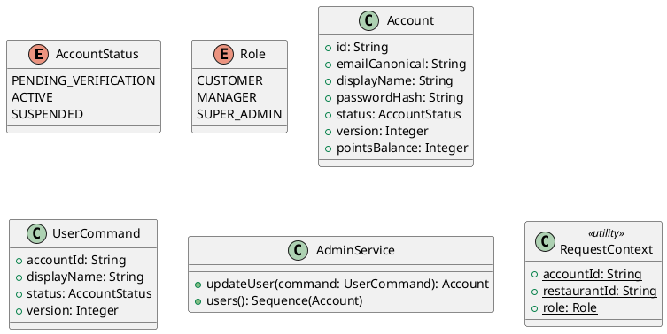

# UC-19 — Manage Users

### Description

A super admin reviews users and edits a user record.

### Actors

Super Admin; client; system.

### Priority

P0.

### Trigger

**TRG-UC-19-01** — The admin opens Users.

### Preconditions

- **PRE-UC-19-01** — The user administration view is visible.

### Postconditions

- **POST-UC-19-01** — The client displays the updated user record.

### Basic Flow

1. The admin opens the Users table.
2. The client requests user rows.
3. The system returns user summaries.
4. The admin opens a user edit form and submits changes.
5. The client sends the update request.
6. The system returns the user outcome.
7. The client refreshes the user row.

### Alternative Flows

#### AF-UC-19-01

1. The admin closes the edit form and returns to the Users table.

### Exception Flows

#### EF-UC-19-01

1. The client displays the returned update error and keeps the form available.

### UML Model



### Business Rules

```ocl
-- BR-UC-19-01
-- Source: Assumption
context AdminService::updateUser(command: UserCommand): Account
pre BR_UC_19_01_OnlySuperAdminMayEditUser:
  RequestContext::role = Role::SUPER_ADMIN
```
```ocl
-- BR-UC-19-02
-- Source: Assumption
context AdminService::updateUser(command: UserCommand): Account
pre BR_UC_19_02_UserVersionMatches:
  Account.allInstances()->exists(a | a.id = command.accountId and a.version = command.version)
```
```ocl
-- BR-UC-19-03
-- Source: Assumption
context AdminService::updateUser(command: UserCommand): Account
post BR_UC_19_03_UserVersionAdvances:
  result.id = command.accountId and result.version = command.version + 1
```
```ocl
-- BR-UC-19-04
-- Source: Assumption
context AdminService::users(): Sequence(Account)
pre BR_UC_19_04_OnlySuperAdminMayListUsers:
  RequestContext::role = Role::SUPER_ADMIN
```
```ocl
-- BR-UC-19-05
-- Source: Assumption
context AdminService::updateUser(command: UserCommand): Account
post BR_UC_19_05_EditedUserFieldsAreSaved:
  result.displayName = command.displayName and result.status = command.status
```
```ocl
-- BR-UC-19-06
-- Source: Assumption
context AdminService::updateUser(command: UserCommand): Account
pre BR_UC_19_06_EditedDisplayNameIsPresent:
  command.displayName.trim().size() > 0
```
```ocl
-- BR-UC-19-07
-- Source: Assumption
context AdminService::updateUser(command: UserCommand): Account
post BR_UC_19_07_UserEmailIsPreserved:
  result.emailCanonical = result.emailCanonical@pre
```

### Related UI

- [Users](https://www.figma.com/design/BKc1SojjRCQwSPPzZpvDn2/Table-Booking-Restaurant-Application--Web---Mobile---Admin-Panels---Community---Copy-?node-id=1016-4816) (`1016:4816`)
- [User edit](https://www.figma.com/design/BKc1SojjRCQwSPPzZpvDn2/Table-Booking-Restaurant-Application--Web---Mobile---Admin-Panels---Community---Copy-?node-id=1000-4208) (`1000:4208`)

### Related APIs

- [API-ADMIN-USER-UPDATE](../api/api-admin-user-update.md)
- [API-ADMIN-USER-LIST](../api/api-admin-user-list.md)

### Notes

The UI establishes the interaction boundary. Rule values and persistence behavior are explicit assumptions in [ASSUMPTIONS.md](../ASSUMPTIONS.md).
