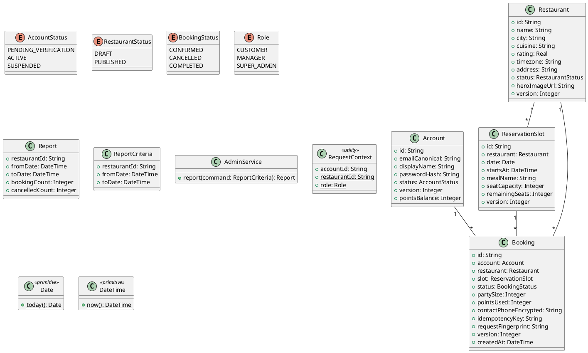

# UC-20 — View Reports

### Description

A manager views booking and restaurant activity reports.

### Actors

Restaurant Manager; client; system.

### Priority

P1.

### Trigger

**TRG-UC-20-01** — The manager opens Reports.

### Preconditions

- **PRE-UC-20-01** — The manager is in the administration panel.

### Postconditions

- **POST-UC-20-01** — The client displays the returned report summary.

### Basic Flow

1. The manager opens Reports.
2. The client requests report data for the displayed period.
3. The system returns report totals and series.
4. The client renders the report cards and charts.

### Alternative Flows

#### AF-UC-20-01

1. The manager changes the displayed period and views a refreshed report.

### Exception Flows

#### EF-UC-20-01

1. The client displays a report loading error and retry action.

### UML Model



### Business Rules

```ocl
-- BR-UC-20-01
-- Source: Assumption
context AdminService::report(command: ReportCriteria): Report
pre BR_UC_20_01_ReportScopeAuthorized:
  RequestContext::role = Role::SUPER_ADMIN or RequestContext::restaurantId = command.restaurantId
```
```ocl
-- BR-UC-20-02
-- Source: Assumption
context AdminService::report(command: ReportCriteria): Report
pre BR_UC_20_02_ReportPeriodOrdered:
  command.fromDate <= command.toDate
```
```ocl
-- BR-UC-20-03
-- Source: Assumption
context AdminService::report(command: ReportCriteria): Report
post BR_UC_20_03_ReportCountsAreDerived:
  result.bookingCount = Booking.allInstances()->select(b | b.restaurant.id = command.restaurantId and b.createdAt >= command.fromDate and b.createdAt <= command.toDate)->size()
```
```ocl
-- BR-UC-20-04
-- Source: Assumption
context AdminService::report(command: ReportCriteria): Report
post BR_UC_20_04_CancelledCountIsDerived:
  result.cancelledCount = Booking.allInstances()->select(b | b.restaurant.id = command.restaurantId and b.status = BookingStatus::CANCELLED and b.createdAt >= command.fromDate and b.createdAt <= command.toDate)->size()
```
```ocl
-- BR-UC-20-05
-- Source: Assumption
context AdminService::report(command: ReportCriteria): Report
post BR_UC_20_05_ReportCountsAreNonnegative:
  result.bookingCount >= 0 and result.cancelledCount >= 0
```
```ocl
-- BR-UC-20-06
-- Source: Assumption
context AdminService::report(command: ReportCriteria): Report
post BR_UC_20_06_CancellationCountDoesNotExceedBookings:
  result.cancelledCount <= result.bookingCount
```
```ocl
-- BR-UC-20-07
-- Source: Assumption
context AdminService::report(command: ReportCriteria): Report
post BR_UC_20_07_ReportEchoesScopeAndPeriod:
  result.restaurantId = command.restaurantId and result.fromDate = command.fromDate and result.toDate = command.toDate
```

### Related UI

- [Reports](https://www.figma.com/design/BKc1SojjRCQwSPPzZpvDn2/Table-Booking-Restaurant-Application--Web---Mobile---Admin-Panels---Community---Copy-?node-id=1913-2633) (`1913:2633`)
- [Reports variant](https://www.figma.com/design/BKc1SojjRCQwSPPzZpvDn2/Table-Booking-Restaurant-Application--Web---Mobile---Admin-Panels---Community---Copy-?node-id=1000-1746) (`1000:1746`)

### Related APIs

- [API-ADMIN-REPORT-GET](../api/api-admin-report-get.md)


### Notes

The UI establishes the interaction boundary. Rule values and persistence behavior are explicit assumptions in [ASSUMPTIONS.md](../ASSUMPTIONS.md).
