# Shared Domain Model

The canonical UML vocabulary for use-case OCL. Local diagrams reference these classifiers without redefining their members. APIs contain transport projections only.

```plantuml
@startuml
hide empty members
enum BookingStatus {
  PENDING
  CONFIRMED
  FAILED
  CANCELLED
}
enum SortDirection {
  ASC
  DESC
}
enum StaySort {
  RECOMMENDED
  PRICE
  RATING
}
enum TaxiSort {
  RECOMMENDED
  PRICE
  DISTANCE
}
enum FlightSort {
  CHEAPEST
  BEST
  QUICKEST
}
enum QuoteStatus {
  ACTIVE
  EXPIRED
  CONSUMED
  UNAVAILABLE
}
enum PaymentStatus {
  REFUNDED
  PENDING
  AUTHORIZED
  FAILED
  NOT_REQUIRED
}
enum PaymentMode {
  ONLINE
  PAY_DRIVER
}
enum ModerationStatus {
  PENDING
  APPROVED
  REJECTED
}
enum TripCompletionStatus {
  COMPLETED
  NOT_COMPLETED
}
class String {
  trim(): String
  toLower(): String
  matches(pattern: String): Boolean
  includes(fragment: String): Boolean
  concat(value: String): String
  <(other: String): Boolean
}
class DateTime {
  {static} now(): DateTime
  {static} hoursBetween(start: DateTime, end: DateTime): Real
  <(other: DateTime): Boolean
  <=(other: DateTime): Boolean
  >(other: DateTime): Boolean
  >=(other: DateTime): Boolean
}
class RequestContext {
  {static} authenticatedUserId: String
  {static} startedAt: DateTime
}
class PasswordHasher {
  {static} matches(password: String, hash: String): Boolean
  {static} hash(password: String): String
}
class User {
  id: String
  fullName: String
  email: String
  passwordHash: String
  active: Boolean
  createdAt: DateTime
}
class Session {
  accessToken: String
  expiresAt: DateTime
  user: User
  id: String
  tokenHash: String
  createdAt: DateTime
  revokedAt: DateTime
}
class Location {
  id: String
  name: String
  countryCode: String
  active: Boolean
  serviceAreaId: String
  timeZone: String
  airTravel: Boolean
}
class Money {
  amount: Real
  currency: String
}
class DateRange {
  start: Date
  end: Date
}
class Stay {
  id: String
  name: String
  location: Location
  rating: Real
  active: Boolean
  amenities: String[*] {ordered}
  media: StayMedia[*] {ordered}
}
class StayOffer {
  id: String
  stay: Stay
  period: DateRange
  rooms: Integer
  available: Boolean
  total: Money
  providerOfferRef: String
  destinationId: String
  adults: Integer
  availableRooms: Integer
  expiresAt: DateTime
  searchContextId: String
  snapshotVersion: Integer
  rank: Integer
  rating: Real
  recommendationScore: Real
  version: Integer
}
class StayQuote {
  id: String
  offerId: String
  available: Boolean
  total: Money
  expiresAt: DateTime
  user: User
  offer: StayOffer
  offerVersion: Integer
  status: QuoteStatus
}
class StayBooking {
  id: String
  user: User
  offer: StayOffer
  quote: StayQuote
  status: BookingStatus
  total: Money
  idempotencyKey: String
  paymentReference: PaymentReference
  requestFingerprint: String
  providerReservationRef: String
  guest: GuestDetails
}
class TaxiOffer {
  paymentMode: PaymentMode
  id: String
  pickup: Location
  dropoff: Location
  pickupAt: DateTime
  dropoffAt: DateTime
  seats: Integer
  available: Boolean
  distanceKm: Real
  total: Money
  driver: Driver
  vehicle: Vehicle
  providerOfferRef: String
  pickupId: String
  dropoffId: String
  expiresAt: DateTime
  searchContextId: String
  snapshotVersion: Integer
  rank: Integer
  recommendationScore: Real
  version: Integer
}
class Driver {
  id: String
  fullName: String
  phone: String
  active: Boolean
}
class Vehicle {
  id: String
  registrationNumber: String
  seatCapacity: Integer
  active: Boolean
  vehicleType: String
  smallBagCapacity: Integer
}
class TaxiQuote {
  id: String
  offerId: String
  available: Boolean
  total: Money
  paymentMode: PaymentMode
  expiresAt: DateTime
  user: User
  offer: TaxiOffer
  offerVersion: Integer
  status: QuoteStatus
}
class TaxiBooking {
  id: String
  user: User
  offer: TaxiOffer
  quote: TaxiQuote
  driver: Driver
  vehicle: Vehicle
  status: BookingStatus
  total: Money
  idempotencyKey: String
  paymentReference: PaymentReference
  requestFingerprint: String
  guest: GuestDetails
}
class PaymentReference {
  id: String
  provider: String
  providerReference: String
  tokenFingerprint: String
  status: PaymentStatus
}
class FlightOffer {
  snapshotVersion: Integer
  id: String
  providerId: String
  origin: Location
  destination: Location
  departureAt: DateTime
  arrivalAt: DateTime
  passengers: Integer
  durationMinutes: Integer
  available: Boolean
  total: Money
  expiresAt: DateTime
  fareFingerprint: String
  itinerarySignature: String
  seatsRemaining: Integer
  searchContextId: String
  stopCount: Integer
  bestScore: Real
  outboundSegments: FlightSegment[*] {ordered}
  inboundSegments: FlightSegment[*] {ordered}
}
class BudgetTrip {
  id: String
  title: String
  description: String
  attractions: Attraction[*] {ordered}
  destination: Location
  active: Boolean
  startingPrice: Money
  destinationId: String
  editorialRank: Integer
  publishFrom: DateTime
  publishUntil: DateTime
  priceEvidence: PriceEvidence[*] {ordered}
  media: TripMedia[*] {ordered}
}
class Review {
  id: String
  authorName: String
  rating: Integer
  comment: String
  published: Boolean
  publishedAt: DateTime
  featuredRank: Integer
  authorId: String
  displayedAuthorName: String
  bookingId: String
  tripCompletionStatus: TripCompletionStatus
  verifiedBooking: Boolean
  moderationStatus: ModerationStatus
  stayId: String
}
class AuthService {
  register(command: RegistrationCommand): Session
  login(command: LoginCommand): LoginOutcome
}
class StayService {
  search(criteria: StaySearchCriteria): Sequence(StayOffer)
  getDetail(stayId: String, offerId: String): StayDetail
  quote(offerId: String): StayQuote
  book(command: StayBookingCommand): StayBooking
}
class TaxiService {
  search(criteria: TaxiSearchCriteria): Sequence(TaxiOffer)
  getOffer(offerId: String): TaxiOfferDetail
  quote(offerId: String): TaxiQuote
  book(command: TaxiBookingCommand): TaxiBooking
}
class FlightService {
  search(criteria: FlightSearchCriteria): Sequence(FlightOffer)
}
class TripService {
  list(limit: Integer, offset: Integer): TripPage
  getDetail(tripId: String): BudgetTrip
}
class ReviewService {
  list(limit: Integer, offset: Integer): ReviewPage
}
class StaySearchCriteria {
  destinationId: String
  checkIn: Date
  checkOut: Date
  rooms: Integer
  adults: Integer
  minPrice: Real
  maxPrice: Real
  minRating: Real
  sort: StaySort
  limit: Integer
  offset: Integer
  searchContextId: String
  snapshotVersion: Integer
  currency: String
}
class TaxiSearchCriteria {
  pickupId: String
  dropoffId: String
  pickupAt: DateTime
  dropoffAt: DateTime
  passengers: Integer
  minPrice: Real
  maxPrice: Real
  sort: TaxiSort
  limit: Integer
  offset: Integer
  searchContextId: String
  snapshotVersion: Integer
  currency: String
  vehicleTypes: String[*] {ordered}
}
class FlightSearchCriteria {
  originId: String
  destinationId: String
  departOn: Date
  returnOn: Date
  passengers: Integer
  minPrice: Real
  maxPrice: Real
  maxDurationMinutes: Integer
  providerIds: String[*] {ordered}
  sort: FlightSort
  limit: Integer
  offset: Integer
  searchContextId: String
  snapshotVersion: Integer
  currency: String
}
class GuestDetails {
  firstName: String
  lastName: String
  email: String
  phone: String
  countryCode: String
}
class StayBookingCommand {
  guest: GuestDetails
  paymentToken: String
  idempotencyKey: String
  quoteId: String
  requestFingerprint: String
}
class TaxiBookingCommand {
  guest: GuestDetails
  paymentToken: String
  idempotencyKey: String
  quoteId: String
  requestFingerprint: String
}
class Validation {
  {static} isEmail(value: String): Boolean
  {static} isPhone(value: String): Boolean
  {static} isCurrency(value: String): Boolean
  {static} isCountryCode(value: String): Boolean
}
class RegistrationCommand {
  fullName: String
  email: String
  password: String
  confirmPassword: String
}
class IdentityNormalization {
  {static} canonicalEmail(value: String): String
}
class CredentialPolicy {
  {static} accepts(password: String, email: String, fullName: String): Boolean
}
class LoginCommand {
  email: String
  password: String
}
class LoginOutcome {
  accepted: Boolean
  publicCode: String
  session: Session
}
class ServiceArea {
  id: String
  active: Boolean
}
class HomeSummary {
  destinations: BudgetTrip[*] {ordered}
  reviews: Review[*] {ordered}
  services: String[*] {ordered}
  viewer: HomeViewer
  sectionStates: HomeSectionStates
}
class HomeService {
  getSummary(): HomeSummary
}
class BusinessCalendar {
  {static} today(timeZone: String): Date
  {static} nights(start: Date, end: Date): Integer
}
class StayResultPage {
  searchContextId: String
  snapshotVersion: Integer
  items: StayOffer[*] {ordered}
  total: Integer
  limit: Integer
  offset: Integer
  hasMore: Boolean
  capturedAt: DateTime
  validUntil: DateTime
  orderedOfferIds: String[*] {ordered}
  currency: String
}
class StayMedia {
  id: String
  sortOrder: Integer
  mediaUrl: String
}
class ReviewSummary {
  approvedCount: Integer
  averageRating: Real
  approvedRatings: Bag(Real)
}
class StayDetail {
  stay: Stay
  reviewSummary: ReviewSummary
  currentOffer: StayOffer
}
class BusinessClock {
  {static} now(timeZone: String): DateTime
  {static} hoursBetween(start: DateTime, end: DateTime): Real
}
class AllocationCalendar {
  {static} isFree(driverId: String, vehicleId: String, start: DateTime, end: DateTime): Boolean
}
class TaxiResultPage {
  searchContextId: String
  snapshotVersion: Integer
  items: TaxiOffer[*] {ordered}
  total: Integer
  limit: Integer
  offset: Integer
  hasMore: Boolean
  capturedAt: DateTime
  validUntil: DateTime
  orderedOfferIds: String[*] {ordered}
  currency: String
}
class TaxiOfferDetail {
  offer: TaxiOffer
  driver: Driver
  vehicle: Vehicle
  displayedDriverPhone: String
  displayedRegistration: String
}
class PrivacyMask {
  {static} phone(value: String): String
  {static} registration(value: String): String
  {static} personName(value: String): String
}
class FlightSegment {
  originId: String
  destinationId: String
  departureAt: DateTime
  arrivalAt: DateTime
}
class FlightCalendar {
  {static} localDate(value: DateTime, timeZone: String): Date
  {static} minutesBetween(start: DateTime, end: DateTime): Integer
}
class FlightNormalization {
  {static} signature(outbound: FlightSegment[*], inbound: FlightSegment[*]): String
}
class PriceEvidence {
  amount: Money
  active: Boolean
  observedAt: DateTime
}
class TripPage {
  items: BudgetTrip[*] {ordered}
  total: Integer
  limit: Integer
  offset: Integer
  hasMore: Boolean
}
class Attraction {
  id: String
  destinationId: String
  title: String
  published: Boolean
  editorialRank: Integer
}
class ReviewPage {
  items: Review[*] {ordered}
  total: Integer
  limit: Integer
  offset: Integer
  hasMore: Boolean
}
class ContentSafety {
  {static} isPublicSafe(value: String): Boolean
}
class Date {
  <(other: Date): Boolean
  <=(other: Date): Boolean
  >(other: Date): Boolean
  >=(other: Date): Boolean
}
class TokenHasher {
  {static} hash(value: String): String
}
class PaymentFingerprint {
  {static} of(value: String): String
}
class RequestFingerprint {
  {static} of(command: StayBookingCommand): String
  {static} ofTaxi(command: TaxiBookingCommand): String
}
class ReadState {
  {static} users(): String
  {static} sessions(): String
  {static} stays(): String
  {static} stayBookings(): String
  {static} taxiBookings(): String
  {static} payments(): String
  {static} editorial(): String
  {static} reviews(): String
}
class SearchSnapshot {
  {static} refinementChanged(criteria: StaySearchCriteria): Boolean
  {static} accepts(criteria: StaySearchCriteria, at: DateTime): Boolean
  id: String
  version: Integer
  currency: String
  criteriaFingerprint: String
  refinementFingerprint: String
  capturedAt: DateTime
  validUntil: DateTime
  orderedOfferIds: String[*] {ordered}
  {static} refinementChanged(criteria: TaxiSearchCriteria): Boolean
  {static} accepts(criteria: TaxiSearchCriteria, at: DateTime): Boolean
  {static} refinementChanged(criteria: FlightSearchCriteria): Boolean
  {static} accepts(criteria: FlightSearchCriteria, at: DateTime): Boolean
}
class FlightItinerary {
  {static} connects(segments: FlightSegment[*], originId: String, destinationId: String): Boolean
  {static} hasValidConnections(segments: FlightSegment[*], minMinutes: Integer, maxMinutes: Integer): Boolean
  {static} duration(segments: FlightSegment[*]): Integer
}
class ProviderInventory {
  {static} reservations(): String
}
class TripMedia {
  id: String
  sortOrder: Integer
  mediaUrl: String
}
class HomeViewer {
  authenticated: Boolean
  displayName: String
}
class HomeSectionStates {
  destinations: String
  reviews: String
}
User "1" -- "0..*" Session
StayBooking --> StayQuote
TaxiBooking --> TaxiQuote
StayQuote --> StayOffer
TaxiQuote --> TaxiOffer
TaxiOffer --> Driver
TaxiOffer --> Vehicle
@enduml
```

## Semantic adapters and primitive operations

- OCL `null` denotes an omitted optional domain value. Optional API fields that disallow JSON null map absence to domain null; omitted list filters map to an empty sequence. Requiredness is specified by each API. Money equality compares amount and currency. String ordering is ordinal lexicographic ordering of opaque IDs; Date ordering is calendar ordering and DateTime ordering compares instants.
- All multivalued properties used with `at`, `first`, or `last` are ordered sequences; `approvedRatings` is a Bag. `RequestContext.startedAt` is a fixed instant for one operation. A public request has a null authenticatedUserId. Session.accessToken is transient response data; only tokenHash is persisted.
- Search service operations return the selected sequence of offers. The transport adapter wraps that sequence in the corresponding result page. Page.items is that sequence; orderedOfferIds is the complete filtered order for the snapshot. Snapshot metadata is supplied by SearchSnapshot, not by mutable provider inventory.
- `SearchSnapshot.refinementChanged(criteria)` compares the submitted filters and sort with the referenced snapshot; it returns true for a new search. `SearchSnapshot.accepts(criteria, at)` resolves both ID and version, verifies unchanged base route/dates/party/currency, and checks at precedes validUntil. Changing refinements creates a new version with a new orderedOfferIds sequence; unchanged refinements reuse the sequence. These helper definitions form part of the search OCL semantics.
- Snapshot offer attributes are immutable observations captured at capturedAt. New provider observations do not edit an existing snapshot. Booking and detail operations resolve the current provider-backed offer separately. An unusable snapshot returns a conflict rather than silently removing rows or shifting page offsets.
- `ReadState` helpers return canonical structural values, including row identities and all persisted columns, for their named tables and dependent rows. stayBookings and taxiBookings include reservations/allocations and their quotes; payments includes payment references and external payment effects; editorial includes trips, media, attractions and price evidence; reviews includes review records. Equality with @pre compares both membership and values, not just object identity.
- IdentityNormalization.canonicalEmail trims surrounding whitespace and performs case-insensitive comparison. PasswordHasher.matches verifies a salted password hash; hash creates a salted hash. TokenHasher.hash and PaymentFingerprint.of produce one-way digests. CredentialPolicy.accepts excludes identity-derived and known-compromised secrets. These are implementation-supplied primitive helpers, not unconstrained business entities.
- RequestFingerprint.of/ofTaxi hashes a canonical tuple of operation, authenticated user, quote ID, guest details and payment-token fingerprint. It is computed by the server, never accepted as a client field. The idempotency key is the separate lookup key. Raw secrets are excluded from stored snapshots, fingerprints, logs and payment references.
- AllocationCalendar.isFree checks active allocations over half-open intervals [pickupAt, dropoffAt). Atomic enforcement must cover overlapping bookings sharing either driver or vehicle, including different offers. The database exclusion constraints in persistence-constraints.sql enforce this boundary. ProviderInventory.reservations returns the provider reservation state; flight search only refreshes observations.
- FlightItinerary.connects requires a nonempty, consecutive sequence with the requested first/last endpoints and positive segment durations. hasValidConnections returns true for an empty sequence, otherwise checks positive segment durations and every adjacent transfer against its inclusive bounds. duration is zero for an empty journey, otherwise elapsed minutes from first departure to last arrival. It excludes the gap between outbound arrival and inbound departure. FlightNormalization.signature includes both ordered journeys and their boundary.
- PrivacyMask helpers return public display strings without exposing the full source value. ContentSafety.isPublicSafe is the configured public-content check. Public projections map Review.displayedAuthorName to authorName, TaxiOfferDetail.displayedDriverPhone to driver.phone and displayedRegistration to vehicle.registrationNumber; internal raw attributes are never serialized as public display fields.
- API IDs are opaque encodings of database UUIDs, not UUID literals. StayOffer.destinationId maps through Stay.location; TaxiOffer.pickupId/dropoffId map to their Location references. Booking.offer is reached through its quote (taxi also stores offer_id). Review.bookingId resolves through exactly one optional stay_booking_id or taxi_booking_id. Review.tripCompletionStatus is COMPLETED exactly when completed_at is non-null on that booking, otherwise NOT_COMPLETED. A stay-linked review resolves stayId from its stay_id.
- API detail projections flatten StayDetail.stay, map approvedCount/averageRating to reviewCount/rating, map ordered media to imageUrls, and expose currentOffer separately. Trip detail maps ordered Attraction.title values to attractions and TripMedia.mediaUrl values to imageUrls.
- New booking persistence, quote consumption, inventory reservation/allocation and the idempotency record form one logical transaction. External reservations and authorizations use the same operation key and are reconciled before retry. A processor rejection yields a 422 response and creates no booking; persisted pending/confirmed bookings may later become failed/cancelled through provider lifecycle updates outside the current UI scope. Replays return the stored booking without reauthorizing payment or reallocating resources.

## Persistence and Projection Mapping

SearchSnapshot maps to search_snapshots plus search_snapshot_items. Offer searchContextId, snapshotVersion, rank, recommendationScore and captured prices are fields of the immutable observed_offer snapshot projection; live availability derives from offer_status. StayOffer.rating derives from its stay review aggregate. Quote.available derives from quote status. Home section outcomes and viewer data are transient response projections. BudgetTrip.destinationId maps to destination_location_id; Attraction.title/editorialRank map to name/sort_order; approvedRatings and verifiedBooking are derived values and are not independent persisted flags.

All snapshots store an observation for each item and an ordered identity list represented by rank. The referenced snapshot is selected by ID and version, and its type must match the endpoint. A refresh may create a new offer observation without allocating inventory. Replaying a booking never changes the associated quote, booking, allocation or payment record. Provider lifecycle updates are separate operations.

The booking operation maps guest details to the corresponding guest columns. An idempotency_records row uses operation STAY_BOOKING_CREATE or TAXI_BOOKING_CREATE, request_fingerprint and the returned booking resource. The unique booking key remains authoritative after the operational idempotency cache expires. Retain the quote and fingerprint while a booking can be replayed. A quote has no inventory reservation effect.
