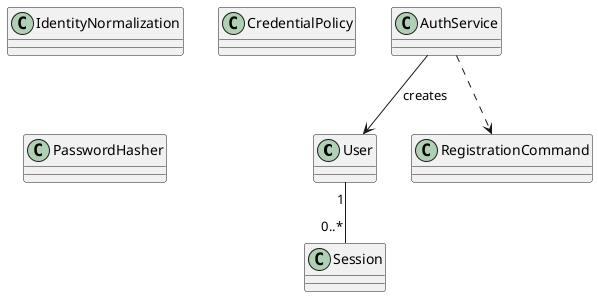

# UC-01 — Register an Account

### Description

As a visitor, I want to create an account so that I can use authenticated booking features.

### Actors

Visitor; Authentication Service.

### Priority

P0.

### Trigger

**TRG-UC-01-01** — The visitor chooses to create an account.

### Preconditions

- **PRE-UC-01-01** — The visitor is viewing the account-registration interface.

### Postconditions

- **POST-UC-01-01** — The client displays the registration outcome returned by the system.
- **POST-UC-01-02** — The interface reflects the navigation state associated with that outcome.

### Basic Flow

1. The visitor opens the create-account form.
2. The client presents the identity and credential fields available in the design.
3. The visitor completes the form and submits it.
4. The client sends the entered registration data to the registration API.
5. The system processes the request and returns a registration outcome.
6. The client renders the returned outcome and its available continuation.

### Alternative Flows

#### AF-UC-01-01

1. The visitor leaves registration and opens the login interface.

#### AF-UC-01-02

1. After a returned rejection, the visitor revises the displayed fields and submits a new request.

### Exception Flows

#### EF-UC-01-01

1. If the registration service cannot complete the request, the client displays a technical-failure state.
2. The visitor may retry from the preserved registration context.

### UML Model

Classifiers and operations are defined in the [shared domain model](shared-domain-model.md).



### Business Rules

```ocl
-- BR-UC-01-01
-- Source: Assumption
context AuthService::register(command: RegistrationCommand): Session
pre BR_UC_01_01_CanonicalIdentityIsUnclaimed:
  not User.allInstances()->exists(u |
    IdentityNormalization::canonicalEmail(u.email) =
    IdentityNormalization::canonicalEmail(command.email))
```

```ocl
-- BR-UC-01-02
-- Source: Assumption
context AuthService::register(command: RegistrationCommand): Session
pre BR_UC_01_02_CredentialIsIndependentOfIdentity:
  CredentialPolicy::accepts(
    command.password,
    IdentityNormalization::canonicalEmail(command.email),
    command.fullName.trim())
```

```ocl
-- BR-UC-01-03
-- Source: Figma
context AuthService::register(command: RegistrationCommand): Session
pre BR_UC_01_03_ConfirmationRepresentsSameSecret:
  command.password = command.confirmPassword
```

```ocl
-- BR-UC-01-04
-- Source: Assumption
context AuthService::register(command: RegistrationCommand): Session
post BR_UC_01_04_ExactlyOneCanonicalAccountIsCreated:
  User.allInstances()->select(u |
    IdentityNormalization::canonicalEmail(u.email) =
    IdentityNormalization::canonicalEmail(command.email))->size() = 1 and
  User.allInstances()->size() = User.allInstances()@pre->size() + 1
```

```ocl
-- BR-UC-01-05
-- Source: Assumption
context AuthService::register(command: RegistrationCommand): Session
post BR_UC_01_05_StoredIdentityIsCanonicalAndActive:
  result.user.email = IdentityNormalization::canonicalEmail(command.email) and
  result.user.fullName = command.fullName.trim() and result.user.active
```

```ocl
-- BR-UC-01-06
-- Source: Assumption
context AuthService::register(command: RegistrationCommand): Session
post BR_UC_01_06_SecretIsPersistedOnlyAsHash:
  PasswordHasher::matches(command.password, result.user.passwordHash) and
  result.user.passwordHash <> command.password
```

```ocl
-- BR-UC-01-07
-- Source: Assumption
context AuthService::register(command: RegistrationCommand): Session
post BR_UC_01_07_SessionBelongsToCreatedIdentity:
  result.oclIsNew() and result.user.oclIsNew() and
  result.user.createdAt >= RequestContext::startedAt and
  result.expiresAt > result.user.createdAt and
  result.tokenHash = TokenHasher::hash(result.accessToken) and
  result.tokenHash <> result.accessToken
```

```ocl
-- BR-UC-01-08
-- Source: Assumption
context AuthService::register(command: RegistrationCommand): Session
pre BR_UC_01_08_IdentityHasUsableDisplayAndContactValues:
  command.fullName.trim().size() > 0 and
  Validation::isEmail(IdentityNormalization::canonicalEmail(command.email))
```

### Related UI

`create account`.

### Related APIs

`API-AUTH-REGISTER`.
