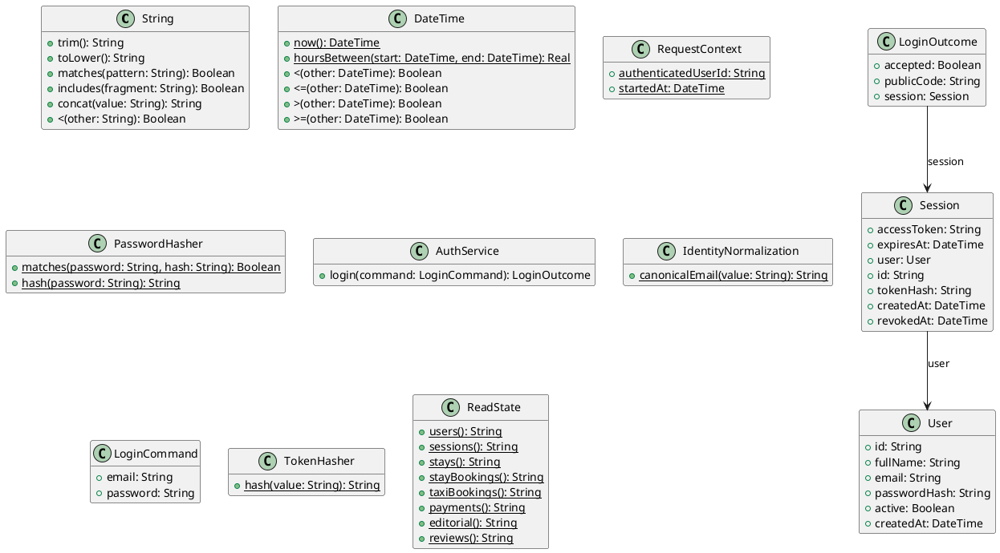

# UC-02 — Log In

### Description

As a registered visitor, I want to authenticate with email and password so that I can access protected features.

### Actors

Visitor; Authentication Service.

### Priority

P0.

### Trigger

**TRG-UC-02-01** — The visitor chooses to log in.

### Preconditions

- **PRE-UC-02-01** — The visitor is viewing a login interface.

### Postconditions

- **POST-UC-02-01** — The client displays the login outcome returned by the system.
- **POST-UC-02-02** — The interface reflects the navigation state associated with that outcome.

### Basic Flow

1. The visitor opens the login form.
2. The client presents the credential fields and the available navigation.
3. The visitor enters credentials and submits the form.
4. The client sends the entered credentials to the login API.
5. The system processes the request and returns a login outcome.
6. The client renders the returned outcome and its available continuation.

### Alternative Flows

#### AF-UC-02-01

1. The visitor opens the registration interface instead of submitting credentials.

#### AF-UC-02-02

1. After a returned rejection, the visitor replaces the entered credentials and submits a new request.

### Exception Flows

#### EF-UC-02-01

1. If the login request cannot be completed, the client displays a technical-failure state.
2. The visitor may retry from the login interface.

### UML Model



### Business Rules

```ocl
-- BR-UC-02-01
-- Source: Assumption
context AuthService::login(command: LoginCommand): LoginOutcome
post BR_UC_02_01_AcceptanceRequiresOneActiveCredentialMatch:
  result.accepted =
    (User.allInstances()->select(u |
      u.active and
      IdentityNormalization::canonicalEmail(u.email) =
        IdentityNormalization::canonicalEmail(command.email) and
      PasswordHasher::matches(command.password, u.passwordHash))->size() = 1)
```

```ocl
-- BR-UC-02-02
-- Source: Assumption
context AuthService::login(command: LoginCommand): LoginOutcome
post BR_UC_02_02_AllCredentialRejectionsArePubliclyIndistinguishable:
  not result.accepted implies
    result.publicCode = 'INVALID_CREDENTIALS' and result.session = null
```

```ocl
-- BR-UC-02-03
-- Source: Assumption
context AuthService::login(command: LoginCommand): LoginOutcome
post BR_UC_02_03_AcceptedSessionIsBoundToMatchedIdentity:
  result.accepted implies
    result.session <> null and
    result.session.user.active and
    IdentityNormalization::canonicalEmail(result.session.user.email) =
      IdentityNormalization::canonicalEmail(command.email) and
    result.session.expiresAt > RequestContext::startedAt
```

```ocl
-- BR-UC-02-04
-- Source: Assumption
context AuthService::login(command: LoginCommand): LoginOutcome
post BR_UC_02_04_AuthenticationDoesNotMutateIdentityRecords:
  ReadState::users() = ReadState::users()@pre
```

```ocl
-- BR-UC-02-05
-- Source: Assumption
context AuthService::login(command: LoginCommand): LoginOutcome
post BR_UC_02_05_AcceptedSessionIsNewAndTokenIsDistinct:
  result.accepted implies
    result.session.oclIsNew() and
    Session.allInstances()@pre->forAll(s |
      s.tokenHash <> result.session.tokenHash)
```

```ocl
-- BR-UC-02-06
-- Source: Assumption
context AuthService::login(command: LoginCommand): LoginOutcome
post BR_UC_02_06_RejectedLoginCreatesNoSession:
  not result.accepted implies
    ReadState::sessions() = ReadState::sessions()@pre
```

```ocl
-- BR-UC-02-07
-- Source: Assumption
context AuthService::login(command: LoginCommand): LoginOutcome
post BR_UC_02_07_SessionPersistsOnlyTokenHash:
  result.accepted implies
    result.session.tokenHash = TokenHasher::hash(result.session.accessToken) and
    result.session.tokenHash <> result.session.accessToken
```

### Related UI

`Login page`; `log in`.

### Related APIs

`API-AUTH-LOGIN`.
