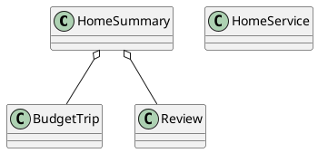

# UC-03 — View the Home Page

### Description

As a visitor or authenticated user, I want to view featured travel services, destinations, and reviews so that I can start planning a trip.

### Actors

Visitor; Authenticated User; Content Service.

### Priority

P1.

### Trigger

**TRG-UC-03-01** — The actor opens the home route.

### Preconditions

- **PRE-UC-03-01** — The actor can open the home route.

### Postconditions

- **POST-UC-03-01** — The home route displays the returned content state.
- **POST-UC-03-02** — Available navigation from the displayed sections remains accessible.

### Basic Flow

1. The actor opens the home route.
2. The client requests the home summary.
3. The system processes the request and returns the home-summary outcome.
4. The client renders each returned section in the home layout.
5. The actor may select a service entry point or a displayed content item.

### Alternative Flows

#### AF-UC-03-01

1. If a content section is returned empty, the client displays its designed empty presentation while retaining the remaining home content.

#### AF-UC-03-02

1. The client renders the header state returned for the current actor context.

#### AF-UC-03-03

1. An authenticated traveller opens the notification control.
2. The client displays the returned upcoming-trip summary.

### Exception Flows

#### EF-UC-03-01

1. If the home summary cannot be loaded, the client displays the designed retry state.

#### EF-UC-03-02

1. If the response contains an unavailable section, the client renders the remaining returned sections and marks the affected section unavailable.

### UML Model

Classifiers and operations are defined in the [shared domain model](shared-domain-model.md).



### Business Rules

```ocl
-- BR-UC-03-01
-- Source: Assumption
context HomeService::getSummary(): HomeSummary
post BR_UC_03_01_EditorialDestinationSetIsPublishedAndNonRepeating:
  result.destinations->forAll(d |
    d.active and d.publishFrom <= RequestContext::startedAt and
    (d.publishUntil = null or d.publishUntil > RequestContext::startedAt)) and
  result.destinations->isUnique(d | d.destinationId)
```

```ocl
-- BR-UC-03-02
-- Source: Assumption
context HomeService::getSummary(): HomeSummary
post BR_UC_03_02_ReviewSetIsPublicAtResponseTime:
  result.reviews->forAll(r |
    r.published and r.moderationStatus = ModerationStatus::APPROVED and
    r.publishedAt <= RequestContext::startedAt)
```

```ocl
-- BR-UC-03-03
-- Source: Assumption
context HomeService::getSummary(): HomeSummary
post BR_UC_03_03_EditorialSectionsHaveDeterministicOrder:
  (result.destinations->size() <= 1 or
    Sequence{1..result.destinations->size() - 1}->forAll(i |
      result.destinations->at(i).editorialRank < result.destinations->at(i + 1).editorialRank or
      (result.destinations->at(i).editorialRank = result.destinations->at(i + 1).editorialRank and
       result.destinations->at(i).id < result.destinations->at(i + 1).id))) and
  (result.reviews->size() <= 1 or
    Sequence{1..result.reviews->size() - 1}->forAll(i |
      result.reviews->at(i).featuredRank < result.reviews->at(i + 1).featuredRank or
      (result.reviews->at(i).featuredRank = result.reviews->at(i + 1).featuredRank and
       result.reviews->at(i).id < result.reviews->at(i + 1).id)))
```

```ocl
-- BR-UC-03-04
-- Source: Assumption
context HomeService::getSummary(): HomeSummary
post BR_UC_03_04_ServiceEntryPointsAreNotDuplicated:
  result.services->isUnique(s | s.toLower())
```

```ocl
-- BR-UC-03-05
-- Source: Assumption
context HomeService::getSummary(): HomeSummary
post BR_UC_03_05_HomeCompositionIsReadOnly:
  ReadState::editorial() = ReadState::editorial()@pre and
  ReadState::reviews() = ReadState::reviews()@pre
```

```ocl
-- BR-UC-03-06
-- Source: Assumption
context HomeService::getSummary(): HomeSummary
post BR_UC_03_06_HomeReviewProjectionProtectsIdentityAndContent:
  result.reviews->forAll(r |
    r.displayedAuthorName = PrivacyMask::personName(r.authorName) and
    ContentSafety::isPublicSafe(r.comment) and r.rating >= 1 and r.rating <= 5)
```

```ocl
-- BR-UC-03-07
-- Source: Assumption
context HomeService::getSummary(): HomeSummary
post BR_UC_03_07_ServiceEntriesStayWithinSupportedDiscoveryScope:
  result.services->forAll(s | Set{'Stays', 'Taxis', 'Flights', 'Budget Trips'}->includes(s))
```

```ocl
-- BR-UC-03-08
-- Source: Assumption
context HomeService::getSummary(): HomeSummary
post BR_UC_03_08_HomePricesUseRecentEvidenceInTheSameCurrency:
  result.destinations->forAll(t |
    let eligible = t.priceEvidence->select(e |
      e.active and e.amount.currency = t.startingPrice.currency and
      e.observedAt <= RequestContext::startedAt and
      DateTime::hoursBetween(e.observedAt, RequestContext::startedAt) <= 24) in
    eligible->notEmpty() and t.startingPrice.amount >= 0 and
    t.startingPrice.amount = eligible->collect(e | e.amount.amount)->min())
```


```ocl
-- BR-UC-03-09
-- Source: Figma
context HomeService::getSummary(): HomeSummary
post BR_UC_03_09_UpcomingTripNoticeBelongsToTheAuthenticatedTraveller:
  result.upcomingTrip = null or
  (result.viewer.authenticated and
   StayBooking.allInstances()->exists(b |
     b.id = result.upcomingTrip.bookingId and b.user.id = RequestContext::authenticatedUserId and
     Set{BookingStatus::PENDING, BookingStatus::CONFIRMED}->includes(b.status)) and
   result.upcomingTrip.daysRemaining >= 0)
```

### Related UI

`Home page`; `Home page after login`; `home page`; notification bell; `Your Next Trip` pop-up.

### Related APIs

`API-HOME-SUMMARY`; `API-REVIEW-LIST`.
