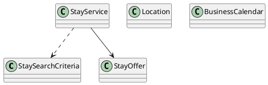

# UC-04 — Search for Stays

### Description

As a traveller, I want to search by destination, dates, rooms, and guests so that I can find suitable stays.

### Actors

Traveller; Stay Service.

### Priority

P0.

### Trigger

**TRG-UC-04-01** — The traveller chooses to search for stays.

### Preconditions

- **PRE-UC-04-01** — The traveller can access a stay-search interface.

### Postconditions

- **POST-UC-04-01** — The client displays the stay-search outcome returned by the system.
- **POST-UC-04-02** — The entered search context remains available for the next interaction.

### Basic Flow

1. The traveller opens the stay-search interface.
2. The client presents destination, travel-period, room, and guest controls.
3. The traveller enters or revises the search criteria and submits the search.
4. The client sends the selected criteria to the stay-search API.
5. The system processes the request and returns a search outcome.
6. The client renders the returned outcome and its available continuation.

### Alternative Flows

#### AF-UC-04-01

1. While entering a destination, the traveller selects one of the returned location suggestions.

#### AF-UC-04-02

1. From the results view, the traveller reopens the search controls, changes the criteria, and submits a replacement search.

### Exception Flows

#### EF-UC-04-01

1. If destination suggestions are unavailable, the client keeps the search form visible and identifies the affected control.

#### EF-UC-04-02

1. If the search cannot be completed, the client preserves the selected criteria and displays a retry action.

### UML Model

Classifiers and operations are defined in the [shared domain model](shared-domain-model.md).



### Business Rules

```ocl
-- BR-UC-04-01
-- Source: Assumption
context StayService::search(criteria: StaySearchCriteria): Sequence(StayOffer)
pre BR_UC_04_01_DestinationMustBeSearchable:
  Location.allInstances()->one(d |
    d.id = criteria.destinationId and d.active)
```

```ocl
-- BR-UC-04-02
-- Source: Assumption
context StayService::search(criteria: StaySearchCriteria): Sequence(StayOffer)
pre BR_UC_04_02_StayFallsWithinTheSellableWindow:
  let destination: Location =
    Location.allInstances()->any(d | d.id = criteria.destinationId) in
  criteria.checkIn >= BusinessCalendar::today(destination.timeZone) and
  BusinessCalendar::nights(criteria.checkIn, criteria.checkOut) >= 1 and
  BusinessCalendar::nights(criteria.checkIn, criteria.checkOut) <= 30
```

```ocl
-- BR-UC-04-03
-- Source: Assumption
context StayService::search(criteria: StaySearchCriteria): Sequence(StayOffer)
pre BR_UC_04_03_OccupancyCanBeDistributedAcrossRequestedRooms:
  criteria.rooms >= 1 and criteria.rooms <= 8 and
  criteria.adults >= criteria.rooms and
  criteria.adults <= criteria.rooms * 4
```

```ocl
-- BR-UC-04-04
-- Source: Assumption
context StayService::search(criteria: StaySearchCriteria): Sequence(StayOffer)
post BR_UC_04_04_ReturnedInventoryIsBoundToTheSearchContext:
  result->forAll(o |
    o.available and o.expiresAt > RequestContext::startedAt and
    o.destinationId = criteria.destinationId and
    o.period.start = criteria.checkIn and o.period.end = criteria.checkOut and
    o.rooms = criteria.rooms and o.adults = criteria.adults and
    o.availableRooms >= criteria.rooms)
```

```ocl
-- BR-UC-04-05
-- Source: Assumption
context StayService::search(criteria: StaySearchCriteria): Sequence(StayOffer)
post BR_UC_04_05_ProviderInventoryIsDeduplicated:
  result->isUnique(o | o.providerOfferRef)
```

```ocl
-- BR-UC-04-06
-- Source: Assumption
context StayService::search(criteria: StaySearchCriteria): Sequence(StayOffer)
post BR_UC_04_06_SearchDoesNotReserveInventory:
  ReadState::stayBookings() = ReadState::stayBookings()@pre
```

```ocl
-- BR-UC-04-07
-- Source: Assumption
context StayService::search(criteria: StaySearchCriteria): Sequence(StayOffer)
post BR_UC_04_07_SearchPricesUseOneCurrency:
  result->forAll(o |
    o.total.amount >= 0 and o.total.currency = criteria.currency)
```

### Related UI

`stays`; `stay search bar`; `check in date picker`; `check out date picker`.

### Related APIs

`API-LOCATION-SUGGEST`; `API-STAY-SEARCH`.
