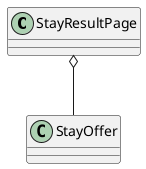

# UC-05 — View Stay Results

### Description

As a traveller, I want to browse the stay offers returned by my search.

### Actors

Traveller; Stay Service.

### Priority

P0.

### Trigger

**TRG-UC-05-01** — The client receives a stay-search result context.

### Preconditions

- **PRE-UC-05-01** — A stay-search result context is available to the client.

### Postconditions

- **POST-UC-05-01** — The client displays the returned result-page state.
- **POST-UC-05-02** — The displayed search context remains available for navigation or revision.

### Basic Flow

1. The client opens the stay-results view for the current search context.
2. The client requests the corresponding result page.
3. The system processes the request and returns a page outcome.
4. The client renders the search summary and returned offer presentations.
5. The traveller reviews the visible offer summaries.
6. The traveller may select an offer to continue to stay details.

### Alternative Flows

#### AF-UC-05-01

1. If the response contains no offer presentations, the client displays the designed no-results state and keeps the search summary available.

#### AF-UC-05-02

1. The traveller requests another result page from the current search context.

### Exception Flows

#### EF-UC-05-01

1. If another result page cannot be loaded, the client keeps the displayed page and offers a retry.

#### EF-UC-05-02

1. If the system returns an unusable-context outcome, the client presents the supplied recovery action.

### UML Model

Classifiers and operations are defined in the [shared domain model](shared-domain-model.md).



### Business Rules

```ocl
-- BR-UC-05-01
-- Source: Assumption
context StayResultPage
inv BR_UC_05_01_PageBelongsToOneSearchSnapshot:
  self.items->forAll(o |
    o.searchContextId = self.searchContextId and
    o.snapshotVersion = self.snapshotVersion)
```

```ocl
-- BR-UC-05-02
-- Source: Assumption
context StayResultPage
inv BR_UC_05_02_PageMetadataMatchesItsSlice:
  self.total = self.orderedOfferIds->size() and self.limit > 0 and self.offset >= 0 and
  self.items->size() = (self.total - self.offset).max(0).min(self.limit) and
  self.hasMore = (self.offset + self.items->size() < self.total)
```

```ocl
-- BR-UC-05-03
-- Source: Assumption
context StayResultPage
inv BR_UC_05_03_PageInventoryWasLiveAtSnapshotCreation:
  self.items->forAll(o |
    o.available and o.expiresAt > self.capturedAt) and
  self.validUntil > self.capturedAt and
  self.items->forAll(o | self.validUntil <= o.expiresAt)
```

```ocl
-- BR-UC-05-04
-- Source: Assumption
context StayResultPage
inv BR_UC_05_04_OfferIdentifiersDoNotRepeatAcrossThePage:
  self.items->isUnique(o | o.id)
```

```ocl
-- BR-UC-05-05
-- Source: Assumption
context StayResultPage
inv BR_UC_05_05_PresentationOrderIsStableWithinTheSnapshot:
  self.items->size() <= 1 or
  Sequence{1..self.items->size() - 1}->forAll(i |
    self.items->at(i).rank < self.items->at(i + 1).rank)
```

```ocl
-- BR-UC-05-06
-- Source: Assumption
context StayResultPage
inv BR_UC_05_06_PageIsExactSliceOfTheOrderedSnapshot:
  self.orderedOfferIds->isUnique(id | id) and
  (if self.items->isEmpty() then self.offset >= self.total
   else Sequence{1..self.items->size()}->forAll(i |
     self.items->at(i).id = self.orderedOfferIds->at(self.offset + i)) endif)
```

```ocl
-- BR-UC-05-07
-- Source: Assumption
context StayResultPage
inv BR_UC_05_07_SnapshotUsesOneComparisonCurrency:
  self.items->forAll(o | o.total.currency = self.currency and o.total.amount >= 0)
```

### Related UI

`hotel list`; `budget stays`.

### Related APIs

`API-STAY-SEARCH`.
