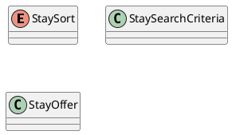

# UC-06 — Filter and Sort Stay Results

### Description

As a traveller, I want to filter and sort stays so that I can narrow the results.

### Actors

Traveller; Stay Service.

### Priority

P1.

### Trigger

**TRG-UC-06-01** — The traveller chooses to refine the displayed stay results.

### Preconditions

- **PRE-UC-06-01** — The traveller is viewing stay results for a search context.

### Postconditions

- **POST-UC-06-01** — The results view displays the refinement outcome returned by the system.
- **POST-UC-06-02** — The search context remains available for another result interaction.

### Basic Flow

1. The traveller opens the stay filter or sort controls.
2. The client displays the current selections.
3. The traveller changes one or more selections and applies them.
4. The client submits the revised result preferences with the current search context.
5. The system processes the request and returns a refinement outcome.
6. The client renders the returned result state and selections.

### Alternative Flows

#### AF-UC-06-01

1. The traveller clears the displayed refinements and requests the base result view.

#### AF-UC-06-02

1. On mobile, the traveller dismisses the filter panel without applying pending changes.

### Exception Flows

#### EF-UC-06-01

1. If the refresh cannot be completed, the client keeps the previously displayed result state.
2. The client presents the retry action returned for the failed refresh.

### UML Model

Classifiers and operations are defined in the [shared domain model](shared-domain-model.md).



### Business Rules

```ocl
-- BR-UC-06-01
-- Source: Assumption
context StayService::search(criteria: StaySearchCriteria): Sequence(StayOffer)
post BR_UC_06_01_RefinementCannotEscapeTheAcceptedSearch:
  result->forAll(o | (criteria.searchContextId = null or o.searchContextId = criteria.searchContextId))
```

```ocl
-- BR-UC-06-02
-- Source: Assumption
context StayService::search(criteria: StaySearchCriteria): Sequence(StayOffer)
post BR_UC_06_02_AllAcceptedFiltersApplyTogether:
  result->forAll(o |
    (criteria.minPrice = null or o.total.amount >= criteria.minPrice) and
    (criteria.maxPrice = null or o.total.amount <= criteria.maxPrice) and
    (criteria.minRating = null or o.rating >= criteria.minRating))
```

```ocl
-- BR-UC-06-03
-- Source: Assumption
context StayService::search(criteria: StaySearchCriteria): Sequence(StayOffer)
pre BR_UC_06_03_ChangedRefinementStartsANewResultTraversal:
  criteria.offset >= 0 and criteria.limit > 0 and
  (SearchSnapshot::refinementChanged(criteria) implies criteria.offset = 0)
```

```ocl
-- BR-UC-06-04
-- Source: Assumption
context StayService::search(criteria: StaySearchCriteria): Sequence(StayOffer)
post BR_UC_06_04_PriceOrderUsesRatingAndIdentifierAsTieBreakers:
  criteria.sort = StaySort::PRICE implies
    (result->size() <= 1 or
      Sequence{1..result->size() - 1}->forAll(i |
        result->at(i).total.amount < result->at(i + 1).total.amount or
        (result->at(i).total.amount = result->at(i + 1).total.amount and
          (result->at(i).rating > result->at(i + 1).rating or
           (result->at(i).rating = result->at(i + 1).rating and
            result->at(i).id < result->at(i + 1).id)))))
```

```ocl
-- BR-UC-06-05
-- Source: Assumption
context StayService::search(criteria: StaySearchCriteria): Sequence(StayOffer)
post BR_UC_06_05_RatingOrderUsesPriceAndIdentifierAsTieBreakers:
  criteria.sort = StaySort::RATING implies
    (result->size() <= 1 or
      Sequence{1..result->size() - 1}->forAll(i |
        result->at(i).rating > result->at(i + 1).rating or
        (result->at(i).rating = result->at(i + 1).rating and
          (result->at(i).total.amount < result->at(i + 1).total.amount or
           (result->at(i).total.amount = result->at(i + 1).total.amount and
            result->at(i).id < result->at(i + 1).id)))))
```

```ocl
-- BR-UC-06-06
-- Source: Assumption
context StayService::search(criteria: StaySearchCriteria): Sequence(StayOffer)
post BR_UC_06_06_RecommendedOrderIsDeterministic:
  criteria.sort = StaySort::RECOMMENDED implies
    (result->size() <= 1 or
      Sequence{1..result->size() - 1}->forAll(i |
        result->at(i).recommendationScore > result->at(i + 1).recommendationScore or
        (result->at(i).recommendationScore = result->at(i + 1).recommendationScore and
          result->at(i).id < result->at(i + 1).id)))
```

```ocl
-- BR-UC-06-07
-- Source: Assumption
context StayService::search(criteria: StaySearchCriteria): Sequence(StayOffer)
pre BR_UC_06_07_OptionalFilterBoundsAreCoherent:
  (criteria.minPrice = null or criteria.minPrice >= 0) and
  (criteria.maxPrice = null or criteria.maxPrice >= 0) and
  (criteria.minPrice = null or criteria.maxPrice = null or criteria.minPrice <= criteria.maxPrice) and
  (criteria.minRating = null or (criteria.minRating >= 0 and criteria.minRating <= 5))
```

```ocl
-- BR-UC-06-08
-- Source: Assumption
context StayService::search(criteria: StaySearchCriteria): Sequence(StayOffer)
pre BR_UC_06_08_ContinuationReferencesAUsableSnapshot:
  (criteria.searchContextId = null and criteria.snapshotVersion = null) or
  (criteria.searchContextId <> null and criteria.snapshotVersion <> null and
   SearchSnapshot::accepts(criteria, RequestContext::startedAt))
```

### Related UI

`hotel filter`; `stay filters mobile`.

### Related APIs

`API-STAY-SEARCH`.
