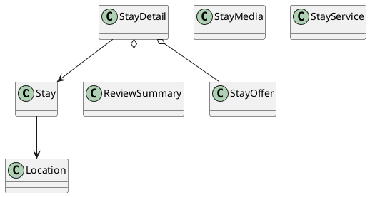

# UC-07 — View Stay Details

### Description

As a traveller, I want to inspect a stay's details, amenities, reviews, location, and current offer.

### Actors

Traveller; Stay Service.

### Priority

P0.

### Trigger

**TRG-UC-07-01** — The traveller chooses a stay from a result view.

### Preconditions

- **PRE-UC-07-01** — A selected stay reference is available to the client.

### Postconditions

- **POST-UC-07-01** — The client displays the stay-detail outcome returned by the system.
- **POST-UC-07-02** — Navigation back to the originating result context remains available.

### Basic Flow

1. The traveller selects a stay result.
2. The client requests the detail associated with the selected stay.
3. The system processes the request and returns a detail outcome.
4. The client renders the detail sections represented by the response.
5. The traveller reviews the displayed sections.
6. The traveller may use an available continuation from the detail view.

### Alternative Flows

#### AF-UC-07-01

1. The traveller returns to the preserved result context.

#### AF-UC-07-02

1. If an optional section is absent from the response, the client renders the remaining detail sections.

### Exception Flows

#### EF-UC-07-01

1. If stay detail cannot be loaded, the client displays a retry state.
2. The client retains navigation back to the result view.

### UML Model

Classifiers and operations are defined in the [shared domain model](shared-domain-model.md).



### Business Rules

```ocl
-- BR-UC-07-01
-- Source: Assumption
context StayService::getDetail(stayId: String, offerId: String): StayDetail
post BR_UC_07_01_DetailRepresentsTheSelectedActiveStay:
  result <> null and result.stay.id = stayId and result.stay.active
```

```ocl
-- BR-UC-07-02
-- Source: Assumption
context StayService::getDetail(stayId: String, offerId: String): StayDetail
post BR_UC_07_02_AmenitiesAreCanonicalAndNonRepeating:
  result.stay.amenities->forAll(a | a = a.trim().toLower()) and
  result.stay.amenities->isUnique(a | a)
```

```ocl
-- BR-UC-07-03
-- Source: Assumption
context StayService::getDetail(stayId: String, offerId: String): StayDetail
post BR_UC_07_03_MediaOrderIsStableAndGapFree:
  result.stay.media->isUnique(m | m.id) and
  (result.stay.media->isEmpty() or
   Sequence{1..result.stay.media->size()}->forAll(i | result.stay.media->at(i).sortOrder = i))
```

```ocl
-- BR-UC-07-04
-- Source: Assumption
context StayService::getDetail(stayId: String, offerId: String): StayDetail
post BR_UC_07_04_ReviewSummaryIsDerivedOnlyFromApprovedRatings:
  result.reviewSummary.approvedCount =
    result.reviewSummary.approvedRatings->size() and
  (result.reviewSummary.approvedCount = 0 implies
    result.reviewSummary.averageRating = 0) and
  (result.reviewSummary.approvedCount > 0 implies
    result.reviewSummary.averageRating =
      result.reviewSummary.approvedRatings->sum() /
      result.reviewSummary.approvedCount)
```

```ocl
-- BR-UC-07-05
-- Source: Assumption
context StayService::getDetail(stayId: String, offerId: String): StayDetail
post BR_UC_07_05_CurrentOfferIsBoundToTheSelectedContext:
  (offerId = null implies result.currentOffer = null) and
  (result.currentOffer <> null implies
    result.currentOffer.id = offerId and result.currentOffer.stay = result.stay and
    result.currentOffer.available and result.currentOffer.expiresAt > RequestContext::startedAt)
```

```ocl
-- BR-UC-07-06
-- Source: Assumption
context StayService::getDetail(stayId: String, offerId: String): StayDetail
post BR_UC_07_06_DetailRetrievalIsReadOnly:
  ReadState::stays() = ReadState::stays()@pre
```

```ocl
-- BR-UC-07-07
-- Source: Assumption
context StayService::getDetail(stayId: String, offerId: String): StayDetail
post BR_UC_07_07_ReviewAggregateUsesTheSelectedStay:
  result.reviewSummary.approvedRatings =
    Review.allInstances()->select(r |
      r.stayId = stayId and r.published and
      r.moderationStatus = ModerationStatus::APPROVED and
      r.publishedAt <= RequestContext::startedAt)->collect(r | r.rating)->asBag()
```

### Related UI

`hotel southern details page`; `stay details mobile`.

### Related APIs

`API-STAY-DETAIL`.
