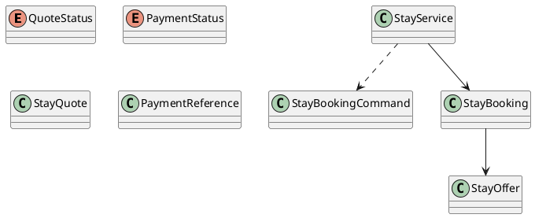

# UC-08 — Book a Stay

### Description

As an authenticated traveller, I want to provide guest details and confirm an available stay offer.

### Actors

Authenticated Traveller; Stay Service; Payment Provider.

### Priority

P0.

### Trigger

**TRG-UC-08-01** — The traveller chooses to continue from a stay offer to checkout.

### Preconditions

- **PRE-UC-08-01** — The traveller is viewing checkout for a selected stay-offer context.

### Postconditions

- **POST-UC-08-01** — The client displays the checkout outcome returned by the system.
- **POST-UC-08-02** — The interface exposes the continuation supplied with that outcome.

### Basic Flow

1. The traveller opens checkout from a selected stay offer.
2. The client requests a checkout summary for the current context.
3. The system processes the request and returns a checkout-summary outcome.
4. The client presents the returned summary and booking-data controls.
5. The traveller reviews the summary, completes the displayed controls, and confirms.
6. The client submits the confirmation request.
7. The system processes the request and returns a booking outcome.
8. The client renders the returned outcome and its available continuation.

### Alternative Flows

#### AF-UC-08-01

1. If a refreshed checkout summary is returned, the client presents it for review before confirmation.

#### AF-UC-08-02

1. After a recoverable outcome, the traveller uses one of the displayed recovery actions.

### Exception Flows

#### EF-UC-08-01

1. If the client receives no confirmation response, it displays a retry state.
2. The traveller chooses retry and the client resubmits the confirmation request.
3. The client displays the returned booking outcome.

### UML Model

Classifiers and operations are defined in the [shared domain model](shared-domain-model.md).



### Business Rules

```ocl
-- BR-UC-08-01
-- Source: Assumption
context StayService::book(command: StayBookingCommand): StayBooking
pre BR_UC_08_01_NewBookingUsesLiveQuoteOrReplaysExistingIntent:
  let prior = StayBooking.allInstances()->select(b |
    b.user.id = RequestContext::authenticatedUserId and b.idempotencyKey = command.idempotencyKey) in
  if prior->notEmpty() then
    prior->one(b | b.requestFingerprint = command.requestFingerprint and b.quote.id = command.quoteId)
  else
    StayQuote.allInstances()->one(q |
      q.id = command.quoteId and q.user.id = RequestContext::authenticatedUserId and
      q.status = QuoteStatus::ACTIVE and q.expiresAt > RequestContext::startedAt and
      q.offer.available and q.offer.expiresAt > RequestContext::startedAt and
      q.offer.version = q.offerVersion) and
    StayBooking.allInstances()->forAll(b | b.quote.id <> command.quoteId)
  endif
```

```ocl
-- BR-UC-08-02
-- Source: Assumption
context StayService::book(command: StayBookingCommand): StayBooking
pre BR_UC_08_02_FingerprintIsServerDerivedAndKeyMatchesIntent:
  command.idempotencyKey.trim().size() > 0 and
  command.requestFingerprint = RequestFingerprint::of(command) and
  StayBooking.allInstances()->select(b |
    b.user.id = RequestContext::authenticatedUserId and b.idempotencyKey = command.idempotencyKey)
    ->forAll(b | b.requestFingerprint = command.requestFingerprint)
```

```ocl
-- BR-UC-08-03
-- Source: Assumption
context StayService::book(command: StayBookingCommand): StayBooking
post BR_UC_08_03_BookingIsOwnedAndBoundToOneQuote:
  result.user.id = RequestContext::authenticatedUserId and
  result.quote.id = command.quoteId and
  StayBooking.allInstances()->select(b |
    b.quote.id = command.quoteId)->size() = 1
```

```ocl
-- BR-UC-08-04
-- Source: Assumption
context StayService::book(command: StayBookingCommand): StayBooking
post BR_UC_08_04_PersistedCommercialTermsComeFromTheQuote:
  result.offer = result.quote.offer and
  result.total.amount = result.quote.total.amount and
  result.total.currency = result.quote.total.currency
```

```ocl
-- BR-UC-08-05
-- Source: Assumption
context StayService::book(command: StayBookingCommand): StayBooking
post BR_UC_08_05_QuoteIsConsumedAtomicallyWithBookingCreation:
  result.quote.status = QuoteStatus::CONSUMED and
  StayBooking.allInstances()->select(b |
    b.user.id = RequestContext::authenticatedUserId and
    b.idempotencyKey = command.idempotencyKey)->size() = 1
```

```ocl
-- BR-UC-08-06
-- Source: Assumption
context StayService::book(command: StayBookingCommand): StayBooking
post BR_UC_08_06_InitialStateReflectsPaymentAuthorization:
  StayBooking.allInstances()@pre->forAll(b |
    b.user.id <> RequestContext::authenticatedUserId or b.idempotencyKey <> command.idempotencyKey) implies
    result.paymentReference <> null and
    ((result.paymentReference.status = PaymentStatus::AUTHORIZED and result.status = BookingStatus::CONFIRMED) or
     (result.paymentReference.status = PaymentStatus::PENDING and result.status = BookingStatus::PENDING))
```

```ocl
-- BR-UC-08-07
-- Source: Assumption
context StayService::book(command: StayBookingCommand): StayBooking
post BR_UC_08_07_PaymentReferenceContainsOnlyDerivedTokenFingerprint:
  result.paymentReference <> null implies
    result.paymentReference.tokenFingerprint = PaymentFingerprint::of(command.paymentToken) and
    result.paymentReference.tokenFingerprint <> command.paymentToken
```

```ocl
-- BR-UC-08-08
-- Source: Assumption
context StayService::book(command: StayBookingCommand): StayBooking
pre BR_UC_08_08_NewBookingHasPaymentCredentialAndRoomCapacity:
  StayBooking.allInstances()->forAll(b |
    b.user.id <> RequestContext::authenticatedUserId or b.idempotencyKey <> command.idempotencyKey) implies
    command.paymentToken <> null and command.paymentToken.trim().size() > 0 and
    StayQuote.allInstances()->one(q | q.id = command.quoteId and q.offer.availableRooms >= q.offer.rooms)
```

```ocl
-- BR-UC-08-09
-- Source: Assumption
context StayService::book(command: StayBookingCommand): StayBooking
post BR_UC_08_09_ReplayReturnsOriginalBookingWithoutNewEffects:
  let prior = StayBooking.allInstances()@pre->select(b |
    b.user.id = RequestContext::authenticatedUserId and b.idempotencyKey = command.idempotencyKey) in
  result.idempotencyKey = command.idempotencyKey and
  result.requestFingerprint = command.requestFingerprint and
  (if prior->notEmpty() then
    result = prior->any(b | true) and
    ReadState::stayBookings() = ReadState::stayBookings()@pre and
    ReadState::payments() = ReadState::payments()@pre
  else
    result.oclIsNew() and
    StayBooking.allInstances()->size() = StayBooking.allInstances()@pre->size() + 1
  endif)
```

```ocl
-- BR-UC-08-10
-- Source: Assumption
context StayService::quote(offerId: String): StayQuote
pre BR_UC_08_10_QuoteRequiresAuthenticatedUserAndLiveOffer:
  User.allInstances()->one(u | u.id = RequestContext::authenticatedUserId and u.active) and
  StayOffer.allInstances()->one(o |
    o.id = offerId and o.available and o.expiresAt > RequestContext::startedAt)
```

```ocl
-- BR-UC-08-11
-- Source: Assumption
context StayService::quote(offerId: String): StayQuote
post BR_UC_08_11_IssuedQuoteCapturesRevalidatedOfferTerms:
  result.oclIsNew() and result.offer.id = offerId and
  result.user.id = RequestContext::authenticatedUserId and
  result.offerVersion = result.offer.version and result.status = QuoteStatus::ACTIVE and
  result.available and result.total = result.offer.total and
  result.expiresAt > RequestContext::startedAt and result.expiresAt <= result.offer.expiresAt
```

```ocl
-- BR-UC-08-12
-- Source: Assumption
context StayService::book(command: StayBookingCommand): StayBooking
pre BR_UC_08_12_GuestContactAndAuthenticatedOwnerAreUsable:
  User.allInstances()->one(u | u.id = RequestContext::authenticatedUserId and u.active) and
  command.guest.firstName.trim().size() > 0 and command.guest.lastName.trim().size() > 0 and
  Validation::isEmail(command.guest.email) and Validation::isPhone(command.guest.phone) and
  Validation::isCountryCode(command.guest.countryCode)
```

```ocl
-- BR-UC-08-13
-- Source: Assumption
context StayService::book(command: StayBookingCommand): StayBooking
post BR_UC_08_13_NewBookingReservesProviderInventoryOnce:
  result.oclIsNew() implies
    result.providerReservationRef <> null and result.providerReservationRef.trim().size() > 0 and
    StayBooking.allInstances()->isUnique(b | b.providerReservationRef)
```

```ocl
-- BR-UC-08-14
-- Source: Assumption
context StayService::quote(offerId: String): StayQuote
post BR_UC_08_14_QuoteDoesNotReserveInventoryOrAuthorizePayment:
  StayBooking.allInstances() = StayBooking.allInstances()@pre and
  ReadState::payments() = ReadState::payments()@pre and
  ProviderInventory::reservations() = ProviderInventory::reservations()@pre
```

```ocl
-- BR-UC-08-15
-- Source: Assumption
context StayService::book(command: StayBookingCommand): StayBooking
post BR_UC_08_15_BookingRetainsTheSubmittedGuestContact:
  result.guest.firstName = command.guest.firstName and result.guest.lastName = command.guest.lastName and
  result.guest.email = command.guest.email and result.guest.phone = command.guest.phone and
  result.guest.countryCode = command.guest.countryCode
```

### Related UI

`hotel reservation page`; `stay checkoutmobile`.

### Related APIs

`API-STAY-QUOTE`; `API-STAY-BOOKING-CREATE`.
