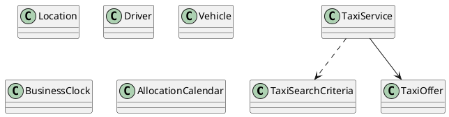

# UC-09 — Search for Taxis

### Description

As a traveller, I want to search for a taxi by pickup, destination, time, and passenger count.

### Actors

Traveller; Taxi Service.

### Priority

P0.

### Trigger

**TRG-UC-09-01** — The traveller chooses to search for taxis.

### Preconditions

- **PRE-UC-09-01** — The traveller can access the taxi-search interface.

### Postconditions

- **POST-UC-09-01** — The client displays the taxi-search outcome returned by the system.
- **POST-UC-09-02** — The entered search context remains available for the next interaction.

### Basic Flow

1. The traveller opens the taxi-search interface.
2. The client presents pickup, destination, schedule, and passenger controls.
3. The traveller completes or revises the search criteria and submits the search.
4. The client sends the selected criteria to the taxi-search API.
5. The system processes the request and returns a search outcome.
6. The client renders the returned outcome and its available continuation.

### Alternative Flows

#### AF-UC-09-01

1. The traveller selects pickup and destination from location suggestions.

#### AF-UC-09-02

1. From the results view, the traveller changes the displayed criteria and submits a replacement search.

### Exception Flows

#### EF-UC-09-01

1. If location suggestions are unavailable, the client identifies the affected control and retains the entered criteria.

#### EF-UC-09-02

1. If the search cannot be completed, the client preserves the criteria and displays a retry action.

### UML Model

Classifiers and operations are defined in the [shared domain model](shared-domain-model.md).



### Business Rules

```ocl
-- BR-UC-09-01
-- Source: Assumption
context TaxiService::search(criteria: TaxiSearchCriteria): Sequence(TaxiOffer)
pre BR_UC_09_01_RouteEndpointsBelongToSupportedServiceAreas:
  Location.allInstances()->one(l | l.id = criteria.pickupId and l.active and
      ServiceArea.allInstances()->one(a | a.id = l.serviceAreaId and a.active)) and
  Location.allInstances()->one(l | l.id = criteria.dropoffId and l.active and
      ServiceArea.allInstances()->one(a | a.id = l.serviceAreaId and a.active))
```

```ocl
-- BR-UC-09-02
-- Source: Assumption
context TaxiService::search(criteria: TaxiSearchCriteria): Sequence(TaxiOffer)
pre BR_UC_09_02_PickupFallsWithinTheDispatchPlanningWindow:
  let pickup: Location =
    Location.allInstances()->any(l | l.id = criteria.pickupId) in
  BusinessClock::hoursBetween(
    BusinessClock::now(pickup.timeZone), criteria.pickupAt) >= 2 and
  BusinessClock::hoursBetween(
    BusinessClock::now(pickup.timeZone), criteria.pickupAt) <= 4320
```

```ocl
-- BR-UC-09-03
-- Source: Assumption
context TaxiService::search(criteria: TaxiSearchCriteria): Sequence(TaxiOffer)
pre BR_UC_09_03_PartyFitsACommercialVehicleCategory:
  criteria.passengers >= 1 and criteria.passengers <= 16
```

```ocl
-- BR-UC-09-04
-- Source: Assumption
context TaxiService::search(criteria: TaxiSearchCriteria): Sequence(TaxiOffer)
post BR_UC_09_04_OffersAreBoundToTheRequestedJourney:
  result->forAll(o |
    o.pickupId = criteria.pickupId and o.dropoffId = criteria.dropoffId and
    o.pickupAt = criteria.pickupAt and o.dropoffAt = criteria.dropoffAt and
    o.seats >= criteria.passengers)
```

```ocl
-- BR-UC-09-05
-- Source: Assumption
context TaxiService::search(criteria: TaxiSearchCriteria): Sequence(TaxiOffer)
post BR_UC_09_05_OfferedResourcesAreLiveAndUnallocated:
  result->forAll(o |
    o.available and o.expiresAt > RequestContext::startedAt and
    o.driver.active and o.vehicle.active and
    o.vehicle.seatCapacity >= o.seats and
    AllocationCalendar::isFree(
      o.driver.id, o.vehicle.id, o.pickupAt, o.dropoffAt))
```

```ocl
-- BR-UC-09-06
-- Source: Assumption
context TaxiService::search(criteria: TaxiSearchCriteria): Sequence(TaxiOffer)
post BR_UC_09_06_ProviderInventoryIsDeduplicated:
  result->isUnique(o | o.providerOfferRef)
```

```ocl
-- BR-UC-09-07
-- Source: Assumption
context TaxiService::search(criteria: TaxiSearchCriteria): Sequence(TaxiOffer)
post BR_UC_09_07_SearchDoesNotAllocateResources:
  ReadState::taxiBookings() = ReadState::taxiBookings()@pre
```

```ocl
-- BR-UC-09-08
-- Source: Assumption
context TaxiService::search(criteria: TaxiSearchCriteria): Sequence(TaxiOffer)
pre BR_UC_09_08_JourneyHasDistinctEndpointsAndPositiveDuration:
  criteria.pickupId <> criteria.dropoffId and criteria.dropoffAt > criteria.pickupAt
```

```ocl
-- BR-UC-09-09
-- Source: Assumption
context TaxiService::search(criteria: TaxiSearchCriteria): Sequence(TaxiOffer)
post BR_UC_09_09_SearchPricesUseOneCurrency:
  result->forAll(o | o.total.amount >= 0 and o.total.currency = criteria.currency)
```

### Related UI

`taxis`; `taxi home page`; `taxi locationsearch bar`; `Pick-up Date & Time`; `Drop Off Date & Time`.

### Related APIs

`API-LOCATION-SUGGEST`; `API-TAXI-SEARCH`.
