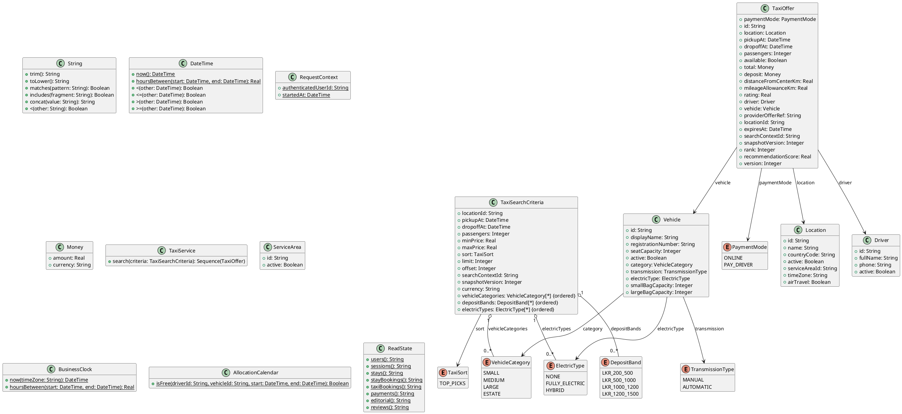

# UC-09 — Search for Taxi Rentals

### Description

As a traveller, I want to search for a vehicle with a driver at a selected location and rental period.

### Actors

Traveller; Taxi Rental Service.

### Priority

P0.

### Trigger

**TRG-UC-09-01** — The traveller chooses the Taxi service.

### Preconditions

- **PRE-UC-09-01** — The traveller can access the Taxi search interface.

### Postconditions

- **POST-UC-09-01** — The client displays the taxi-rental search outcome returned by the system.
- **POST-UC-09-02** — The entered location and rental period remain available for the next interaction.

### Basic Flow

1. The traveller opens the Taxi search interface.
2. The client presents location, pick-up date and time, drop-off date and time, and passenger controls.
3. The traveller completes or revises the displayed controls and submits the search.
4. The client sends the selected criteria to the Taxi search API.
5. The system processes the request and returns a search outcome.
6. The client renders the returned outcome and its available continuation.

### Alternative Flows

#### AF-UC-09-01

1. The traveller selects the rental location from location suggestions.

#### AF-UC-09-02

1. From the results view, the traveller changes the displayed criteria and submits a replacement search.

### Exception Flows

#### EF-UC-09-01

1. If location suggestions are unavailable, the client identifies the affected control and retains the entered criteria.

#### EF-UC-09-02

1. If the search cannot be completed, the client preserves the criteria and displays a retry action.

### UML Model



### Business Rules

```ocl
-- BR-UC-09-01
-- Source: Figma
context TaxiService::search(criteria: TaxiSearchCriteria): Sequence(TaxiOffer)
pre BR_UC_09_01_RentalLocationIsSupported:
  Location.allInstances()->one(l | l.id = criteria.locationId and l.active and
    ServiceArea.allInstances()->one(a | a.id = l.serviceAreaId and a.active))
```

```ocl
-- BR-UC-09-02
-- Source: Assumption
context TaxiService::search(criteria: TaxiSearchCriteria): Sequence(TaxiOffer)
pre BR_UC_09_02_PickupFallsWithinThePlanningWindow:
  let location: Location = Location.allInstances()->any(l | l.id = criteria.locationId) in
  BusinessClock::hoursBetween(BusinessClock::now(location.timeZone), criteria.pickupAt) >= 2 and
  BusinessClock::hoursBetween(BusinessClock::now(location.timeZone), criteria.pickupAt) <= 4320
```

```ocl
-- BR-UC-09-03
-- Source: Assumption
context TaxiService::search(criteria: TaxiSearchCriteria): Sequence(TaxiOffer)
pre BR_UC_09_03_PartyFitsAnAvailableVehicleCategory:
  criteria.passengers >= 1 and criteria.passengers <= 16
```

```ocl
-- BR-UC-09-04
-- Source: Figma
context TaxiService::search(criteria: TaxiSearchCriteria): Sequence(TaxiOffer)
post BR_UC_09_04_OffersMatchTheRequestedLocationAndPeriod:
  result->forAll(o |
    o.locationId = criteria.locationId and o.pickupAt = criteria.pickupAt and
    o.dropoffAt = criteria.dropoffAt and o.vehicle.seatCapacity >= criteria.passengers)
```

```ocl
-- BR-UC-09-05
-- Source: Assumption
context TaxiService::search(criteria: TaxiSearchCriteria): Sequence(TaxiOffer)
post BR_UC_09_05_OfferedResourcesAreLiveAndUnallocated:
  result->forAll(o |
    o.available and o.expiresAt > RequestContext::startedAt and
    o.driver.active and o.vehicle.active and
    AllocationCalendar::isFree(o.driver.id, o.vehicle.id, o.pickupAt, o.dropoffAt))
```

```ocl
-- BR-UC-09-06
-- Source: Assumption
context TaxiService::search(criteria: TaxiSearchCriteria): Sequence(TaxiOffer)
post BR_UC_09_06_ProviderInventoryIsDeduplicated:
  result->isUnique(o | o.providerOfferRef)
```

```ocl
-- BR-UC-09-07
-- Source: Assumption
context TaxiService::search(criteria: TaxiSearchCriteria): Sequence(TaxiOffer)
post BR_UC_09_07_SearchDoesNotAllocateResources:
  ReadState::taxiBookings() = ReadState::taxiBookings()@pre
```

```ocl
-- BR-UC-09-08
-- Source: Figma
context TaxiService::search(criteria: TaxiSearchCriteria): Sequence(TaxiOffer)
pre BR_UC_09_08_RentalPeriodHasPositiveDuration:
  criteria.dropoffAt > criteria.pickupAt
```

```ocl
-- BR-UC-09-09
-- Source: Assumption
context TaxiService::search(criteria: TaxiSearchCriteria): Sequence(TaxiOffer)
post BR_UC_09_09_SearchPricesUseOneCurrency:
  result->forAll(o |
    o.total.amount >= 0 and o.total.currency = criteria.currency and
    o.deposit.amount >= 0 and o.deposit.currency = criteria.currency)
```

### Related UI

`Taxi`; `taxi home page`; `Smooth Travels Start Here`; location control; `Pick-up Date & Time`; `Drop-off Date & Time`; `Passengers`.

### Related APIs

`API-LOCATION-SUGGEST`; `API-TAXI-SEARCH`.
